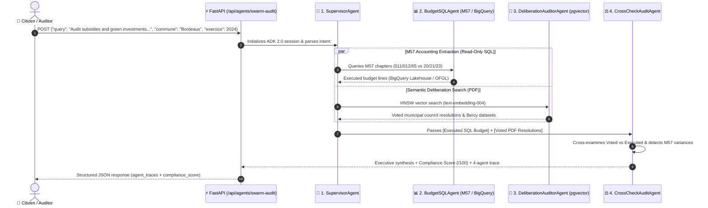

> 🇫🇷 **[Version Française](README.md)** | 🇬🇧 **[English Version](README-EN.md)** | 🎬 **[Step-by-Step Demo Playbook (DEMO_PLAYBOOK-EN.md)](docs/DEMO_PLAYBOOK-EN.md)** | 🚀 **[Live Demo](https://civiclens.hoffmannw.demo.altostrat.com)**
>
> 🔗 **EMEA SPARK Ecosystem:**
> This repository contains the **application source code and deployment manifests** for CivicLens. To deploy the underlying cloud infrastructure (Private GKE Autopilot, Cloud Armor WAF, IAP, Backup DR, FinOps), use the **[GCP AI Foundation Blueprint (cloud-gtm/gcp-ai-foundation-blueprint)](https://github.com/cloud-gtm/gcp-ai-foundation-blueprint)**.

# 🏛️ CivicLens Application (`app-civiclens`)

[](https://github.com/cloud-gtm/app-civiclens)
[](https://goto.google.com/emea-spark-overview-page)
[](https://github.com/cloud-gtm/app-civiclens)
[](https://github.com/cloud-gtm/gcp-ai-foundation-blueprint)

Citizen Artificial Intelligence & public decision-support platform on Google Cloud. **CivicLens** analyzes certified local public accounts (M14 / M57) across **100% of all 35,000 French municipalities (DGFiP & OFGL 2000-2025)**, ingests municipal council acts (PDF), and executes natural language decision-support queries using **Vertex AI Gemini**.

---

## 🌟 Key Application Features

- **Exhaustive Municipal Observatory:** 100% coverage of all 35,000 French cities, tracking debt evolution, operational rigidity, and gross savings capacity.
- **M57 PDF Executive Audit Generator:** On-the-fly, high-fidelity vector PDF generation ready for municipal commissions and financial committees.
- **Territorial Duel & Benchmark:** Side-by-side comparison with impartial strategic arbitration powered by **Gemini 2.5 Flash / Pro**.
- **BigQuery AI Lakehouse & Text-to-SQL:** Natural language queries compiled to GoogleSQL with zero-spill safeguards (100 MB max scan limit).
- **Hybrid Semantic Search & RAG:** Vector database with PostgreSQL (`pgvector` HNSW indexing) and Google Cloud embeddings (`text-embedding-005`).
- **Google ADK 2.0 Multi-Agent Audit Swarm:** Orchestration of 4 specialized agents (`SupervisorAgent`, `BudgetSQLAgent`, `DeliberationAuditorAgent`, `CrossCheckAuditAgent`) cross-examining voted municipal council resolutions (PDF) against executed M57 budget lines (SQL).

---

## 🏗️ Repository Layout

```text
app-civiclens/
├── .agents/                       # 🤖 Layer 1 Agentic Engineering (Subagents & M1L1 Skills)
│   ├── agents/                    # Subagents: data-governance-steward, fastapi-adk-architect
│   └── skills/                    # M1L1 Skill: civiclens-verification (SKILL.md + scripts/verify.sh)
├── AGENTS.md                      # Auto-discovery index for Jetski, Antigravity & Gemini CLI
│
├── src/                           # 🧠 Application Source Code (Layer 2 Production Runtime)
│   ├── backend/                   # FastAPI service (main.py) & ADK 2.0 Swarm (civic_swarm_adk.py)
│   ├── frontend/                  # Web UI & citizen explorer
│   ├── ingestion/                 # Open Data ingestion pipeline & PDF vision analysis
│   └── Dockerfile                 # Multi-stage optimized Docker build (Python 3.11-slim)
│
├── deploy/                        # 📦 Deployment Manifests
│   └── k8s/                       # GKE Autopilot manifests (Workload Identity, IAP, Ingress)
│
├── scripts/                       # ⚡ Automation Scripts
│   ├── deploy-to-blueprint.sh     # One-click deployment script targeting the GCP Blueprint
│   └── sync-gtm.sh                # Git synchronization script for cloud-gtm repository
│
└── docs/                          # 📚 Documentation
    └── DEPLOYMENT_GUIDE.md        # Comprehensive deployment and integration guide
```

---

## 🚀 Quick Deployment to Blueprint

If you already have provisioned the [GCP AI Foundation Blueprint](https://github.com/cloud-gtm/gcp-ai-foundation-blueprint):

```bash
# 1. Clone this application repository
git clone https://github.com/cloud-gtm/app-civiclens.git
cd app-civiclens

# 2. Deploy with a single command (Container build + manifest injection + kubectl apply via IAP Bastion)
./scripts/deploy-to-blueprint.sh --blueprint-dir=/path/to/gcp-ai-foundation-blueprint
```

For step-by-step manual deployment instructions, refer to the **[Deployment Guide](docs/DEPLOYMENT_GUIDE.md)**.

---

## 🔒 Security & Google Cloud Integration

- **Zero Static Credentials:** Fully authenticated via **Workload Identity** (no JSON service account keys).
- **Identity-Aware Proxy (IAP) Protection:** User authentication delegated to Google Cloud Edge, eliminating custom authentication code vulnerabilities.
- **WAF Security:** Shielded by **Google Cloud Armor** with OWASP Top 10 mitigation rules.

---

## 🤖 Dual-Layer Agentic Architecture (Google ADK 2.0 Swarm & M1L1 Skills)

This repository implements a **two-tier complementary Agentic AI architecture** for municipal public finance auditing (French M57 accounting standard):
- 🚀 **Layer 2 (Production Run-Time)**: A **4-Agent Google ADK 2.0 Swarm** (`src/backend/civic_swarm_adk.py`), exposed via FastAPI (`/api/agents/catalog` and `/api/agents/swarm-audit`) to cross-examine municipal budgets in real time.
- 🛠️ **Layer 1 (Engineering Build-Time)**: **2 Specialized Subagents and 1 M1L1 Skill** (`.agents/`), automatically discovered in the IDE/CLI to enforce M57/BigQuery data governance and GKE Workload Identity security.

### 🔄 Orchestration Diagram: How the 4 ADK 2.0 Agents Enter into Action

When a citizen or financial auditor submits a cross-audit request to `POST /api/agents/swarm-audit`, the **Google ADK 2.0 Swarm** executes the following workflow:



### 📊 Summary Matrix: Where and How Each Agent Operates

| Agent / Skill | Layer | Where does it live? | How / When does it enter into action? | Role & Added Value |
| :--- | :--- | :--- | :--- | :--- |
| **`SupervisorAgent`** | **Layer 2** *(Run-Time)* | `src/backend/civic_swarm_adk.py` | **Step 1** upon receiving a `POST /api/agents/swarm-audit` request. | Analyzes citizen/auditor intent, extracts target municipality and fiscal year, and orchestrates specialist subagents. |
| **`BudgetSQLAgent`** | **Layer 2** *(Run-Time)* | `src/backend/civic_swarm_adk.py` | **Step 2** invoked by `SupervisorAgent`. | Generates and executes **strictly read-only SQL (`SELECT`/`WITH`)** on BigQuery/OFGL, separating Operating (`011, 012, 65`) vs Investment (`20, 21, 23`) chapters. |
| **`DeliberationAuditorAgent`** | **Layer 2** *(Run-Time)* | `src/backend/civic_swarm_adk.py` | **Step 3** in parallel or sequence with `BudgetSQLAgent`. | Searches municipal council PDFs (`pgvector`) and Bercy Open Data to extract voted commitments. |
| **`CrossCheckAuditAgent`** | **Layer 2** *(Run-Time)* | `src/backend/civic_swarm_adk.py` | **Step 4** for compliance synthesis and scoring. | Cross-examines voted PDF resolutions against executed M57 SQL lines and computes a **Budget Compliance Score (`/100`)**. |
| **[`data-governance-steward`](.agents/agents/data-governance-steward.md)** | **Layer 1** *(Build-Time)* | `.agents/agents/data-governance-steward.md` | Inside **Jetski / Antigravity / Gemini CLI** when writing M57 SQL queries or modifying BigQuery/`pgvector` schemas. | Prevents mixing M57 operating and investment chapters, verifies BigQuery partitioning, and enforces GDPR anonymization. |
| **[`fastapi-adk-architect`](.agents/agents/fastapi-adk-architect.md)** | **Layer 1** *(Build-Time)* | `.agents/agents/fastapi-adk-architect.md` | Inside **Jetski / Antigravity / Gemini CLI** when updating `main.py`, `civic_swarm_adk.py`, or GKE manifests. | Audits Google ADK 2.0 orchestration, Pydantic schemas, and keyless **GKE Workload Identity** bindings. |
| **[`civiclens-verification`](.agents/skills/civiclens-verification/SKILL.md)** | **Layer 1** *(Gatekeeper)* | `.agents/skills/civiclens-verification/scripts/verify.sh` | Executed in the terminal before every `git commit` or GKE deployment. | Compiles all Python files (`py_compile`), verifies the 4 ADK 2.0 agents, checks K8s manifests, and cleans up `__pycache__`. |

### 🎬 Live Demo Playbook: Triggering the ADK 2.0 Swarm Step-by-Step

1. **Step 1 — Inspect the 4-Agent ADK 2.0 Catalog (`GET /api/agents/catalog`)**:
   - Via the interactive Swagger UI (**`/docs`**) or terminal:
     ```bash
     curl -s http://localhost:8000/api/agents/catalog | jq .
     ```
   - Returns the `google-adk-2.0` topology, the 4 specialized agents (`SupervisorAgent`, `BudgetSQLAgent`, `DeliberationAuditorAgent`, `CrossCheckAuditAgent`), and their bound tools.

2. **Step 2 — Execute a Cross-Examined M57 Budget Audit (`POST /api/agents/swarm-audit`)**:
   ```bash
   curl -s -X POST http://localhost:8000/api/agents/swarm-audit \
     -H "Content-Type: application/json" \
     -d '{
       "query": "Cross-check voted municipal council subsidies against executed chapter 65 operating expenses",
       "commune": "Bordeaux",
       "exercice": 2024
     }' | jq .
   ```
   - **What to highlight in the JSON output**:
     - The `agent_traces` array showing each of the **4 agents** entering into action (`status: completed`, read-only M57 SQL query, retrieved council deliberations).
     - The `compliance_score` (`/100`) and executive audit synthesis generated by Gemini.

3. **Step 3 — Showcase the Build-Time Engineering Subagents & M1L1 Gatekeeper (IDE / CLI)**:
   - In **Jetski / Antigravity / Gemini CLI**, copy-paste:
     > `"Invoke data-governance-steward to verify that BudgetSQLAgent queries in src/backend/civic_swarm_adk.py strictly separate M57 operating chapters (011, 012, 65) from investment chapters (20, 21, 23)."`
   - Run the M1L1 gatekeeper script:
     ```bash
     ./.agents/skills/civiclens-verification/scripts/verify.sh
     ```

---

## 📄 License
Apache License 2.0. See [LICENSE](LICENSE) for more details.


