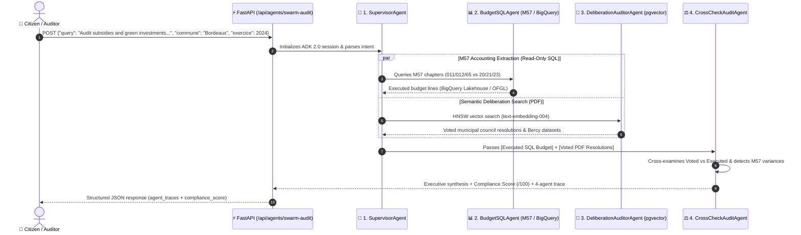

> 🇫🇷 **[Version Française](README.md)** | 🇬🇧 **[English Version](README-EN.md)** | 🎬 **[Step-by-Step Demo Playbook (DEMO_PLAYBOOK-EN.md)](docs/DEMO_PLAYBOOK-EN.md)** | 🚀 **[Live Demo](https://civiclens.hoffmannw.demo.altostrat.com)** | 🗺️ **[Dendrite v3.3 & Draw.io Diagrams](docs/architecture-gcpdraw.md)**

> 🗺️ **Executive Architecture Diagrams (Dendrite v3.3 Bento 16:9 & Draw.io)**: [**🎨 Launch in Dendrite Studio (1-Click) ↗**](https://dendrite-758054785671.cr.gclb.goog/#code=cmVuZGVyT3JkZXI6IG5vZGVzLWZpcnN0CmRpcmVjdGlvbjogZG93bgoKY29uc3QgR2NwQmx1ZSA9ICIjMWE3M2U4Igpjb25zdCBHY3BHcmVlbiA9ICIjMWU4ZTNlIgpjb25zdCBFbWVyYWxkVGVhbCA9ICIjMGQ5NDg4Igpjb25zdCBEYXJrU2xhdGUgPSAiIzIwMjEyNCIKY29uc3QgU3ViVGV4dCA9ICIjNWY2MzY4Igpjb25zdCBDYXJkQm9yZGVyID0gIiNkYWRjZTAiCmNvbnN0IEJ1c1N0cm9rZSA9ICIjMzM0MTU1Igpjb25zdCBTdXJmYWNlV2hpdGUgPSAiI2ZmZmZmZiIKClN0eWxlIEBHaG9zdCB7CiAgZmlsbDogdHJhbnNwYXJlbnQsIHN0cm9rZVdpZHRoOiAwLCBmb250Q29sb3I6IHRyYW5zcGFyZW50LCBwYWRkaW5nOiAwCn0KU3R5bGUgQEFyY2hpdGVjdHVyZVJvb3QgewogIGZpbGw6ICIjZjhmYWZkIiwgc3Ryb2tlQ29sb3I6ICIjYzJkN2Y1Iiwgc3Ryb2tlV2lkdGg6IDEuNSwgYm9yZGVyUmFkaXVzOiAxNiwKICBwYWRkaW5nOiAyMiwgZ2FwOiAxOCwgZm9udENvbG9yOiAiIzNjNDA0MyIsIGZvbnRTaXplOiAyMiwgbGFiZWxXZWlnaHQ6IGJvbGQsCiAgaWNvbjogIkdvb2dsZUNsb3VkIiwgaWNvblNpemU6IDI4Cn0KU3R5bGUgQFBlcmltZXRlclpvbmUgewogIGZpbGw6ICIjZThmMGZlIiwgc3Ryb2tlQ29sb3I6ICIjOGFiNGY4Iiwgc3Ryb2tlV2lkdGg6IDEuNSwgYm9yZGVyUmFkaXVzOiAxMiwKICBwYWRkaW5nOiAxNiwgZ2FwOiAxNiwgZm9udENvbG9yOiAkRGFya1NsYXRlLCBmb250U2l6ZTogMTUsIGxhYmVsV2VpZ2h0OiBib2xkCn0KU3R5bGUgQEV4ZWN1dGlvblpvbmUgewogIGZpbGw6ICIjZjNlOGZkIiwgc3Ryb2tlQ29sb3I6ICIjYzA4NGZjIiwgc3Ryb2tlV2lkdGg6IDEuNSwgYm9yZGVyUmFkaXVzOiAxMiwKICBwYWRkaW5nOiAxNiwgZ2FwOiAxNiwgZm9udENvbG9yOiAkRGFya1NsYXRlLCBmb250U2l6ZTogMTUsIGxhYmVsV2VpZ2h0OiBib2xkCn0KU3R5bGUgQEdvdmVybmFuY2Vab25lIHsKICBmaWxsOiAiI2U2ZjRlYSIsIHN0cm9rZUNvbG9yOiAiIzgxYzk5NSIsIHN0cm9rZVdpZHRoOiAxLjUsIGJvcmRlclJhZGl1czogMTIsCiAgcGFkZGluZzogMTYsIGdhcDogMTQsIGZvbnRDb2xvcjogJERhcmtTbGF0ZSwgZm9udFNpemU6IDE1LCBsYWJlbFdlaWdodDogYm9sZAp9ClN0eWxlIEBSZXNvdXJjZVpvbmUgewogIGZpbGw6ICIjZmVmN2UwIiwgc3Ryb2tlQ29sb3I6ICIjZmRlMjkzIiwgc3Ryb2tlV2lkdGg6IDEuNSwgYm9yZGVyUmFkaXVzOiAxMiwKICBwYWRkaW5nOiAxNiwgZ2FwOiAxNiwgZm9udENvbG9yOiAkRGFya1NsYXRlLCBmb250U2l6ZTogMTUsIGxhYmVsV2VpZ2h0OiBib2xkCn0KU3R5bGUgQFB1cnBsZVN1Ykdyb3VwIHsKICBmaWxsOiAiI2U5ZDVmZiIsIHN0cm9rZUNvbG9yOiBkYXJrZW4oIiNlOWQ1ZmYiLCAxNCksIHN0cm9rZVdpZHRoOiAxLCBib3JkZXJSYWRpdXM6IDEwLAogIHBhZGRpbmc6IDEyLCBnYXA6IDEwLCBmb250Q29sb3I6ICREYXJrU2xhdGUsIGZvbnRTaXplOiAxMywgbGFiZWxXZWlnaHQ6IGJvbGQKfQpTdHlsZSBAR3JlZW5TdWJHcm91cCB7CiAgZmlsbDogIiNjZWVhZDYiLCBzdHJva2VDb2xvcjogZGFya2VuKCIjY2VlYWQ2IiwgMTQpLCBzdHJva2VXaWR0aDogMSwgYm9yZGVyUmFkaXVzOiAxMCwKICBwYWRkaW5nOiAxMCwgZ2FwOiA3LCBmb250Q29sb3I6ICREYXJrU2xhdGUsIGZvbnRTaXplOiAxMywgbGFiZWxXZWlnaHQ6IGJvbGQKfQpTdHlsZSBAQW1iZXJTdWJHcm91cCB7CiAgZmlsbDogIiNmOWU0YTciLCBzdHJva2VDb2xvcjogZGFya2VuKCIjZjllNGE3IiwgMTQpLCBzdHJva2VXaWR0aDogMSwgYm9yZGVyUmFkaXVzOiAxMCwKICBwYWRkaW5nOiAxMiwgZ2FwOiAxMiwgZm9udENvbG9yOiAkRGFya1NsYXRlLCBmb250U2l6ZTogMTMsIGxhYmVsV2VpZ2h0OiBib2xkCn0KU3R5bGUgQEFjdG9yQ2FyZCB7CiAgd2lkdGg6IDE4MiwgaGVpZ2h0OiA1NiwKICBmaWxsOiAkU3VyZmFjZVdoaXRlLCBzdHJva2VDb2xvcjogJENhcmRCb3JkZXIsIHN0cm9rZVdpZHRoOiAxLCBib3JkZXJSYWRpdXM6IDgsCiAgZm9udENvbG9yOiAkRGFya1NsYXRlLCBzdWJGb250Q29sb3I6ICRTdWJUZXh0LAogIGZvbnRTaXplOiAxNCwgc3ViRm9udFNpemU6IDExLCBsYWJlbFdlaWdodDogYm9sZCwKICB0ZXh0QWxpZ246ICJsZWZ0IiwgdGV4dFZBbGlnbjogIm1pZGRsZSIsCiAgaWNvblBvc2l0aW9uOiAibGVmdCIsIGljb25TaXplOiAyOCwgcGFkZGluZzogMTAsIHNoYWRvdzogdHJ1ZQp9ClN0eWxlIEBQcm9kdWN0Q2FyZCB7CiAgd2lkdGg6IDE3MCwgaGVpZ2h0OiA1OCwKICBmaWxsOiAkU3VyZmFjZVdoaXRlLCBzdHJva2VDb2xvcjogJENhcmRCb3JkZXIsIHN0cm9rZVdpZHRoOiAxLCBib3JkZXJSYWRpdXM6IDgsCiAgZm9udENvbG9yOiAkRGFya1NsYXRlLCBzdWJGb250Q29sb3I6ICRTdWJUZXh0LAogIGZvbnRTaXplOiAxMy41LCBzdWJGb250U2l6ZTogMTAuNSwgbGFiZWxXZWlnaHQ6IGJvbGQsCiAgdGV4dEFsaWduOiAibGVmdCIsIHRleHRWQWxpZ246ICJtaWRkbGUiLAogIGljb25Qb3NpdGlvbjogImxlZnQiLCBpY29uU2l6ZTogMjYsIHBhZGRpbmc6IDEwLCBzaGFkb3c6IHRydWUKfQpTdHlsZSBAR2F0ZXdheUh1YkNhcmQgewogIGJhc2U6IEBQcm9kdWN0Q2FyZCwKICB3aWR0aDogMTk4LCBoZWlnaHQ6IDY2LCBzdHJva2VDb2xvcjogIiM3YzNhZWQiLCBzdHJva2VXaWR0aDogMiwKICBmb250U2l6ZTogMTQuNSwgc3ViRm9udFNpemU6IDExLCBpY29uU2l6ZTogMzAsIHBhZGRpbmc6IDEyCn0KU3R5bGUgQFBvbGljeVBpbGwgewogIHdpZHRoOiAyMzQsIGhlaWdodDogMzIsCiAgZmlsbDogJFN1cmZhY2VXaGl0ZSwgc3Ryb2tlQ29sb3I6ICIjOWFhMGE2Iiwgc3Ryb2tlV2lkdGg6IDEsIGJvcmRlclJhZGl1czogMTYsCiAgZm9udENvbG9yOiAkRGFya1NsYXRlLCBmb250U2l6ZTogMTIuNSwgbGFiZWxXZWlnaHQ6IGJvbGQsCiAgdGV4dEFsaWduOiAibGVmdCIsIHRleHRWQWxpZ246ICJtaWRkbGUiLAogIGljb25Qb3NpdGlvbjogImxlZnQiLCBpY29uU2l6ZTogMTYsIHBhZGRpbmc6IDEwLCBzaGFkb3c6IHRydWUKfQoKWm9uZSBAQ2l2aWNMZW5zX1BsYXRmb3JtIHsKICB0aXRsZTogIkNpdmljTGVucyDigJQgUHVibGljIEZpbmFuY2UgTTU3IE9ic2VydmF0b3J5ICYgR29vZ2xlIEFESyAyLjAgTXVsdGktQWdlbnQgU3dhcm0iCiAgc3R5bGU6IEBBcmNoaXRlY3R1cmVSb290CiAgbGF5b3V0OiBtYXRyaXgKICBhcmVhczogWwogICAgInoxIHoxIHoxIHoxIHoxIiwKICAgICJ6MyB6MyB6MyB6MiB6MiIsCiAgICAiejQgejQgejQgejQgejQiCiAgXQogIHNpemVzOiBbIjEuMDVmciIsICIxLjA1ZnIiLCAiMS4wNWZyIiwgIjAuOTJmciIsICIwLjkyZnIiXQogIGdhcDogMjAKCiAgWm9uZSBAWm9uZTFfSW5ncmVzcyB7CiAgICBhcmVhOiAiejEiCiAgICB0aXRsZTogIjEuIENpdGl6ZW4gJiBNdW5pY2lwYWwgUGVyaW1ldGVyIChaZXJvLVRydXN0IEVkZ2UgJiBJQVApIgogICAgc3R5bGU6IEBQZXJpbWV0ZXJab25lCiAgICBsYXlvdXQ6IHJvdywgZ2FwOiAxOCwgYWxpZ246IGNlbnRlciwganVzdGlmeTogY2VudGVyCiAgICBbY2l0aXplbnNfbWF5b3JzOiAiQ2l0aXplbnMgJiBNYXlvcnMiIHwgIjM1LDAwMCBNdW5pY2lwYWxpdGllcyJdIHsgc3R5bGU6IEBBY3RvckNhcmQsIGljb246ICJVc2VycyIgfQogICAgW2NsX2FybW9yX3dhZjogIkNsb3VkIEFybW9yIFdBRiIgfCAiQWRhcHRpdmUgRERvUyAmIE9XQVNQIl0geyBzdHlsZTogQFByb2R1Y3RDYXJkLCB3aWR0aDogMTg2LCBpY29uOiAiQ2xvdWRBcm1vciIgfQogICAgW2NsX2h0dHBzX2xiOiAiR2xvYmFsIEhUVFBTIExCIiB8ICJNYW5hZ2VkIFNTTCBJbmdyZXNzIl0geyBzdHlsZTogQFByb2R1Y3RDYXJkLCB3aWR0aDogMTg2LCBpY29uOiAiQ2xvdWRMb2FkQmFsYW5jaW5nIiB9CiAgICBbY2xfaWFwX2F1dGg6ICJJZGVudGl0eS1Bd2FyZSBQcm94eSIgfCAiQ3J5cHRvZ3JhcGhpYyBKV1QgSGVhZGVyIl0geyBzdHlsZTogQFByb2R1Y3RDYXJkLCB3aWR0aDogMTkyLCBpY29uOiAiR29vZ2xlSWRlbnRpdHkiIH0KICAgIFtjbF93ZWJfdWk6ICJDaXZpY0xlbnMgNS1UYWIgVUkiIHwgIk9ic2VydmF0b3J5IOKAoiBCaWdRdWVyeSDigKIgU3dhcm0iXSB7IHN0eWxlOiBAUHJvZHVjdENhcmQsIHdpZHRoOiAxOTgsIGljb246ICJMYXB0b3AiIH0KICB9CgogIFpvbmUgQFpvbmUzX0dLRV9Td2FybSB7CiAgICBhcmVhOiAiejMiCiAgICB0aXRsZTogIjIuIEdLRSBBdXRvcGlsb3QgUnVudGltZSAmIEdvb2dsZSBBREsgMi4wIDQtQWdlbnQgU3dhcm0gKFdvcmtsb2FkIElkZW50aXR5KSIKICAgIHN0eWxlOiBARXhlY3V0aW9uWm9uZQogICAgbGF5b3V0OiByb3csIGdhcDogMzQsIGFsaWduOiBjZW50ZXIsIGp1c3RpZnk6IGNlbnRlcgoKICAgIFtzdXBlcnZpc29yX2FnZW50OiAiMS4gU3VwZXJ2aXNvckFnZW50XG4oQURLIE9yY2hlc3RyYXRvcikiIHwgIkludGVudCAmIFRhc2sgUm91dGVyIl0gewogICAgICBzdHlsZTogQEdhdGV3YXlIdWJDYXJkLCBpY29uOiAiR29vZ2xlQWdlbnRzIiwKICAgICAgZGVzY3JpcHRpb246ICJDbGFzc2lmaWVzIGNpdmljICYgTTU3IGFjY291bnRpbmcgaW50ZW50IGFuZCBkZWxlZ2F0ZXMgdG8gc3BlY2lhbGl6ZWQgc3ViYWdlbnRzIgogICAgfQoKICAgIFpvbmUgQFNwZWNpYWxpc3RBZ2VudHNDb2wgewogICAgICBzdHlsZTogQEdob3N0LCBsYXlvdXQ6IGNvbHVtbiwgZ2FwOiAxMiwgYWxpZ246IHN0cmV0Y2gKCiAgICAgIFpvbmUgQERhdGFSZXRyaWV2YWxBZ2VudHMgewogICAgICAgIHRpdGxlOiAiUGFyYWxsZWwgUXVhbnRpdGF0aXZlICYgTGVnYWwgUmV0cmlldmFsIFN1YmFnZW50cyIKICAgICAgICBzdHlsZTogQFB1cnBsZVN1Ykdyb3VwLCB3aWR0aDogMzc2LCBsYXlvdXQ6IHJvdywgZ2FwOiAxMiwgYWxpZ246IGNlbnRlciwganVzdGlmeTogY2VudGVyCiAgICAgICAgW2J1ZGdldF9zcWxfYWdlbnQ6ICIyLiBCdWRnZXRTUUxBZ2VudCIgfCAiTTU3IEJpZ1F1ZXJ5ICsgT0ZHTCJdIHsgc3R5bGU6IEBQcm9kdWN0Q2FyZCwgd2lkdGg6IDE3NCwgaWNvbjogIkJpZ1F1ZXJ5IiB9CiAgICAgICAgW2RlbGliX2F1ZGl0b3JfYWdlbnQ6ICIzLiBEZWxpYmVyYXRpb25BdWRpdG9yIiB8ICJwZ3ZlY3RvciBQREYgKyBCZXJjeSJdIHsgc3R5bGU6IEBQcm9kdWN0Q2FyZCwgd2lkdGg6IDE3NCwgaWNvbjogIlNlYXJjaCIgfQogICAgICB9CgogICAgICBab25lIEBTeW50aGVzaXNBdWRpdEFnZW50IHsKICAgICAgICB0aXRsZTogIkNyb3NzLUV4YW1pbmF0aW9uICYgT2ZmaWNpYWwgUmVwb3J0IEdlbmVyYXRpb24iCiAgICAgICAgc3R5bGU6IEBQdXJwbGVTdWJHcm91cCwgZGFzaGVkOiB0cnVlLCB3aWR0aDogMzc2LCBsYXlvdXQ6IHJvdywgZ2FwOiAxMiwgYWxpZ246IGNlbnRlciwganVzdGlmeTogY2VudGVyCiAgICAgICAgW2Nyb3NzY2hlY2tfYWdlbnQ6ICI0LiBDcm9zc0NoZWNrQXVkaXQiIHwgIlZvdGVkIFBERiB2cy4gRXhlY3V0ZWQgU1FMIl0geyBzdHlsZTogQFByb2R1Y3RDYXJkLCB3aWR0aDogMTc0LCBpY29uOiAiU2hpZWxkQ2hlY2siIH0KICAgICAgICBbcGRmX3JlcG9ydF9nZW46ICJNNTcgUERGICYgU2NvcmUgLzEwMCIgfCAiUmVwb3J0TGFiICsgRmluT3BzIEJhZGdlIl0geyBzdHlsZTogQFByb2R1Y3RDYXJkLCB3aWR0aDogMTc0LCBpY29uOiAiQmFyQ2hhcnQzIiB9CiAgICAgIH0KICAgIH0KICB9CgogIFpvbmUgQFpvbmUyX0dvdmVybmFuY2UgewogICAgYXJlYTogInoyIgogICAgdGl0bGU6ICIzLiBNNTcgRGF0YSBHb3Zlcm5hbmNlICYgU292ZXJlaWduIEd1YXJkcmFpbHMiCiAgICBzdHlsZTogQEdvdmVybmFuY2Vab25lCiAgICBsYXlvdXQ6IHJvdywgZ2FwOiAyMCwgYWxpZ246IGNlbnRlciwganVzdGlmeTogY2VudGVyCgogICAgWm9uZSBATTU3R3VhcmRyYWlscyB7CiAgICAgIHRpdGxlOiAiTTU3IEFjY291bnRpbmcgJiBTZWN1cml0eSBSdWxlcyIKICAgICAgc3R5bGU6IEBHcmVlblN1Ykdyb3VwLCBsYXlvdXQ6IGNvbHVtbiwgZ2FwOiA4LCBhbGlnbjogY2VudGVyCiAgICAgIFtydWxlX3JlYWRvbmx5OiAiQmlnUXVlcnlUb29sc2V0IFNFTEVDVC1Pbmx5Il0geyBzdHlsZTogQFBvbGljeVBpbGwsIGljb246ICJMb2NrIiB9CiAgICAgIFtydWxlX201N19zZXA6ICJNNTcgT3AgKDAxMS8wMTIvNjUpIHZzIEludiAoMjAvMjEpIl0geyBzdHlsZTogQFBvbGljeVBpbGwsIGljb246ICJTaGllbGRDaGVjayIgfQogICAgICBbcnVsZV93aTogIktleWxlc3MgR0tFIFdvcmtsb2FkIElkZW50aXR5Il0geyBzdHlsZTogQFBvbGljeVBpbGwsIGljb246ICJHb29nbGVJZGVudGl0eSIgfQogICAgICBbcnVsZV9yZ3BkOiAiR0RQUiBBbm9ueW1pemF0aW9uICYgV09STSBEUiJdIHsgc3R5bGU6IEBQb2xpY3lQaWxsLCBpY29uOiAiU2VjdXJpdHlDb21tYW5kQ2VudGVyIiB9CiAgICB9CiAgfQoKICBab25lIEBab25lNF9MYWtlaG91c2UgewogICAgYXJlYTogIno0IgogICAgdGl0bGU6ICI0LiBTb3ZlcmVpZ24gRGF0YSBMYWtlaG91c2UsIEh5YnJpZCBWZWN0b3IgU3RvcmUgJiBOYXRpb25hbCBPcGVuIERhdGEgQVBJcyIKICAgIHN0eWxlOiBAUmVzb3VyY2Vab25lCiAgICBsYXlvdXQ6IG1hdHJpeCwgY29sczogMywgc2l6ZXM6IFsiMS4wNWZyIiwgIjEuMWZyIiwgIjAuOTVmciJdLCBnYXA6IDE4LCBhbGlnbjogY2VudGVyCgogICAgWm9uZSBAU3RydWN0dXJlZEZpbmFuY2VTdG9yZSB7CiAgICAgIHRpdGxlOiAiU3RydWN0dXJlZCBNNTcgQWNjb3VudGluZyBMYWtlaG91c2UiCiAgICAgIHN0eWxlOiBAQW1iZXJTdWJHcm91cCwgbGF5b3V0OiByb3csIGdhcDogMTIsIGFsaWduOiBjZW50ZXIsIGp1c3RpZnk6IGNlbnRlcgogICAgICBbYnFfbTU3X2xha2Vob3VzZTogIkJpZ1F1ZXJ5IExha2Vob3VzZSIgfCAiY2l2aWNsZW5zX2ZpbmFuY2VzIChNNTcpIl0geyBzdHlsZTogQFByb2R1Y3RDYXJkLCB3aWR0aDogMTc2LCBpY29uOiAiQmlnUXVlcnkiIH0KICAgICAgW2JlcmN5X29mZ2xfYXBpOiAiREdGaVAgLyBPRkdMICYgQmVyY3kiIHwgIjY1MCsgT3BlbiBEYXRhIERhdGFzZXRzIl0geyBzdHlsZTogQFByb2R1Y3RDYXJkLCB3aWR0aDogMTc4LCBpY29uOiAiR2xvYmUiIH0KICAgIH0KCiAgICBab25lIEBVbnN0cnVjdHVyZWRWZWN0b3JTdG9yZSB7CiAgICAgIHRpdGxlOiAiQ291bmNpbCBEZWxpYmVyYXRpb25zICYgTXVsdGltb2RhbCBSQUciCiAgICAgIHN0eWxlOiBAQW1iZXJTdWJHcm91cCwgbGF5b3V0OiByb3csIGdhcDogMTIsIGFsaWduOiBjZW50ZXIsIGp1c3RpZnk6IGNlbnRlcgogICAgICBbY2xvdWRzcWxfcGd2ZWN0b3I6ICJDbG91ZCBTUUwgUEcgMTYiIHwgInBndmVjdG9yIEhOU1cgKDc2OGQpIl0geyBzdHlsZTogQFByb2R1Y3RDYXJkLCB3aWR0aDogMTc0LCBpY29uOiAiQ2xvdWRTUUwiIH0KICAgICAgW2djc19wZGZfdmF1bHQ6ICJDbG91ZCBTdG9yYWdlIFZhdWx0IiB8ICJDb3VuY2lsIFBERiBBY3RzIl0geyBzdHlsZTogQFByb2R1Y3RDYXJkLCB3aWR0aDogMTcwLCBpY29uOiAiR2NwU3RvcmFnZUJ1Y2tldCIgfQogICAgfQoKICAgIFpvbmUgQFZlcnRleEFuZEJhY2t1cCB7CiAgICAgIHRpdGxlOiAiVmVydGV4IEFJICYgSW1tdXRhYmxlIERSIgogICAgICBzdHlsZTogQEFtYmVyU3ViR3JvdXAsIGxheW91dDogcm93LCBnYXA6IDEyLCBhbGlnbjogY2VudGVyLCBqdXN0aWZ5OiBjZW50ZXIKICAgICAgW3ZlcnRleF9nZW1pbmlfY2w6ICJWZXJ0ZXggQUkgR2VtaW5pIDMuNSIgfCAiVGV4dC10by1TUUwgJiBFbWJlZGRpbmdzIl0geyBzdHlsZTogQFByb2R1Y3RDYXJkLCB3aWR0aDogMTc4LCBpY29uOiAiVmVydGV4QUkiIH0KICAgICAgW2JhY2t1cF9kcl9jbDogIkJhY2t1cCAmIERSIFNlcnZpY2UiIHwgIk11bHRpLVJlZ2lvbiBXT1JNIFZhdWx0Il0geyBzdHlsZTogQFByb2R1Y3RDYXJkLCB3aWR0aDogMTc0LCBpY29uOiAiU2VjdXJpdHlDb21tYW5kQ2VudGVyIiB9CiAgICB9CiAgfQp9CgpbY2l0aXplbnNfbWF5b3JzXSAtLT4gW2NsX2FybW9yX3dhZl0geyBjb2xvcjogJEdjcEJsdWUsIHN0cm9rZVdpZHRoOiAyLCBzb3VyY2VBbmNob3I6ICJyaWdodCIsIHRhcmdldEFuY2hvcjogImxlZnQiLCBjdXJ2ZTogInN0ZXAiLCBzZXF1ZW5jZUJhZGdlOiAiMSIsIGJhZGdlRmlsbDogJEdjcEJsdWUsIGJhZGdlRm9udENvbG9yOiAkU3VyZmFjZVdoaXRlIH0KW2NsX2FybW9yX3dhZl0gLS0+IFtjbF9odHRwc19sYl0geyBjb2xvcjogJEdjcEJsdWUsIHN0cm9rZVdpZHRoOiAyLCBzb3VyY2VBbmNob3I6ICJyaWdodCIsIHRhcmdldEFuY2hvcjogImxlZnQiLCBjdXJ2ZTogInN0ZXAiIH0KW2NsX2h0dHBzX2xiXSAtLT4gW2NsX2lhcF9hdXRoXSB7IGNvbG9yOiAkR2NwQmx1ZSwgc3Ryb2tlV2lkdGg6IDIsIHNvdXJjZUFuY2hvcjogInJpZ2h0IiwgdGFyZ2V0QW5jaG9yOiAibGVmdCIsIGN1cnZlOiAic3RlcCIgfQpbY2xfaWFwX2F1dGhdIC0tPiBbY2xfd2ViX3VpXSB7IGNvbG9yOiAkR2NwQmx1ZSwgc3Ryb2tlV2lkdGg6IDIsIHNvdXJjZUFuY2hvcjogInJpZ2h0IiwgdGFyZ2V0QW5jaG9yOiAibGVmdCIsIGN1cnZlOiAic3RlcCIgfQoKW1pvbmUxX0luZ3Jlc3NdIC0tPiBbc3VwZXJ2aXNvcl9hZ2VudF0geyBjb2xvcjogIiM3YzNhZWQiLCBzdHJva2VXaWR0aDogMiwgc291cmNlQW5jaG9yOiAiYm90dG9tIiwgdGFyZ2V0QW5jaG9yOiAidG9wIiwgY3VydmU6ICJzdGVwIiwgbGFiZWw6ICJTd2FybSBBdWRpdCIsIHNlcXVlbmNlQmFkZ2U6ICIyIiwgYmFkZ2VGaWxsOiAiIzdjM2FlZCIsIGJhZGdlRm9udENvbG9yOiAkU3VyZmFjZVdoaXRlIH0KW3N1cGVydmlzb3JfYWdlbnRdIC0tPiBbRGF0YVJldHJpZXZhbEFnZW50c10geyBjb2xvcjogIiM3YzNhZWQiLCBzdHJva2VXaWR0aDogMiwgc291cmNlQW5jaG9yOiAicmlnaHQiLCB0YXJnZXRBbmNob3I6ICJsZWZ0IiwgY3VydmU6ICJzdGVwIiB9CltzdXBlcnZpc29yX2FnZW50XSAtLT4gW1N5bnRoZXNpc0F1ZGl0QWdlbnRdIHsgY29sb3I6ICIjN2MzYWVkIiwgc3Ryb2tlV2lkdGg6IDIsIHNvdXJjZUFuY2hvcjogInJpZ2h0IiwgdGFyZ2V0QW5jaG9yOiAibGVmdCIsIGN1cnZlOiAic3RlcCIgfQpbU3BlY2lhbGlzdEFnZW50c0NvbF0gLS0+IFtNNTdHdWFyZHJhaWxzXSB7IGNvbG9yOiAkR2NwR3JlZW4sIHN0cm9rZVdpZHRoOiAxLjgsIGRhc2hlZDogdHJ1ZSwgc291cmNlQW5jaG9yOiAicmlnaHQiLCB0YXJnZXRBbmNob3I6ICJsZWZ0IiwgY3VydmU6ICJzdGVwIiwgbGFiZWw6ICJFbmZvcmNlZCBCeSIgfQoKW1pvbmUzX0dLRV9Td2FybV0gLS0+IFtTdHJ1Y3R1cmVkRmluYW5jZVN0b3JlXSB7IGNvbG9yOiAkRW1lcmFsZFRlYWwsIHN0cm9rZVdpZHRoOiAyLCBzb3VyY2VBbmNob3I6ICJib3R0b20iLCB0YXJnZXRBbmNob3I6ICJ0b3AiLCBjdXJ2ZTogInN0ZXAiLCBsYWJlbDogIk01NyBTUUwgJiBBUEkiLCBzZXF1ZW5jZUJhZGdlOiAiMyIsIGJhZGdlRmlsbDogJEVtZXJhbGRUZWFsLCBiYWRnZUZvbnRDb2xvcjogJFN1cmZhY2VXaGl0ZSB9Cltab25lM19HS0VfU3dhcm1dIC0tPiBbVW5zdHJ1Y3R1cmVkVmVjdG9yU3RvcmVdIHsgY29sb3I6ICRHY3BCbHVlLCBzdHJva2VXaWR0aDogMiwgc291cmNlQW5jaG9yOiAiYm90dG9tIiwgdGFyZ2V0QW5jaG9yOiAidG9wIiwgY3VydmU6ICJzdGVwIiwgbGFiZWw6ICJwZ3ZlY3RvciBITlNXIiwgc2VxdWVuY2VCYWRnZTogIjQiLCBiYWRnZUZpbGw6ICRHY3BCbHVlLCBiYWRnZUZvbnRDb2xvcjogJFN1cmZhY2VXaGl0ZSB9Cltab25lMl9Hb3Zlcm5hbmNlXSAtLT4gW1ZlcnRleEFuZEJhY2t1cF0geyBjb2xvcjogJEJ1c1N0cm9rZSwgc3Ryb2tlV2lkdGg6IDEuOCwgZGFzaGVkOiB0cnVlLCBzb3VyY2VBbmNob3I6ICJib3R0b20iLCB0YXJnZXRBbmNob3I6ICJ0b3AiLCBjdXJ2ZTogInN0ZXAiLCBsYWJlbDogIkFEQyAmIFdPUk0iIH0K) · [`docs/diagrams/civiclens_adk_swarm_v3.dendrite`](docs/diagrams/civiclens_adk_swarm_v3.dendrite) · [`docs/diagrams/civiclens_adk_swarm_v3.drawio`](docs/diagrams/civiclens_adk_swarm_v3.drawio) · [`docs/architecture-gcpdraw.md`](docs/architecture-gcpdraw.md)
>
> 🔗 **EMEA SPARK Ecosystem:**
> This repository contains the **application source code and deployment manifests** for CivicLens. To deploy the underlying cloud infrastructure (Private GKE Autopilot, Cloud Armor WAF, IAP, Backup DR, FinOps), use the **[GCP AI Foundation Blueprint (cloud-gtm/gcp-ai-foundation-blueprint)](https://github.com/cloud-gtm/gcp-ai-foundation-blueprint)**.

# 🏛️ CivicLens Application (`app-civiclens`)

[](https://github.com/cloud-gtm/app-civiclens)
[](https://goto.google.com/emea-spark-overview-page)
[](https://github.com/cloud-gtm/app-civiclens)
[](https://github.com/cloud-gtm/gcp-ai-foundation-blueprint)

Citizen Artificial Intelligence & public decision-support platform on Google Cloud. **CivicLens** analyzes certified local public accounts (M14 / M57) across **100% of all 35,000 French municipalities (DGFiP & OFGL 2000-2025)**, ingests municipal council acts (PDF), and executes natural language decision-support queries using **Vertex AI Gemini**.

---

## 🌟 Key Application Features

- **Exhaustive Municipal Observatory:** 100% coverage of all 35,000 French cities, tracking debt evolution, operational rigidity, and gross savings capacity.
- **M57 PDF Executive Audit Generator:** On-the-fly, high-fidelity vector PDF generation ready for municipal commissions and financial committees.
- **Territorial Duel & Benchmark:** Side-by-side comparison with impartial strategic arbitration powered by **Gemini 2.5 Flash / Pro**.
- **BigQuery AI Lakehouse & Text-to-SQL:** Natural language queries compiled to GoogleSQL with zero-spill safeguards (100 MB max scan limit).
- **Hybrid Semantic Search & RAG:** Vector database with PostgreSQL (`pgvector` HNSW indexing) and Google Cloud embeddings (`text-embedding-005`).
- **Google ADK 2.0 Multi-Agent Audit Swarm:** Orchestration of 4 specialized agents (`SupervisorAgent`, `BudgetSQLAgent`, `DeliberationAuditorAgent`, `CrossCheckAuditAgent`) cross-examining voted municipal council resolutions (PDF) against executed M57 budget lines (SQL).

---

## 🏗️ Repository Layout

```text
app-civiclens/
├── .agents/                       # 🤖 Layer 1 Agentic Engineering (Subagents & M1L1 Skills)
│   ├── agents/                    # Subagents: data-governance-steward, fastapi-adk-architect
│   └── skills/                    # M1L1 Skill: civiclens-verification (SKILL.md + scripts/verify.sh)
├── AGENTS.md                      # Auto-discovery index for Jetski, Antigravity & Gemini CLI
│
├── src/                           # 🧠 Application Source Code (Layer 2 Production Runtime)
│   ├── backend/                   # FastAPI service (main.py) & ADK 2.0 Swarm (civic_swarm_adk.py)
│   ├── frontend/                  # Web UI & citizen explorer
│   ├── ingestion/                 # Open Data ingestion pipeline & PDF vision analysis
│   └── Dockerfile                 # Multi-stage optimized Docker build (Python 3.11-slim)
│
├── deploy/                        # 📦 Deployment Manifests
│   └── k8s/                       # GKE Autopilot manifests (Workload Identity, IAP, Ingress)
│
├── scripts/                       # ⚡ Automation Scripts
│   ├── deploy-to-blueprint.sh     # One-click deployment script targeting the GCP Blueprint
│   └── sync-gtm.sh                # Git synchronization script for cloud-gtm repository
│
└── docs/                          # 📚 Documentation
    └── DEPLOYMENT_GUIDE.md        # Comprehensive deployment and integration guide
```

---

## 🚀 Quick Deployment to Blueprint

If you already have provisioned the [GCP AI Foundation Blueprint](https://github.com/cloud-gtm/gcp-ai-foundation-blueprint):

```bash
# 1. Clone this application repository
git clone https://github.com/cloud-gtm/app-civiclens.git
cd app-civiclens

# 2. Deploy with a single command (Container build + manifest injection + kubectl apply via IAP Bastion)
./scripts/deploy-to-blueprint.sh --blueprint-dir=/path/to/gcp-ai-foundation-blueprint
```

For step-by-step manual deployment instructions, refer to the **[Deployment Guide](docs/DEPLOYMENT_GUIDE.md)**.

---

## 🔒 Security & Google Cloud Integration

- **Zero Static Credentials:** Fully authenticated via **Workload Identity** (no JSON service account keys).
- **Identity-Aware Proxy (IAP) Protection:** User authentication delegated to Google Cloud Edge, eliminating custom authentication code vulnerabilities.
- **WAF Security:** Shielded by **Google Cloud Armor** with OWASP Top 10 mitigation rules.

---

## 🤖 Dual-Layer Agentic Architecture (Google ADK 2.0 Swarm & M1L1 Skills)

This repository implements a **two-tier complementary Agentic AI architecture** for municipal public finance auditing (French M57 accounting standard):
- 🚀 **Layer 2 (Production Run-Time)**: A **4-Agent Google ADK 2.0 Swarm** (`src/backend/civic_swarm_adk.py`), exposed via FastAPI (`/api/agents/catalog` and `/api/agents/swarm-audit`) to cross-examine municipal budgets in real time.
- 🛠️ **Layer 1 (Engineering Build-Time)**: **2 Specialized Subagents and 1 M1L1 Skill** (`.agents/`), automatically discovered in the IDE/CLI to enforce M57/BigQuery data governance and GKE Workload Identity security.

### 🔄 Orchestration Diagram: How the 4 ADK 2.0 Agents Enter into Action

When a citizen or financial auditor submits a cross-audit request to `POST /api/agents/swarm-audit`, the **Google ADK 2.0 Swarm** executes the following workflow:



### 📊 Summary Matrix: Where and How Each Agent Operates

| Agent / Skill | Layer | Where does it live? | How / When does it enter into action? | Role & Added Value |
| :--- | :--- | :--- | :--- | :--- |
| **`SupervisorAgent`** | **Layer 2** *(Run-Time)* | `src/backend/civic_swarm_adk.py` | **Step 1** upon receiving a `POST /api/agents/swarm-audit` request. | Analyzes citizen/auditor intent, extracts target municipality and fiscal year, and orchestrates specialist subagents. |
| **`BudgetSQLAgent`** | **Layer 2** *(Run-Time)* | `src/backend/civic_swarm_adk.py` | **Step 2** invoked by `SupervisorAgent`. | Generates and executes **strictly read-only SQL (`SELECT`/`WITH`)** on BigQuery/OFGL, separating Operating (`011, 012, 65`) vs Investment (`20, 21, 23`) chapters. |
| **`DeliberationAuditorAgent`** | **Layer 2** *(Run-Time)* | `src/backend/civic_swarm_adk.py` | **Step 3** in parallel or sequence with `BudgetSQLAgent`. | Searches municipal council PDFs (`pgvector`) and Bercy Open Data to extract voted commitments. |
| **`CrossCheckAuditAgent`** | **Layer 2** *(Run-Time)* | `src/backend/civic_swarm_adk.py` | **Step 4** for compliance synthesis and scoring. | Cross-examines voted PDF resolutions against executed M57 SQL lines and computes a **Budget Compliance Score (`/100`)**. |
| **[`data-governance-steward`](.agents/agents/data-governance-steward.md)** | **Layer 1** *(Build-Time)* | `.agents/agents/data-governance-steward.md` | Inside **Jetski / Antigravity / Gemini CLI** when writing M57 SQL queries or modifying BigQuery/`pgvector` schemas. | Prevents mixing M57 operating and investment chapters, verifies BigQuery partitioning, and enforces GDPR anonymization. |
| **[`fastapi-adk-architect`](.agents/agents/fastapi-adk-architect.md)** | **Layer 1** *(Build-Time)* | `.agents/agents/fastapi-adk-architect.md` | Inside **Jetski / Antigravity / Gemini CLI** when updating `main.py`, `civic_swarm_adk.py`, or GKE manifests. | Audits Google ADK 2.0 orchestration, Pydantic schemas, and keyless **GKE Workload Identity** bindings. |
| **[`civiclens-verification`](.agents/skills/civiclens-verification/SKILL.md)** | **Layer 1** *(Gatekeeper)* | `.agents/skills/civiclens-verification/scripts/verify.sh` | Executed in the terminal before every `git commit` or GKE deployment. | Compiles all Python files (`py_compile`), verifies the 4 ADK 2.0 agents, checks K8s manifests, and cleans up `__pycache__`. |

### 🎬 Live Demo Playbook: Triggering the ADK 2.0 Swarm Step-by-Step

1. **Step 1 — Inspect the 4-Agent ADK 2.0 Catalog (`GET /api/agents/catalog`)**:
   - Via the interactive Swagger UI (**`/docs`**) or terminal:
     ```bash
     curl -s http://localhost:8000/api/agents/catalog | jq .
     ```
   - Returns the `google-adk-2.0` topology, the 4 specialized agents (`SupervisorAgent`, `BudgetSQLAgent`, `DeliberationAuditorAgent`, `CrossCheckAuditAgent`), and their bound tools.

2. **Step 2 — Execute a Cross-Examined M57 Budget Audit (`POST /api/agents/swarm-audit`)**:
   ```bash
   curl -s -X POST http://localhost:8000/api/agents/swarm-audit \
     -H "Content-Type: application/json" \
     -d '{
       "query": "Cross-check voted municipal council subsidies against executed chapter 65 operating expenses",
       "commune": "Bordeaux",
       "exercice": 2024
     }' | jq .
   ```
   - **What to highlight in the JSON output**:
     - The `agent_traces` array showing each of the **4 agents** entering into action (`status: completed`, read-only M57 SQL query, retrieved council deliberations).
     - The `compliance_score` (`/100`) and executive audit synthesis generated by Gemini.

3. **Step 3 — Showcase the Build-Time Engineering Subagents & M1L1 Gatekeeper (IDE / CLI)**:
   - In **Jetski / Antigravity / Gemini CLI**, copy-paste:
     > `"Invoke data-governance-steward to verify that BudgetSQLAgent queries in src/backend/civic_swarm_adk.py strictly separate M57 operating chapters (011, 012, 65) from investment chapters (20, 21, 23)."`
   - Run the M1L1 gatekeeper script:
     ```bash
     ./.agents/skills/civiclens-verification/scripts/verify.sh
     ```

---

## 📄 License
Apache License 2.0. See [LICENSE](LICENSE) for more details.


