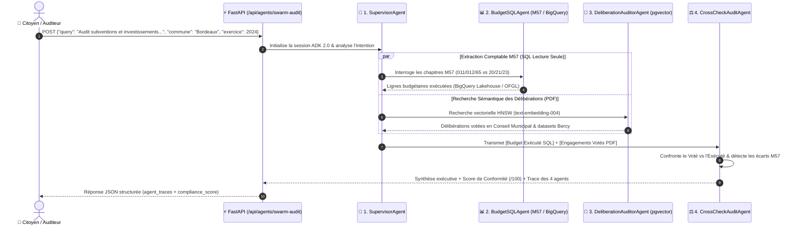

> 🇫🇷 **[Version Française](README.md)** | 🇬🇧 **[English Version](README-EN.md)**
>
> 🔗 **Écosystème EMEA SPARK :**
> Ce dépôt contient le **code source et les manifests applicatifs** de CivicLens. Pour déployer l'infrastructure cloud sous-jacente (GKE Autopilot privé, Cloud Armor WAF, IAP, Backup DR, FinOps), utilisez le **[GCP AI Foundation Blueprint (cloud-gtm/gcp-ai-foundation-blueprint)](https://github.com/cloud-gtm/gcp-ai-foundation-blueprint)**.

# 🏛️ CivicLens Application (`app-civiclens`)

[](https://github.com/cloud-gtm/app-civiclens)
[](https://goto.google.com/emea-spark-overview-page)
[](https://github.com/cloud-gtm/app-civiclens)
[](https://github.com/cloud-gtm/gcp-ai-foundation-blueprint)

Plateforme d'Intelligence Artificielle citoyenne et d'aide à la décision publique sur Google Cloud. **CivicLens** permet d'analyser en temps réel les comptes administratifs et balances comptables (M14 / M57) de **100% des 35 000 communes françaises (DGFiP & OFGL 2000-2025)**, d'ingérer des délibérations municipales (PDF) et d'effectuer des requêtes décisionnelles en langage naturel via **Vertex AI Gemini**.

---

## 🌟 Fonctionnalités Clés de l'Application

- **Observatoire Financier Intégral :** 35 000 communes françaises couvertes, évolution de la dette, rigidité des charges et capacité d'autofinancement (épargne brute).
- **Générateur de Rapports PDF M57 :** Synthèse d'audit haute-fidélité générée à la volée, prête pour les commissions municipales.
- **Benchmark & Duel de Communes :** Comparaison côte-à-côte avec arbitrage stratégique impartial rédigé par **Gemini 2.5 Flash / Pro**.
- **Data Lakehouse BigQuery Text-to-SQL :** Requêtage analytique en langage naturel directement traduit en GoogleSQL sécurisé avec garde-fou anti-surcoût (100 Mo max scan).
- **Recherche Sémantique Hybride & RAG :** Base vectorielle PostgreSQL (`pgvector` avec index HNSW) couplée aux modèles d'embedding Google Cloud (`text-embedding-005`).
- **Swarm d'Audit Multi-Agents (Google ADK 2.0) :** Orchestration de 4 agents spécialisés (`SupervisorAgent`, `BudgetSQLAgent`, `DeliberationAuditorAgent`, `CrossCheckAuditAgent`) croisant le budget voté en délibération (PDF) avec le budget exécuté en comptabilité M57 (SQL).

---

## 🏗️ Structure du Dépôt

```text
app-civiclens/
├── .agents/                       # 🤖 Architecture Agentique Couche 1 (Ingénierie & M1L1 Skills)
│   ├── agents/                    # Sous-agents : data-governance-steward, fastapi-adk-architect
│   └── skills/                    # Skill M1L1 : civiclens-verification (SKILL.md + scripts/verify.sh)
├── AGENTS.md                      # Point d'entrée de découverte automatique (Jetski / Antigravity / Gemini CLI)
│
├── src/                           # 🧠 Code Source Applicatif (Couche 2 Runtime)
│   ├── backend/                   # API FastAPI (main.py) & Swarm ADK 2.0 (civic_swarm_adk.py)
│   ├── frontend/                  # Interface web citoyenne & explorateur
│   ├── ingestion/                 # Pipeline Open Data (data.gouv.fr) & analyse vision PDF
│   └── Dockerfile                 # Image multi-stage optimisée (Python 3.11-slim)
│
├── deploy/                        # 📦 Manifests de Déploiement
│   └── k8s/                       # Manifests GKE Autopilot (Workload Identity, IAP, Ingress)
│
├── scripts/                       # ⚡ Scripts d'Automatisation
│   ├── deploy-to-blueprint.sh     # Déploiement "One-Click" sur le Blueprint GCP
│   └── sync-gtm.sh                # Synchronisation Git vers le dépôt officiel cloud-gtm
│
└── docs/                          # 📚 Documentation Technique
    └── DEPLOYMENT_GUIDE.md        # Guide complet de déploiement et d'intégration
```

---

## 🚀 Déploiement Rapide sur le Blueprint

Si vous avez déjà déployé le [GCP AI Foundation Blueprint](https://github.com/cloud-gtm/gcp-ai-foundation-blueprint) :

```bash
# 1. Cloner ce dépôt applicatif
git clone https://github.com/cloud-gtm/app-civiclens.git
cd app-civiclens

# 2. Déployer en une commande (build conteneur + injection manifests + kubectl apply via Bastion IAP)
./scripts/deploy-to-blueprint.sh --blueprint-dir=/chemin/vers/gcp-ai-foundation-blueprint
```

Pour les instructions détaillées de déploiement manuel ou pas-à-pas, consultez le **[Guide de Déploiement](docs/DEPLOYMENT_GUIDE.md)**.

---

## 🔒 Sécurité & Intégration Google Cloud

- **Zéro Clé Statique :** L'application utilise nativement **Workload Identity** pour s'authentifier auprès de Vertex AI, BigQuery et Cloud Storage.
- **Accès Sécurisé par IAP :** L'accès web est protégé en amont par **Identity-Aware Proxy (IAP)**, garantissant une authentification Google Workspace sans exposition directe de code d'authentification.
- **Résilience WAF :** Protégé par **Google Cloud Armor** contre les attaques du Top 10 OWASP.

---

## 🤖 Architecture Agentique Dual-Layer (Swarm Google ADK 2.0 & M1L1 Skills)

Ce dépôt implémente une architecture agentique à **deux niveaux complémentaires** pour l'audit des finances publiques municipales (nomenclature M57) :
- 🚀 **Couche 2 (Run-Time en Production)** : Un **Swarm de 4 Agents Google ADK 2.0** (`src/backend/civic_swarm_adk.py`), exposé par FastAPI (`/api/agents/catalog` et `/api/agents/swarm-audit`) pour auditer et croiser les budgets municipaux.
- 🛠️ **Couche 1 (Build-Time en Ingénierie)** : **2 Sous-Agents spécialisés et 1 Skill M1L1** (`.agents/`), découverts automatiquement dans l'IDE/CLI pour garantir la gouvernance M57/BigQuery et la conformité GKE Workload Identity.

### 🔄 Diagramme d'Orchestration : Comment les 4 Agents ADK 2.0 entrent en action

Lorsqu'un auditeur ou citoyen soumet une requête d'audit croisé sur `POST /api/agents/swarm-audit`, voici le flux d'orchestration exécuté par le **Swarm Google ADK 2.0** :



### 📊 Matrice Récapitulative : Où et Comment chaque Agent intervient

| Agent / Skill | Couche | Où vit-il ? | Comment / Quand entre-t-il en action ? | Rôle & Valeur ajoutée |
| :--- | :--- | :--- | :--- | :--- |
| **`SupervisorAgent`** | **Couche 2** *(Run-Time)* | `src/backend/civic_swarm_adk.py` | **Étape 1** lors d'un appel `POST /api/agents/swarm-audit`. | Analyse la question citoyenne, identifie la commune et l'exercice, et orchestre les sous-agents spécialisés. |
| **`BudgetSQLAgent`** | **Couche 2** *(Run-Time)* | `src/backend/civic_swarm_adk.py` | **Étape 2** appelé par le `SupervisorAgent`. | Génère et exécute du SQL **strictement en lecture seule (`SELECT`/`WITH`)** sur BigQuery/OFGL en séparant Fonctionnement (`011, 012, 65`) et Investissement (`20, 21, 23`). |
| **`DeliberationAuditorAgent`** | **Couche 2** *(Run-Time)* | `src/backend/civic_swarm_adk.py` | **Étape 3** en parallèle ou à la suite du `BudgetSQLAgent`. | Fouille les délibérations municipales PDF (`pgvector`) et le catalogue Open Data Bercy pour extraire les montants votés. |
| **`CrossCheckAuditAgent`** | **Couche 2** *(Run-Time)* | `src/backend/civic_swarm_adk.py` | **Étape 4** de synthèse et contrôle de conformité. | Croise les engagements votés (PDF) avec les paiements exécutés (SQL M57) et attribue un **Score de Conformité Budgétaire (`/100`)**. |
| **[`data-governance-steward`](.agents/agents/data-governance-steward.md)** | **Couche 1** *(Build-Time)* | `.agents/agents/data-governance-steward.md` | Dans **Jetski / Antigravity / Gemini CLI** lors de la modification de requêtes SQL M57 ou du schéma BigQuery/`pgvector`. | Vérifie la non-confusion entre chapitres M57 de fonctionnement et d'investissement, le partitionnement BigQuery et l'anonymisation RGPD. |
| **[`fastapi-adk-architect`](.agents/agents/fastapi-adk-architect.md)** | **Couche 1** *(Build-Time)* | `.agents/agents/fastapi-adk-architect.md` | Dans **Jetski / Antigravity / Gemini CLI** lors de l'évolution de `main.py`, `civic_swarm_adk.py` ou des manifests GKE. | Audite l'orchestration Google ADK 2.0, le typage Pydantic et les liaisons **GKE Workload Identity** (zéro clé JSON). |
| **[`civiclens-verification`](.agents/skills/civiclens-verification/SKILL.md)** | **Couche 1** *(Gatekeeper)* | `.agents/skills/civiclens-verification/scripts/verify.sh` | Exécuté dans le terminal avant chaque `git commit` ou déploiement GKE. | Compile tous les fichiers Python (`py_compile`), vérifie l'intégrité des 4 agents ADK 2.0, contrôle les manifests K8s et purge les `__pycache__`. |

### 🎬 Playbook de Démo Live : Déclencher le Swarm ADK 2.0 en Direct

1. **Étape 1 — Inspecter le Catalogue des 4 Agents ADK 2.0 (`GET /api/agents/catalog`)** :
   - Depuis le portail Swagger (**`/docs`**) ou en ligne de commande :
     ```bash
     curl -s http://localhost:8000/api/agents/catalog | jq .
     ```
   - Retourne la topologie `google-adk-2.0`, la liste des 4 agents (`SupervisorAgent`, `BudgetSQLAgent`, `DeliberationAuditorAgent`, `CrossCheckAuditAgent`) et leurs outils associés.

2. **Étape 2 — Lancer un Audit Budgétaire Croisé M57 (`POST /api/agents/swarm-audit`)** :
   ```bash
   curl -s -X POST http://localhost:8000/api/agents/swarm-audit \
     -H "Content-Type: application/json" \
     -d '{
       "query": "Vérifie la conformité entre les subventions votées en conseil municipal et les dépenses exécutées au chapitre 65",
       "commune": "Bordeaux",
       "exercice": 2024
     }' | jq .
   ```
   - **Ce qu'il faut montrer dans la réponse JSON** :
     - Le tableau `agent_traces` détaillant l'action séquentielle des **4 agents** (`status: completed`, requête SQL M57 générée, délibérations trouvées).
     - L'indicateur `compliance_score` (`/100`) et le rapport exécutif généré par Gemini.

3. **Étape 3 — Démontrer les Agents d'Ingénierie & le Gatekeeper M1L1 (IDE / CLI)** :
   - Dans **Jetski / Antigravity / Gemini CLI**, copiez-collez :
     > `"Invoque data-governance-steward pour vérifier que les requêtes SQL de BudgetSQLAgent dans src/backend/civic_swarm_adk.py séparent strictement les chapitres M57 de fonctionnement (011, 012, 65) et d'investissement (20, 21, 23)."`
   - Puis lancez le script gatekeeper M1L1 :
     ```bash
     ./.agents/skills/civiclens-verification/scripts/verify.sh
     ```

---

## 📄 Licence
Apache License 2.0. Voir [LICENSE](LICENSE) pour plus d'informations.


