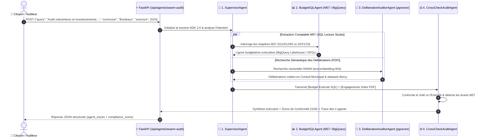

> 🇫🇷 **[Version Française](README.md)** | 🇬🇧 **[English Version](README-EN.md)** | 🎬 **[Guide de Démo Pas-à-Pas (DEMO_PLAYBOOK.md)](docs/DEMO_PLAYBOOK.md)** | 🚀 **[Démo Live](https://civiclens.hoffmannw.demo.altostrat.com)** | 🗺️ **[Schémas Dendrite v3.3 & Draw.io](docs/architecture-gcpdraw.md)**

> 🗺️ **Schémas d'Architecture Exécutifs (Dendrite v3.3 Bento 16:9 & Draw.io)** : [**🎨 Ouvrir dans Dendrite Studio (1-Click) ↗**](https://dendrite-758054785671.cr.gclb.goog/#code=cmVuZGVyT3JkZXI6IG5vZGVzLWZpcnN0CmRpcmVjdGlvbjogZG93bgoKY29uc3QgR2NwQmx1ZSA9ICIjMWE3M2U4Igpjb25zdCBHY3BHcmVlbiA9ICIjMWU4ZTNlIgpjb25zdCBFbWVyYWxkVGVhbCA9ICIjMGQ5NDg4Igpjb25zdCBEYXJrU2xhdGUgPSAiIzIwMjEyNCIKY29uc3QgU3ViVGV4dCA9ICIjNWY2MzY4Igpjb25zdCBDYXJkQm9yZGVyID0gIiNkYWRjZTAiCmNvbnN0IEJ1c1N0cm9rZSA9ICIjMzM0MTU1Igpjb25zdCBTdXJmYWNlV2hpdGUgPSAiI2ZmZmZmZiIKClN0eWxlIEBHaG9zdCB7CiAgZmlsbDogdHJhbnNwYXJlbnQsIHN0cm9rZVdpZHRoOiAwLCBmb250Q29sb3I6IHRyYW5zcGFyZW50LCBwYWRkaW5nOiAwCn0KU3R5bGUgQEFyY2hpdGVjdHVyZVJvb3QgewogIGZpbGw6ICIjZjhmYWZkIiwgc3Ryb2tlQ29sb3I6ICIjYzJkN2Y1Iiwgc3Ryb2tlV2lkdGg6IDEuNSwgYm9yZGVyUmFkaXVzOiAxNiwKICBwYWRkaW5nOiAyMiwgZ2FwOiAxOCwgZm9udENvbG9yOiAiIzNjNDA0MyIsIGZvbnRTaXplOiAyMiwgbGFiZWxXZWlnaHQ6IGJvbGQsCiAgaWNvbjogIkdvb2dsZUNsb3VkIiwgaWNvblNpemU6IDI4Cn0KU3R5bGUgQFBlcmltZXRlclpvbmUgewogIGZpbGw6ICIjZThmMGZlIiwgc3Ryb2tlQ29sb3I6ICIjOGFiNGY4Iiwgc3Ryb2tlV2lkdGg6IDEuNSwgYm9yZGVyUmFkaXVzOiAxMiwKICBwYWRkaW5nOiAyMCwgZ2FwOiAxOCwgZm9udENvbG9yOiAkRGFya1NsYXRlLCBmb250U2l6ZTogMTUsIGxhYmVsV2VpZ2h0OiBib2xkCn0KU3R5bGUgQEV4ZWN1dGlvblpvbmUgewogIGZpbGw6ICIjZjNlOGZkIiwgc3Ryb2tlQ29sb3I6ICIjYzA4NGZjIiwgc3Ryb2tlV2lkdGg6IDEuNSwgYm9yZGVyUmFkaXVzOiAxMiwKICBwYWRkaW5nOiAyMCwgZ2FwOiAxOCwgZm9udENvbG9yOiAkRGFya1NsYXRlLCBmb250U2l6ZTogMTUsIGxhYmVsV2VpZ2h0OiBib2xkCn0KU3R5bGUgQEdvdmVybmFuY2Vab25lIHsKICBmaWxsOiAiI2U2ZjRlYSIsIHN0cm9rZUNvbG9yOiAiIzgxYzk5NSIsIHN0cm9rZVdpZHRoOiAxLjUsIGJvcmRlclJhZGl1czogMTIsCiAgcGFkZGluZzogMTYsIGdhcDogMTQsIGZvbnRDb2xvcjogJERhcmtTbGF0ZSwgZm9udFNpemU6IDE1LCBsYWJlbFdlaWdodDogYm9sZAp9ClN0eWxlIEBSZXNvdXJjZVpvbmUgewogIGZpbGw6ICIjZmVmN2UwIiwgc3Ryb2tlQ29sb3I6ICIjZmRlMjkzIiwgc3Ryb2tlV2lkdGg6IDEuNSwgYm9yZGVyUmFkaXVzOiAxMiwKICBwYWRkaW5nOiAyMCwgZ2FwOiAxOCwgZm9udENvbG9yOiAkRGFya1NsYXRlLCBmb250U2l6ZTogMTUsIGxhYmVsV2VpZ2h0OiBib2xkCn0KU3R5bGUgQFB1cnBsZVN1Ykdyb3VwIHsKICBmaWxsOiAiI2U5ZDVmZiIsIHN0cm9rZUNvbG9yOiBkYXJrZW4oIiNlOWQ1ZmYiLCAxNCksIHN0cm9rZVdpZHRoOiAxLCBib3JkZXJSYWRpdXM6IDEwLAogIHBhZGRpbmc6IDE2LCBnYXA6IDEyLCBmb250Q29sb3I6ICREYXJrU2xhdGUsIGZvbnRTaXplOiAxMywgbGFiZWxXZWlnaHQ6IGJvbGQKfQpTdHlsZSBAR3JlZW5TdWJHcm91cCB7CiAgZmlsbDogIiNjZWVhZDYiLCBzdHJva2VDb2xvcjogZGFya2VuKCIjY2VlYWQ2IiwgMTQpLCBzdHJva2VXaWR0aDogMSwgYm9yZGVyUmFkaXVzOiAxMCwKICBwYWRkaW5nOiAxMCwgZ2FwOiA3LCBmb250Q29sb3I6ICREYXJrU2xhdGUsIGZvbnRTaXplOiAxMywgbGFiZWxXZWlnaHQ6IGJvbGQKfQpTdHlsZSBAQW1iZXJTdWJHcm91cCB7CiAgZmlsbDogIiNmOWU0YTciLCBzdHJva2VDb2xvcjogZGFya2VuKCIjZjllNGE3IiwgMTQpLCBzdHJva2VXaWR0aDogMSwgYm9yZGVyUmFkaXVzOiAxMCwKICBwYWRkaW5nOiAxNiwgZ2FwOiAxMiwgZm9udENvbG9yOiAkRGFya1NsYXRlLCBmb250U2l6ZTogMTMsIGxhYmVsV2VpZ2h0OiBib2xkCn0KU3R5bGUgQEFjdG9yQ2FyZCB7CiAgd2lkdGg6IDE4MiwgaGVpZ2h0OiA1NiwKICBmaWxsOiAkU3VyZmFjZVdoaXRlLCBzdHJva2VDb2xvcjogJENhcmRCb3JkZXIsIHN0cm9rZVdpZHRoOiAxLCBib3JkZXJSYWRpdXM6IDgsCiAgZm9udENvbG9yOiAkRGFya1NsYXRlLCBzdWJGb250Q29sb3I6ICRTdWJUZXh0LAogIGZvbnRTaXplOiAxMi41LCBzdWJGb250U2l6ZTogMTAsIGxhYmVsV2VpZ2h0OiBib2xkLAogIHRleHRBbGlnbjogImxlZnQiLCB0ZXh0VkFsaWduOiAibWlkZGxlIiwKICBpY29uUG9zaXRpb246ICJsZWZ0IiwgaWNvblNpemU6IDI4LCBwYWRkaW5nOiAxMCwgc2hhZG93OiB0cnVlCn0KU3R5bGUgQFByb2R1Y3RDYXJkIHsKICB3aWR0aDogMTcwLCBoZWlnaHQ6IDU4LAogIGZpbGw6ICRTdXJmYWNlV2hpdGUsIHN0cm9rZUNvbG9yOiAkQ2FyZEJvcmRlciwgc3Ryb2tlV2lkdGg6IDEsIGJvcmRlclJhZGl1czogOCwKICBmb250Q29sb3I6ICREYXJrU2xhdGUsIHN1YkZvbnRDb2xvcjogJFN1YlRleHQsCiAgZm9udFNpemU6IDEyLjUsIHN1YkZvbnRTaXplOiAxMCwgbGFiZWxXZWlnaHQ6IGJvbGQsCiAgdGV4dEFsaWduOiAibGVmdCIsIHRleHRWQWxpZ246ICJtaWRkbGUiLAogIGljb25Qb3NpdGlvbjogImxlZnQiLCBpY29uU2l6ZTogMjYsIHBhZGRpbmc6IDEwLCBzaGFkb3c6IHRydWUKfQpTdHlsZSBAR2F0ZXdheUh1YkNhcmQgewogIGJhc2U6IEBQcm9kdWN0Q2FyZCwKICB3aWR0aDogMTk4LCBoZWlnaHQ6IDY2LCBzdHJva2VDb2xvcjogIiM3YzNhZWQiLCBzdHJva2VXaWR0aDogMiwKICBmb250U2l6ZTogMTQuNSwgc3ViRm9udFNpemU6IDExLCBpY29uU2l6ZTogMzAsIHBhZGRpbmc6IDEyCn0KU3R5bGUgQFBvbGljeVBpbGwgewogIHdpZHRoOiAyMzQsIGhlaWdodDogMzIsCiAgZmlsbDogJFN1cmZhY2VXaGl0ZSwgc3Ryb2tlQ29sb3I6ICIjOWFhMGE2Iiwgc3Ryb2tlV2lkdGg6IDEsIGJvcmRlclJhZGl1czogMTYsCiAgZm9udENvbG9yOiAkRGFya1NsYXRlLCBmb250U2l6ZTogMTIuNSwgbGFiZWxXZWlnaHQ6IGJvbGQsCiAgdGV4dEFsaWduOiAibGVmdCIsIHRleHRWQWxpZ246ICJtaWRkbGUiLAogIGljb25Qb3NpdGlvbjogImxlZnQiLCBpY29uU2l6ZTogMTYsIHBhZGRpbmc6IDEwLCBzaGFkb3c6IHRydWUKfQoKWm9uZSBAQ2l2aWNMZW5zX1BsYXRmb3JtIHsKICB0aXRsZTogIkNpdmljTGVucyDigJQgUHVibGljIEZpbmFuY2UgTTU3IE9ic2VydmF0b3J5ICYgR29vZ2xlIEFESyAyLjAgTXVsdGktQWdlbnQgU3dhcm0iCiAgc3R5bGU6IEBBcmNoaXRlY3R1cmVSb290CiAgbGF5b3V0OiBtYXRyaXgKICBhcmVhczogWwogICAgInoxIHoxIHoxIHoxIHoxIiwKICAgICJ6MyB6MyB6MyB6MiB6MiIsCiAgICAiejQgejQgejQgejQgejQiCiAgXQogIHNpemVzOiBbIjEuMDVmciIsICIxLjA1ZnIiLCAiMS4wNWZyIiwgIjAuOTJmciIsICIwLjkyZnIiXQogIGdhcDogMjAKCiAgWm9uZSBAWm9uZTFfSW5ncmVzcyB7CiAgICBhcmVhOiAiejEiCiAgICB0aXRsZTogIjEuIENpdGl6ZW4gJiBNdW5pY2lwYWwgUGVyaW1ldGVyIChaZXJvLVRydXN0IEVkZ2UgJiBJQVApIgogICAgc3R5bGU6IEBQZXJpbWV0ZXJab25lCiAgICBsYXlvdXQ6IHJvdywgZ2FwOiAxOCwgYWxpZ246IGNlbnRlciwganVzdGlmeTogY2VudGVyCiAgICBbY2l0aXplbnNfbWF5b3JzOiAiQ2l0aXplbnMgJiBNYXlvcnMiIHwgIjM1LDAwMCBNdW5pY2lwYWxpdGllcyJdIHsgc3R5bGU6IEBBY3RvckNhcmQsIGljb246ICJVc2VycyIgfQogICAgW2NsX2FybW9yX3dhZjogIkNsb3VkIEFybW9yIFdBRiIgfCAiQWRhcHRpdmUgRERvUyAmIE9XQVNQIl0geyBzdHlsZTogQFByb2R1Y3RDYXJkLCB3aWR0aDogMTg2LCBpY29uOiAiQ2xvdWRBcm1vciIgfQogICAgW2NsX2h0dHBzX2xiOiAiR2xvYmFsIEhUVFBTIExCIiB8ICJNYW5hZ2VkIFNTTCBJbmdyZXNzIl0geyBzdHlsZTogQFByb2R1Y3RDYXJkLCB3aWR0aDogMTg2LCBpY29uOiAiQ2xvdWRMb2FkQmFsYW5jaW5nIiB9CiAgICBbY2xfaWFwX2F1dGg6ICJJZGVudGl0eS1Bd2FyZSBQcm94eSIgfCAiQ3J5cHRvZ3JhcGhpYyBKV1QgSGVhZGVyIl0geyBzdHlsZTogQFByb2R1Y3RDYXJkLCB3aWR0aDogMTkyLCBpY29uOiAiR29vZ2xlSWRlbnRpdHkiIH0KICAgIFtjbF93ZWJfdWk6ICJDaXZpY0xlbnMgNS1UYWIgVUkiIHwgIk9ic2VydmF0b3J5IOKAoiBCaWdRdWVyeSDigKIgU3dhcm0iXSB7IHN0eWxlOiBAUHJvZHVjdENhcmQsIHdpZHRoOiAxOTgsIGljb246ICJMYXB0b3AiIH0KICB9CgogIFpvbmUgQFpvbmUzX0dLRV9Td2FybSB7CiAgICBhcmVhOiAiejMiCiAgICB0aXRsZTogIjIuIEdLRSBBdXRvcGlsb3QgUnVudGltZSAmIEdvb2dsZSBBREsgMi4wIDQtQWdlbnQgU3dhcm0gKFdvcmtsb2FkIElkZW50aXR5KSIKICAgIHN0eWxlOiBARXhlY3V0aW9uWm9uZQogICAgbGF5b3V0OiByb3csIGdhcDogMzQsIGFsaWduOiBjZW50ZXIsIGp1c3RpZnk6IGNlbnRlcgoKICAgIFtzdXBlcnZpc29yX2FnZW50OiAiMS4gU3VwZXJ2aXNvckFnZW50XG4oQURLIE9yY2hlc3RyYXRvcikiIHwgIkludGVudCAmIFRhc2sgUm91dGVyIl0gewogICAgICBzdHlsZTogQEdhdGV3YXlIdWJDYXJkLCBpY29uOiAiR29vZ2xlQWdlbnRzIiwKICAgICAgZGVzY3JpcHRpb246ICJDbGFzc2lmaWVzIGNpdmljICYgTTU3IGFjY291bnRpbmcgaW50ZW50IGFuZCBkZWxlZ2F0ZXMgdG8gc3BlY2lhbGl6ZWQgc3ViYWdlbnRzIgogICAgfQoKICAgIFpvbmUgQFNwZWNpYWxpc3RBZ2VudHNDb2wgewogICAgICBzdHlsZTogQEdob3N0LCBsYXlvdXQ6IGNvbHVtbiwgZ2FwOiAxMiwgYWxpZ246IHN0cmV0Y2gKCiAgICAgIFpvbmUgQERhdGFSZXRyaWV2YWxBZ2VudHMgewogICAgICAgIHRpdGxlOiAiUGFyYWxsZWwgUXVhbnRpdGF0aXZlICYgTGVnYWwgUmV0cmlldmFsIFN1YmFnZW50cyIKICAgICAgICBzdHlsZTogQFB1cnBsZVN1Ykdyb3VwLCB3aWR0aDogMzc2LCBsYXlvdXQ6IHJvdywgZ2FwOiAxMiwgYWxpZ246IGNlbnRlciwganVzdGlmeTogY2VudGVyCiAgICAgICAgW2J1ZGdldF9zcWxfYWdlbnQ6ICIyLiBCdWRnZXRTUUxBZ2VudCIgfCAiTTU3IEJpZ1F1ZXJ5ICsgT0ZHTCJdIHsgc3R5bGU6IEBQcm9kdWN0Q2FyZCwgd2lkdGg6IDE3NCwgaWNvbjogIkJpZ1F1ZXJ5IiB9CiAgICAgICAgW2RlbGliX2F1ZGl0b3JfYWdlbnQ6ICIzLiBEZWxpYkF1ZGl0b3IiIHwgInBndmVjdG9yIFBERiArIEJlcmN5Il0geyBzdHlsZTogQFByb2R1Y3RDYXJkLCB3aWR0aDogMTc0LCBpY29uOiAiU2VhcmNoIiB9CiAgICAgIH0KCiAgICAgIFpvbmUgQFN5bnRoZXNpc0F1ZGl0QWdlbnQgewogICAgICAgIHRpdGxlOiAiQ3Jvc3MtRXhhbWluYXRpb24gJiBPZmZpY2lhbCBSZXBvcnQgR2VuZXJhdGlvbiIKICAgICAgICBzdHlsZTogQFB1cnBsZVN1Ykdyb3VwLCBkYXNoZWQ6IHRydWUsIHdpZHRoOiAzNzYsIGxheW91dDogcm93LCBnYXA6IDEyLCBhbGlnbjogY2VudGVyLCBqdXN0aWZ5OiBjZW50ZXIKICAgICAgICBbY3Jvc3NjaGVja19hZ2VudDogIjQuIENyb3NzQ2hlY2tBdWRpdCIgfCAiVm90ZWQgUERGIHZzLiBFeGVjdXRlZCBTUUwiXSB7IHN0eWxlOiBAUHJvZHVjdENhcmQsIHdpZHRoOiAxNzQsIGljb246ICJTaGllbGRDaGVjayIgfQogICAgICAgIFtwZGZfcmVwb3J0X2dlbjogIk01NyBQREYgUmVwb3J0IiB8ICJSZXBvcnRMYWIgKyBGaW5PcHMgQmFkZ2UiXSB7IHN0eWxlOiBAUHJvZHVjdENhcmQsIHdpZHRoOiAxNzQsIGljb246ICJCYXJDaGFydDMiIH0KICAgICAgfQogICAgfQogIH0KCiAgWm9uZSBAWm9uZTJfR292ZXJuYW5jZSB7CiAgICBhcmVhOiAiejIiCiAgICB0aXRsZTogIjMuIE01NyBEYXRhIEdvdmVybmFuY2UgJiBTb3ZlcmVpZ24gR3VhcmRyYWlscyIKICAgIHN0eWxlOiBAR292ZXJuYW5jZVpvbmUKICAgIGxheW91dDogcm93LCBnYXA6IDIwLCBhbGlnbjogY2VudGVyLCBqdXN0aWZ5OiBjZW50ZXIKCiAgICBab25lIEBNNTdHdWFyZHJhaWxzIHsKICAgICAgdGl0bGU6ICJNNTcgQWNjb3VudGluZyAmIFNlY3VyaXR5IFJ1bGVzIgogICAgICBzdHlsZTogQEdyZWVuU3ViR3JvdXAsIGxheW91dDogY29sdW1uLCBnYXA6IDgsIGFsaWduOiBjZW50ZXIKICAgICAgW3J1bGVfcmVhZG9ubHk6ICJCaWdRdWVyeVRvb2xzZXQgU0VMRUNULU9ubHkiXSB7IHN0eWxlOiBAUG9saWN5UGlsbCwgaWNvbjogIkxvY2siIH0KICAgICAgW3J1bGVfbTU3X3NlcDogIk01NyBPcCAoMDExLzAxMi82NSkgdnMgSW52ICgyMC8yMSkiXSB7IHN0eWxlOiBAUG9saWN5UGlsbCwgaWNvbjogIlNoaWVsZENoZWNrIiB9CiAgICAgIFtydWxlX3dpOiAiS2V5bGVzcyBHS0UgV29ya2xvYWQgSWRlbnRpdHkiXSB7IHN0eWxlOiBAUG9saWN5UGlsbCwgaWNvbjogIkdvb2dsZUlkZW50aXR5IiB9CiAgICAgIFtydWxlX3JncGQ6ICJHRFBSIEFub255bWl6YXRpb24gJiBXT1JNIERSIl0geyBzdHlsZTogQFBvbGljeVBpbGwsIGljb246ICJTZWN1cml0eUNvbW1hbmRDZW50ZXIiIH0KICAgIH0KICB9CgogIFpvbmUgQFpvbmU0X0xha2Vob3VzZSB7CiAgICBhcmVhOiAiejQiCiAgICB0aXRsZTogIjQuIFNvdmVyZWlnbiBEYXRhIExha2Vob3VzZSwgSHlicmlkIFZlY3RvciBTdG9yZSAmIE5hdGlvbmFsIE9wZW4gRGF0YSBBUElzIgogICAgc3R5bGU6IEBSZXNvdXJjZVpvbmUKICAgIGxheW91dDogbWF0cml4LCBjb2xzOiAzLCBzaXplczogWyIxLjA1ZnIiLCAiMS4xZnIiLCAiMC45NWZyIl0sIGdhcDogMTgsIGFsaWduOiBjZW50ZXIKCiAgICBab25lIEBTdHJ1Y3R1cmVkRmluYW5jZVN0b3JlIHsKICAgICAgdGl0bGU6ICJTdHJ1Y3R1cmVkIE01NyBBY2NvdW50aW5nIExha2Vob3VzZSIKICAgICAgc3R5bGU6IEBBbWJlclN1Ykdyb3VwLCBsYXlvdXQ6IHJvdywgZ2FwOiAxMiwgYWxpZ246IGNlbnRlciwganVzdGlmeTogY2VudGVyCiAgICAgIFticV9tNTdfbGFrZWhvdXNlOiAiQmlnUXVlcnkgTGFrZWhvdXNlIiB8ICJjaXZpY2xlbnNfZmluYW5jZXMgKE01NykiXSB7IHN0eWxlOiBAUHJvZHVjdENhcmQsIHdpZHRoOiAxNzYsIGljb246ICJCaWdRdWVyeSIgfQogICAgICBbYmVyY3lfb2ZnbF9hcGk6ICJER0ZpUCAmIEJlcmN5IEFQSSIgfCAiNjUwKyBPcGVuIERhdGEgRGF0YXNldHMiXSB7IHN0eWxlOiBAUHJvZHVjdENhcmQsIHdpZHRoOiAxNzgsIGljb246ICJHbG9iZSIgfQogICAgfQoKICAgIFpvbmUgQFVuc3RydWN0dXJlZFZlY3RvclN0b3JlIHsKICAgICAgdGl0bGU6ICJDb3VuY2lsIERlbGliZXJhdGlvbnMgJiBNdWx0aW1vZGFsIFJBRyIKICAgICAgc3R5bGU6IEBBbWJlclN1Ykdyb3VwLCBsYXlvdXQ6IHJvdywgZ2FwOiAxMiwgYWxpZ246IGNlbnRlciwganVzdGlmeTogY2VudGVyCiAgICAgIFtjbG91ZHNxbF9wZ3ZlY3RvcjogIkNsb3VkIFNRTCBQRyAxNiIgfCAicGd2ZWN0b3IgSE5TVyAoNzY4ZCkiXSB7IHN0eWxlOiBAUHJvZHVjdENhcmQsIHdpZHRoOiAxNzQsIGljb246ICJDbG91ZFNRTCIgfQogICAgICBbZ2NzX3BkZl92YXVsdDogIkNsb3VkIFN0b3JhZ2UgVmF1bHQiIHwgIkNvdW5jaWwgUERGIEFjdHMiXSB7IHN0eWxlOiBAUHJvZHVjdENhcmQsIHdpZHRoOiAxNzAsIGljb246ICJHY3BTdG9yYWdlQnVja2V0IiB9CiAgICB9CgogICAgWm9uZSBAVmVydGV4QW5kQmFja3VwIHsKICAgICAgdGl0bGU6ICJWZXJ0ZXggQUkgJiBJbW11dGFibGUgRFIiCiAgICAgIHN0eWxlOiBAQW1iZXJTdWJHcm91cCwgbGF5b3V0OiByb3csIGdhcDogMTIsIGFsaWduOiBjZW50ZXIsIGp1c3RpZnk6IGNlbnRlcgogICAgICBbdmVydGV4X2dlbWluaV9jbDogIlZlcnRleCBBSSBHZW1pbmkgMy41IiB8ICJUZXh0LXRvLVNRTCAmIEVtYmVkZGluZ3MiXSB7IHN0eWxlOiBAUHJvZHVjdENhcmQsIHdpZHRoOiAxNzgsIGljb246ICJWZXJ0ZXhBSSIgfQogICAgICBbYmFja3VwX2RyX2NsOiAiQmFja3VwICYgRFIgU2VydmljZSIgfCAiTXVsdGktUmVnaW9uIFdPUk0gVmF1bHQiXSB7IHN0eWxlOiBAUHJvZHVjdENhcmQsIHdpZHRoOiAxNzQsIGljb246ICJTZWN1cml0eUNvbW1hbmRDZW50ZXIiIH0KICAgIH0KICB9Cn0KCltjaXRpemVuc19tYXlvcnNdIC0tPiBbY2xfYXJtb3Jfd2FmXSB7IGNvbG9yOiAkR2NwQmx1ZSwgc3Ryb2tlV2lkdGg6IDIsIHNvdXJjZUFuY2hvcjogInJpZ2h0IiwgdGFyZ2V0QW5jaG9yOiAibGVmdCIsIGN1cnZlOiAic3RlcCIsIHNlcXVlbmNlQmFkZ2U6ICIxIiwgYmFkZ2VGaWxsOiAkR2NwQmx1ZSwgYmFkZ2VGb250Q29sb3I6ICRTdXJmYWNlV2hpdGUgfQpbY2xfYXJtb3Jfd2FmXSAtLT4gW2NsX2h0dHBzX2xiXSB7IGNvbG9yOiAkR2NwQmx1ZSwgc3Ryb2tlV2lkdGg6IDIsIHNvdXJjZUFuY2hvcjogInJpZ2h0IiwgdGFyZ2V0QW5jaG9yOiAibGVmdCIsIGN1cnZlOiAic3RlcCIgfQpbY2xfaHR0cHNfbGJdIC0tPiBbY2xfaWFwX2F1dGhdIHsgY29sb3I6ICRHY3BCbHVlLCBzdHJva2VXaWR0aDogMiwgc291cmNlQW5jaG9yOiAicmlnaHQiLCB0YXJnZXRBbmNob3I6ICJsZWZ0IiwgY3VydmU6ICJzdGVwIiB9CltjbF9pYXBfYXV0aF0gLS0+IFtjbF93ZWJfdWldIHsgY29sb3I6ICRHY3BCbHVlLCBzdHJva2VXaWR0aDogMiwgc291cmNlQW5jaG9yOiAicmlnaHQiLCB0YXJnZXRBbmNob3I6ICJsZWZ0IiwgY3VydmU6ICJzdGVwIiB9CgpbWm9uZTFfSW5ncmVzc10gLS0+IFtzdXBlcnZpc29yX2FnZW50XSB7IGNvbG9yOiAiIzdjM2FlZCIsIHN0cm9rZVdpZHRoOiAyLCBzb3VyY2VBbmNob3I6ICJib3R0b20iLCB0YXJnZXRBbmNob3I6ICJ0b3AiLCBjdXJ2ZTogInN0ZXAiLCBsYWJlbDogIlN3YXJtIEF1ZGl0Iiwgc2VxdWVuY2VCYWRnZTogIjIiLCBiYWRnZUZpbGw6ICIjN2MzYWVkIiwgYmFkZ2VGb250Q29sb3I6ICRTdXJmYWNlV2hpdGUgfQpbc3VwZXJ2aXNvcl9hZ2VudF0gLS0+IFtEYXRhUmV0cmlldmFsQWdlbnRzXSB7IGNvbG9yOiAiIzdjM2FlZCIsIHN0cm9rZVdpZHRoOiAyLCBzb3VyY2VBbmNob3I6ICJyaWdodCIsIHRhcmdldEFuY2hvcjogImxlZnQiLCBjdXJ2ZTogInN0ZXAiIH0KW3N1cGVydmlzb3JfYWdlbnRdIC0tPiBbU3ludGhlc2lzQXVkaXRBZ2VudF0geyBjb2xvcjogIiM3YzNhZWQiLCBzdHJva2VXaWR0aDogMiwgc291cmNlQW5jaG9yOiAicmlnaHQiLCB0YXJnZXRBbmNob3I6ICJsZWZ0IiwgY3VydmU6ICJzdGVwIiB9CltTcGVjaWFsaXN0QWdlbnRzQ29sXSAtLT4gW001N0d1YXJkcmFpbHNdIHsgY29sb3I6ICRHY3BHcmVlbiwgc3Ryb2tlV2lkdGg6IDEuOCwgZGFzaGVkOiB0cnVlLCBzb3VyY2VBbmNob3I6ICJyaWdodCIsIHRhcmdldEFuY2hvcjogImxlZnQiLCBjdXJ2ZTogInN0ZXAiLCBsYWJlbDogIkVuZm9yY2VkIEJ5IiB9CgpbWm9uZTNfR0tFX1N3YXJtXSAtLT4gW1N0cnVjdHVyZWRGaW5hbmNlU3RvcmVdIHsgY29sb3I6ICRFbWVyYWxkVGVhbCwgc3Ryb2tlV2lkdGg6IDIsIHNvdXJjZUFuY2hvcjogImJvdHRvbSIsIHRhcmdldEFuY2hvcjogInRvcCIsIGN1cnZlOiAic3RlcCIsIGxhYmVsOiAiTTU3IFNRTCAmIEFQSSIsIHNlcXVlbmNlQmFkZ2U6ICIzIiwgYmFkZ2VGaWxsOiAkRW1lcmFsZFRlYWwsIGJhZGdlRm9udENvbG9yOiAkU3VyZmFjZVdoaXRlIH0KW1pvbmUzX0dLRV9Td2FybV0gLS0+IFtVbnN0cnVjdHVyZWRWZWN0b3JTdG9yZV0geyBjb2xvcjogJEdjcEJsdWUsIHN0cm9rZVdpZHRoOiAyLCBzb3VyY2VBbmNob3I6ICJib3R0b20iLCB0YXJnZXRBbmNob3I6ICJ0b3AiLCBjdXJ2ZTogInN0ZXAiLCBsYWJlbDogInBndmVjdG9yIEhOU1ciLCBzZXF1ZW5jZUJhZGdlOiAiNCIsIGJhZGdlRmlsbDogJEdjcEJsdWUsIGJhZGdlRm9udENvbG9yOiAkU3VyZmFjZVdoaXRlIH0KW1pvbmUyX0dvdmVybmFuY2VdIC0tPiBbVmVydGV4QW5kQmFja3VwXSB7IGNvbG9yOiAkQnVzU3Ryb2tlLCBzdHJva2VXaWR0aDogMS44LCBkYXNoZWQ6IHRydWUsIHNvdXJjZUFuY2hvcjogImJvdHRvbSIsIHRhcmdldEFuY2hvcjogInRvcCIsIGN1cnZlOiAic3RlcCIsIGxhYmVsOiAiQURDICYgV09STSIgfQo=) · [**🖼️ PNG Haute-Résolution**](docs/diagrams/civiclens_adk_swarm_v3.png) · [`docs/diagrams/civiclens_adk_swarm_v3.dendrite`](docs/diagrams/civiclens_adk_swarm_v3.dendrite) · [`docs/diagrams/civiclens_adk_swarm_v3.drawio`](docs/diagrams/civiclens_adk_swarm_v3.drawio) · [`docs/architecture-gcpdraw.md`](docs/architecture-gcpdraw.md)
>
> 🔗 **Écosystème EMEA SPARK :**
> Ce dépôt contient le **code source et les manifests applicatifs** de CivicLens. Pour déployer l'infrastructure cloud sous-jacente (GKE Autopilot privé, Cloud Armor WAF, IAP, Backup DR, FinOps), utilisez le **[GCP AI Foundation Blueprint (cloud-gtm/gcp-ai-foundation-blueprint)](https://github.com/cloud-gtm/gcp-ai-foundation-blueprint)**.

# 🏛️ CivicLens Application (`app-civiclens`)

[](https://github.com/cloud-gtm/app-civiclens)
[](https://goto.google.com/emea-spark-overview-page)
[](https://github.com/cloud-gtm/app-civiclens)
[](https://github.com/cloud-gtm/gcp-ai-foundation-blueprint)

Plateforme d'Intelligence Artificielle citoyenne et d'aide à la décision publique sur Google Cloud. **CivicLens** permet d'analyser en temps réel les comptes administratifs et balances comptables (M14 / M57) de **100% des 35 000 communes françaises (DGFiP & OFGL 2000-2025)**, d'ingérer des délibérations municipales (PDF) et d'effectuer des requêtes décisionnelles en langage naturel via **Vertex AI Gemini**.

---

## 🗺️ Architecture Globale (Dendrite v3.3 — Bento Matrix 16:9)

[](docs/diagrams/civiclens_adk_swarm_v3.png)

> 💡 **Astuce** : Cliquez sur l'image pour l'afficher en pleine résolution (Retina 2x), ou [**ouvrez-la dans Dendrite Studio ↗**](https://dendrite-758054785671.cr.gclb.goog/#code=cmVuZGVyT3JkZXI6IG5vZGVzLWZpcnN0CmRpcmVjdGlvbjogZG93bgoKY29uc3QgR2NwQmx1ZSA9ICIjMWE3M2U4Igpjb25zdCBHY3BHcmVlbiA9ICIjMWU4ZTNlIgpjb25zdCBFbWVyYWxkVGVhbCA9ICIjMGQ5NDg4Igpjb25zdCBEYXJrU2xhdGUgPSAiIzIwMjEyNCIKY29uc3QgU3ViVGV4dCA9ICIjNWY2MzY4Igpjb25zdCBDYXJkQm9yZGVyID0gIiNkYWRjZTAiCmNvbnN0IEJ1c1N0cm9rZSA9ICIjMzM0MTU1Igpjb25zdCBTdXJmYWNlV2hpdGUgPSAiI2ZmZmZmZiIKClN0eWxlIEBHaG9zdCB7CiAgZmlsbDogdHJhbnNwYXJlbnQsIHN0cm9rZVdpZHRoOiAwLCBmb250Q29sb3I6IHRyYW5zcGFyZW50LCBwYWRkaW5nOiAwCn0KU3R5bGUgQEFyY2hpdGVjdHVyZVJvb3QgewogIGZpbGw6ICIjZjhmYWZkIiwgc3Ryb2tlQ29sb3I6ICIjYzJkN2Y1Iiwgc3Ryb2tlV2lkdGg6IDEuNSwgYm9yZGVyUmFkaXVzOiAxNiwKICBwYWRkaW5nOiAyMiwgZ2FwOiAxOCwgZm9udENvbG9yOiAiIzNjNDA0MyIsIGZvbnRTaXplOiAyMiwgbGFiZWxXZWlnaHQ6IGJvbGQsCiAgaWNvbjogIkdvb2dsZUNsb3VkIiwgaWNvblNpemU6IDI4Cn0KU3R5bGUgQFBlcmltZXRlclpvbmUgewogIGZpbGw6ICIjZThmMGZlIiwgc3Ryb2tlQ29sb3I6ICIjOGFiNGY4Iiwgc3Ryb2tlV2lkdGg6IDEuNSwgYm9yZGVyUmFkaXVzOiAxMiwKICBwYWRkaW5nOiAyMCwgZ2FwOiAxOCwgZm9udENvbG9yOiAkRGFya1NsYXRlLCBmb250U2l6ZTogMTUsIGxhYmVsV2VpZ2h0OiBib2xkCn0KU3R5bGUgQEV4ZWN1dGlvblpvbmUgewogIGZpbGw6ICIjZjNlOGZkIiwgc3Ryb2tlQ29sb3I6ICIjYzA4NGZjIiwgc3Ryb2tlV2lkdGg6IDEuNSwgYm9yZGVyUmFkaXVzOiAxMiwKICBwYWRkaW5nOiAyMCwgZ2FwOiAxOCwgZm9udENvbG9yOiAkRGFya1NsYXRlLCBmb250U2l6ZTogMTUsIGxhYmVsV2VpZ2h0OiBib2xkCn0KU3R5bGUgQEdvdmVybmFuY2Vab25lIHsKICBmaWxsOiAiI2U2ZjRlYSIsIHN0cm9rZUNvbG9yOiAiIzgxYzk5NSIsIHN0cm9rZVdpZHRoOiAxLjUsIGJvcmRlclJhZGl1czogMTIsCiAgcGFkZGluZzogMTYsIGdhcDogMTQsIGZvbnRDb2xvcjogJERhcmtTbGF0ZSwgZm9udFNpemU6IDE1LCBsYWJlbFdlaWdodDogYm9sZAp9ClN0eWxlIEBSZXNvdXJjZVpvbmUgewogIGZpbGw6ICIjZmVmN2UwIiwgc3Ryb2tlQ29sb3I6ICIjZmRlMjkzIiwgc3Ryb2tlV2lkdGg6IDEuNSwgYm9yZGVyUmFkaXVzOiAxMiwKICBwYWRkaW5nOiAyMCwgZ2FwOiAxOCwgZm9udENvbG9yOiAkRGFya1NsYXRlLCBmb250U2l6ZTogMTUsIGxhYmVsV2VpZ2h0OiBib2xkCn0KU3R5bGUgQFB1cnBsZVN1Ykdyb3VwIHsKICBmaWxsOiAiI2U5ZDVmZiIsIHN0cm9rZUNvbG9yOiBkYXJrZW4oIiNlOWQ1ZmYiLCAxNCksIHN0cm9rZVdpZHRoOiAxLCBib3JkZXJSYWRpdXM6IDEwLAogIHBhZGRpbmc6IDE2LCBnYXA6IDEyLCBmb250Q29sb3I6ICREYXJrU2xhdGUsIGZvbnRTaXplOiAxMywgbGFiZWxXZWlnaHQ6IGJvbGQKfQpTdHlsZSBAR3JlZW5TdWJHcm91cCB7CiAgZmlsbDogIiNjZWVhZDYiLCBzdHJva2VDb2xvcjogZGFya2VuKCIjY2VlYWQ2IiwgMTQpLCBzdHJva2VXaWR0aDogMSwgYm9yZGVyUmFkaXVzOiAxMCwKICBwYWRkaW5nOiAxMCwgZ2FwOiA3LCBmb250Q29sb3I6ICREYXJrU2xhdGUsIGZvbnRTaXplOiAxMywgbGFiZWxXZWlnaHQ6IGJvbGQKfQpTdHlsZSBAQW1iZXJTdWJHcm91cCB7CiAgZmlsbDogIiNmOWU0YTciLCBzdHJva2VDb2xvcjogZGFya2VuKCIjZjllNGE3IiwgMTQpLCBzdHJva2VXaWR0aDogMSwgYm9yZGVyUmFkaXVzOiAxMCwKICBwYWRkaW5nOiAxNiwgZ2FwOiAxMiwgZm9udENvbG9yOiAkRGFya1NsYXRlLCBmb250U2l6ZTogMTMsIGxhYmVsV2VpZ2h0OiBib2xkCn0KU3R5bGUgQEFjdG9yQ2FyZCB7CiAgd2lkdGg6IDE4MiwgaGVpZ2h0OiA1NiwKICBmaWxsOiAkU3VyZmFjZVdoaXRlLCBzdHJva2VDb2xvcjogJENhcmRCb3JkZXIsIHN0cm9rZVdpZHRoOiAxLCBib3JkZXJSYWRpdXM6IDgsCiAgZm9udENvbG9yOiAkRGFya1NsYXRlLCBzdWJGb250Q29sb3I6ICRTdWJUZXh0LAogIGZvbnRTaXplOiAxMi41LCBzdWJGb250U2l6ZTogMTAsIGxhYmVsV2VpZ2h0OiBib2xkLAogIHRleHRBbGlnbjogImxlZnQiLCB0ZXh0VkFsaWduOiAibWlkZGxlIiwKICBpY29uUG9zaXRpb246ICJsZWZ0IiwgaWNvblNpemU6IDI4LCBwYWRkaW5nOiAxMCwgc2hhZG93OiB0cnVlCn0KU3R5bGUgQFByb2R1Y3RDYXJkIHsKICB3aWR0aDogMTcwLCBoZWlnaHQ6IDU4LAogIGZpbGw6ICRTdXJmYWNlV2hpdGUsIHN0cm9rZUNvbG9yOiAkQ2FyZEJvcmRlciwgc3Ryb2tlV2lkdGg6IDEsIGJvcmRlclJhZGl1czogOCwKICBmb250Q29sb3I6ICREYXJrU2xhdGUsIHN1YkZvbnRDb2xvcjogJFN1YlRleHQsCiAgZm9udFNpemU6IDEyLjUsIHN1YkZvbnRTaXplOiAxMCwgbGFiZWxXZWlnaHQ6IGJvbGQsCiAgdGV4dEFsaWduOiAibGVmdCIsIHRleHRWQWxpZ246ICJtaWRkbGUiLAogIGljb25Qb3NpdGlvbjogImxlZnQiLCBpY29uU2l6ZTogMjYsIHBhZGRpbmc6IDEwLCBzaGFkb3c6IHRydWUKfQpTdHlsZSBAR2F0ZXdheUh1YkNhcmQgewogIGJhc2U6IEBQcm9kdWN0Q2FyZCwKICB3aWR0aDogMTk4LCBoZWlnaHQ6IDY2LCBzdHJva2VDb2xvcjogIiM3YzNhZWQiLCBzdHJva2VXaWR0aDogMiwKICBmb250U2l6ZTogMTQuNSwgc3ViRm9udFNpemU6IDExLCBpY29uU2l6ZTogMzAsIHBhZGRpbmc6IDEyCn0KU3R5bGUgQFBvbGljeVBpbGwgewogIHdpZHRoOiAyMzQsIGhlaWdodDogMzIsCiAgZmlsbDogJFN1cmZhY2VXaGl0ZSwgc3Ryb2tlQ29sb3I6ICIjOWFhMGE2Iiwgc3Ryb2tlV2lkdGg6IDEsIGJvcmRlclJhZGl1czogMTYsCiAgZm9udENvbG9yOiAkRGFya1NsYXRlLCBmb250U2l6ZTogMTIuNSwgbGFiZWxXZWlnaHQ6IGJvbGQsCiAgdGV4dEFsaWduOiAibGVmdCIsIHRleHRWQWxpZ246ICJtaWRkbGUiLAogIGljb25Qb3NpdGlvbjogImxlZnQiLCBpY29uU2l6ZTogMTYsIHBhZGRpbmc6IDEwLCBzaGFkb3c6IHRydWUKfQoKWm9uZSBAQ2l2aWNMZW5zX1BsYXRmb3JtIHsKICB0aXRsZTogIkNpdmljTGVucyDigJQgUHVibGljIEZpbmFuY2UgTTU3IE9ic2VydmF0b3J5ICYgR29vZ2xlIEFESyAyLjAgTXVsdGktQWdlbnQgU3dhcm0iCiAgc3R5bGU6IEBBcmNoaXRlY3R1cmVSb290CiAgbGF5b3V0OiBtYXRyaXgKICBhcmVhczogWwogICAgInoxIHoxIHoxIHoxIHoxIiwKICAgICJ6MyB6MyB6MyB6MiB6MiIsCiAgICAiejQgejQgejQgejQgejQiCiAgXQogIHNpemVzOiBbIjEuMDVmciIsICIxLjA1ZnIiLCAiMS4wNWZyIiwgIjAuOTJmciIsICIwLjkyZnIiXQogIGdhcDogMjAKCiAgWm9uZSBAWm9uZTFfSW5ncmVzcyB7CiAgICBhcmVhOiAiejEiCiAgICB0aXRsZTogIjEuIENpdGl6ZW4gJiBNdW5pY2lwYWwgUGVyaW1ldGVyIChaZXJvLVRydXN0IEVkZ2UgJiBJQVApIgogICAgc3R5bGU6IEBQZXJpbWV0ZXJab25lCiAgICBsYXlvdXQ6IHJvdywgZ2FwOiAxOCwgYWxpZ246IGNlbnRlciwganVzdGlmeTogY2VudGVyCiAgICBbY2l0aXplbnNfbWF5b3JzOiAiQ2l0aXplbnMgJiBNYXlvcnMiIHwgIjM1LDAwMCBNdW5pY2lwYWxpdGllcyJdIHsgc3R5bGU6IEBBY3RvckNhcmQsIGljb246ICJVc2VycyIgfQogICAgW2NsX2FybW9yX3dhZjogIkNsb3VkIEFybW9yIFdBRiIgfCAiQWRhcHRpdmUgRERvUyAmIE9XQVNQIl0geyBzdHlsZTogQFByb2R1Y3RDYXJkLCB3aWR0aDogMTg2LCBpY29uOiAiQ2xvdWRBcm1vciIgfQogICAgW2NsX2h0dHBzX2xiOiAiR2xvYmFsIEhUVFBTIExCIiB8ICJNYW5hZ2VkIFNTTCBJbmdyZXNzIl0geyBzdHlsZTogQFByb2R1Y3RDYXJkLCB3aWR0aDogMTg2LCBpY29uOiAiQ2xvdWRMb2FkQmFsYW5jaW5nIiB9CiAgICBbY2xfaWFwX2F1dGg6ICJJZGVudGl0eS1Bd2FyZSBQcm94eSIgfCAiQ3J5cHRvZ3JhcGhpYyBKV1QgSGVhZGVyIl0geyBzdHlsZTogQFByb2R1Y3RDYXJkLCB3aWR0aDogMTkyLCBpY29uOiAiR29vZ2xlSWRlbnRpdHkiIH0KICAgIFtjbF93ZWJfdWk6ICJDaXZpY0xlbnMgNS1UYWIgVUkiIHwgIk9ic2VydmF0b3J5IOKAoiBCaWdRdWVyeSDigKIgU3dhcm0iXSB7IHN0eWxlOiBAUHJvZHVjdENhcmQsIHdpZHRoOiAxOTgsIGljb246ICJMYXB0b3AiIH0KICB9CgogIFpvbmUgQFpvbmUzX0dLRV9Td2FybSB7CiAgICBhcmVhOiAiejMiCiAgICB0aXRsZTogIjIuIEdLRSBBdXRvcGlsb3QgUnVudGltZSAmIEdvb2dsZSBBREsgMi4wIDQtQWdlbnQgU3dhcm0gKFdvcmtsb2FkIElkZW50aXR5KSIKICAgIHN0eWxlOiBARXhlY3V0aW9uWm9uZQogICAgbGF5b3V0OiByb3csIGdhcDogMzQsIGFsaWduOiBjZW50ZXIsIGp1c3RpZnk6IGNlbnRlcgoKICAgIFtzdXBlcnZpc29yX2FnZW50OiAiMS4gU3VwZXJ2aXNvckFnZW50XG4oQURLIE9yY2hlc3RyYXRvcikiIHwgIkludGVudCAmIFRhc2sgUm91dGVyIl0gewogICAgICBzdHlsZTogQEdhdGV3YXlIdWJDYXJkLCBpY29uOiAiR29vZ2xlQWdlbnRzIiwKICAgICAgZGVzY3JpcHRpb246ICJDbGFzc2lmaWVzIGNpdmljICYgTTU3IGFjY291bnRpbmcgaW50ZW50IGFuZCBkZWxlZ2F0ZXMgdG8gc3BlY2lhbGl6ZWQgc3ViYWdlbnRzIgogICAgfQoKICAgIFpvbmUgQFNwZWNpYWxpc3RBZ2VudHNDb2wgewogICAgICBzdHlsZTogQEdob3N0LCBsYXlvdXQ6IGNvbHVtbiwgZ2FwOiAxMiwgYWxpZ246IHN0cmV0Y2gKCiAgICAgIFpvbmUgQERhdGFSZXRyaWV2YWxBZ2VudHMgewogICAgICAgIHRpdGxlOiAiUGFyYWxsZWwgUXVhbnRpdGF0aXZlICYgTGVnYWwgUmV0cmlldmFsIFN1YmFnZW50cyIKICAgICAgICBzdHlsZTogQFB1cnBsZVN1Ykdyb3VwLCB3aWR0aDogMzc2LCBsYXlvdXQ6IHJvdywgZ2FwOiAxMiwgYWxpZ246IGNlbnRlciwganVzdGlmeTogY2VudGVyCiAgICAgICAgW2J1ZGdldF9zcWxfYWdlbnQ6ICIyLiBCdWRnZXRTUUxBZ2VudCIgfCAiTTU3IEJpZ1F1ZXJ5ICsgT0ZHTCJdIHsgc3R5bGU6IEBQcm9kdWN0Q2FyZCwgd2lkdGg6IDE3NCwgaWNvbjogIkJpZ1F1ZXJ5IiB9CiAgICAgICAgW2RlbGliX2F1ZGl0b3JfYWdlbnQ6ICIzLiBEZWxpYkF1ZGl0b3IiIHwgInBndmVjdG9yIFBERiArIEJlcmN5Il0geyBzdHlsZTogQFByb2R1Y3RDYXJkLCB3aWR0aDogMTc0LCBpY29uOiAiU2VhcmNoIiB9CiAgICAgIH0KCiAgICAgIFpvbmUgQFN5bnRoZXNpc0F1ZGl0QWdlbnQgewogICAgICAgIHRpdGxlOiAiQ3Jvc3MtRXhhbWluYXRpb24gJiBPZmZpY2lhbCBSZXBvcnQgR2VuZXJhdGlvbiIKICAgICAgICBzdHlsZTogQFB1cnBsZVN1Ykdyb3VwLCBkYXNoZWQ6IHRydWUsIHdpZHRoOiAzNzYsIGxheW91dDogcm93LCBnYXA6IDEyLCBhbGlnbjogY2VudGVyLCBqdXN0aWZ5OiBjZW50ZXIKICAgICAgICBbY3Jvc3NjaGVja19hZ2VudDogIjQuIENyb3NzQ2hlY2tBdWRpdCIgfCAiVm90ZWQgUERGIHZzLiBFeGVjdXRlZCBTUUwiXSB7IHN0eWxlOiBAUHJvZHVjdENhcmQsIHdpZHRoOiAxNzQsIGljb246ICJTaGllbGRDaGVjayIgfQogICAgICAgIFtwZGZfcmVwb3J0X2dlbjogIk01NyBQREYgUmVwb3J0IiB8ICJSZXBvcnRMYWIgKyBGaW5PcHMgQmFkZ2UiXSB7IHN0eWxlOiBAUHJvZHVjdENhcmQsIHdpZHRoOiAxNzQsIGljb246ICJCYXJDaGFydDMiIH0KICAgICAgfQogICAgfQogIH0KCiAgWm9uZSBAWm9uZTJfR292ZXJuYW5jZSB7CiAgICBhcmVhOiAiejIiCiAgICB0aXRsZTogIjMuIE01NyBEYXRhIEdvdmVybmFuY2UgJiBTb3ZlcmVpZ24gR3VhcmRyYWlscyIKICAgIHN0eWxlOiBAR292ZXJuYW5jZVpvbmUKICAgIGxheW91dDogcm93LCBnYXA6IDIwLCBhbGlnbjogY2VudGVyLCBqdXN0aWZ5OiBjZW50ZXIKCiAgICBab25lIEBNNTdHdWFyZHJhaWxzIHsKICAgICAgdGl0bGU6ICJNNTcgQWNjb3VudGluZyAmIFNlY3VyaXR5IFJ1bGVzIgogICAgICBzdHlsZTogQEdyZWVuU3ViR3JvdXAsIGxheW91dDogY29sdW1uLCBnYXA6IDgsIGFsaWduOiBjZW50ZXIKICAgICAgW3J1bGVfcmVhZG9ubHk6ICJCaWdRdWVyeVRvb2xzZXQgU0VMRUNULU9ubHkiXSB7IHN0eWxlOiBAUG9saWN5UGlsbCwgaWNvbjogIkxvY2siIH0KICAgICAgW3J1bGVfbTU3X3NlcDogIk01NyBPcCAoMDExLzAxMi82NSkgdnMgSW52ICgyMC8yMSkiXSB7IHN0eWxlOiBAUG9saWN5UGlsbCwgaWNvbjogIlNoaWVsZENoZWNrIiB9CiAgICAgIFtydWxlX3dpOiAiS2V5bGVzcyBHS0UgV29ya2xvYWQgSWRlbnRpdHkiXSB7IHN0eWxlOiBAUG9saWN5UGlsbCwgaWNvbjogIkdvb2dsZUlkZW50aXR5IiB9CiAgICAgIFtydWxlX3JncGQ6ICJHRFBSIEFub255bWl6YXRpb24gJiBXT1JNIERSIl0geyBzdHlsZTogQFBvbGljeVBpbGwsIGljb246ICJTZWN1cml0eUNvbW1hbmRDZW50ZXIiIH0KICAgIH0KICB9CgogIFpvbmUgQFpvbmU0X0xha2Vob3VzZSB7CiAgICBhcmVhOiAiejQiCiAgICB0aXRsZTogIjQuIFNvdmVyZWlnbiBEYXRhIExha2Vob3VzZSwgSHlicmlkIFZlY3RvciBTdG9yZSAmIE5hdGlvbmFsIE9wZW4gRGF0YSBBUElzIgogICAgc3R5bGU6IEBSZXNvdXJjZVpvbmUKICAgIGxheW91dDogbWF0cml4LCBjb2xzOiAzLCBzaXplczogWyIxLjA1ZnIiLCAiMS4xZnIiLCAiMC45NWZyIl0sIGdhcDogMTgsIGFsaWduOiBjZW50ZXIKCiAgICBab25lIEBTdHJ1Y3R1cmVkRmluYW5jZVN0b3JlIHsKICAgICAgdGl0bGU6ICJTdHJ1Y3R1cmVkIE01NyBBY2NvdW50aW5nIExha2Vob3VzZSIKICAgICAgc3R5bGU6IEBBbWJlclN1Ykdyb3VwLCBsYXlvdXQ6IHJvdywgZ2FwOiAxMiwgYWxpZ246IGNlbnRlciwganVzdGlmeTogY2VudGVyCiAgICAgIFticV9tNTdfbGFrZWhvdXNlOiAiQmlnUXVlcnkgTGFrZWhvdXNlIiB8ICJjaXZpY2xlbnNfZmluYW5jZXMgKE01NykiXSB7IHN0eWxlOiBAUHJvZHVjdENhcmQsIHdpZHRoOiAxNzYsIGljb246ICJCaWdRdWVyeSIgfQogICAgICBbYmVyY3lfb2ZnbF9hcGk6ICJER0ZpUCAmIEJlcmN5IEFQSSIgfCAiNjUwKyBPcGVuIERhdGEgRGF0YXNldHMiXSB7IHN0eWxlOiBAUHJvZHVjdENhcmQsIHdpZHRoOiAxNzgsIGljb246ICJHbG9iZSIgfQogICAgfQoKICAgIFpvbmUgQFVuc3RydWN0dXJlZFZlY3RvclN0b3JlIHsKICAgICAgdGl0bGU6ICJDb3VuY2lsIERlbGliZXJhdGlvbnMgJiBNdWx0aW1vZGFsIFJBRyIKICAgICAgc3R5bGU6IEBBbWJlclN1Ykdyb3VwLCBsYXlvdXQ6IHJvdywgZ2FwOiAxMiwgYWxpZ246IGNlbnRlciwganVzdGlmeTogY2VudGVyCiAgICAgIFtjbG91ZHNxbF9wZ3ZlY3RvcjogIkNsb3VkIFNRTCBQRyAxNiIgfCAicGd2ZWN0b3IgSE5TVyAoNzY4ZCkiXSB7IHN0eWxlOiBAUHJvZHVjdENhcmQsIHdpZHRoOiAxNzQsIGljb246ICJDbG91ZFNRTCIgfQogICAgICBbZ2NzX3BkZl92YXVsdDogIkNsb3VkIFN0b3JhZ2UgVmF1bHQiIHwgIkNvdW5jaWwgUERGIEFjdHMiXSB7IHN0eWxlOiBAUHJvZHVjdENhcmQsIHdpZHRoOiAxNzAsIGljb246ICJHY3BTdG9yYWdlQnVja2V0IiB9CiAgICB9CgogICAgWm9uZSBAVmVydGV4QW5kQmFja3VwIHsKICAgICAgdGl0bGU6ICJWZXJ0ZXggQUkgJiBJbW11dGFibGUgRFIiCiAgICAgIHN0eWxlOiBAQW1iZXJTdWJHcm91cCwgbGF5b3V0OiByb3csIGdhcDogMTIsIGFsaWduOiBjZW50ZXIsIGp1c3RpZnk6IGNlbnRlcgogICAgICBbdmVydGV4X2dlbWluaV9jbDogIlZlcnRleCBBSSBHZW1pbmkgMy41IiB8ICJUZXh0LXRvLVNRTCAmIEVtYmVkZGluZ3MiXSB7IHN0eWxlOiBAUHJvZHVjdENhcmQsIHdpZHRoOiAxNzgsIGljb246ICJWZXJ0ZXhBSSIgfQogICAgICBbYmFja3VwX2RyX2NsOiAiQmFja3VwICYgRFIgU2VydmljZSIgfCAiTXVsdGktUmVnaW9uIFdPUk0gVmF1bHQiXSB7IHN0eWxlOiBAUHJvZHVjdENhcmQsIHdpZHRoOiAxNzQsIGljb246ICJTZWN1cml0eUNvbW1hbmRDZW50ZXIiIH0KICAgIH0KICB9Cn0KCltjaXRpemVuc19tYXlvcnNdIC0tPiBbY2xfYXJtb3Jfd2FmXSB7IGNvbG9yOiAkR2NwQmx1ZSwgc3Ryb2tlV2lkdGg6IDIsIHNvdXJjZUFuY2hvcjogInJpZ2h0IiwgdGFyZ2V0QW5jaG9yOiAibGVmdCIsIGN1cnZlOiAic3RlcCIsIHNlcXVlbmNlQmFkZ2U6ICIxIiwgYmFkZ2VGaWxsOiAkR2NwQmx1ZSwgYmFkZ2VGb250Q29sb3I6ICRTdXJmYWNlV2hpdGUgfQpbY2xfYXJtb3Jfd2FmXSAtLT4gW2NsX2h0dHBzX2xiXSB7IGNvbG9yOiAkR2NwQmx1ZSwgc3Ryb2tlV2lkdGg6IDIsIHNvdXJjZUFuY2hvcjogInJpZ2h0IiwgdGFyZ2V0QW5jaG9yOiAibGVmdCIsIGN1cnZlOiAic3RlcCIgfQpbY2xfaHR0cHNfbGJdIC0tPiBbY2xfaWFwX2F1dGhdIHsgY29sb3I6ICRHY3BCbHVlLCBzdHJva2VXaWR0aDogMiwgc291cmNlQW5jaG9yOiAicmlnaHQiLCB0YXJnZXRBbmNob3I6ICJsZWZ0IiwgY3VydmU6ICJzdGVwIiB9CltjbF9pYXBfYXV0aF0gLS0+IFtjbF93ZWJfdWldIHsgY29sb3I6ICRHY3BCbHVlLCBzdHJva2VXaWR0aDogMiwgc291cmNlQW5jaG9yOiAicmlnaHQiLCB0YXJnZXRBbmNob3I6ICJsZWZ0IiwgY3VydmU6ICJzdGVwIiB9CgpbWm9uZTFfSW5ncmVzc10gLS0+IFtzdXBlcnZpc29yX2FnZW50XSB7IGNvbG9yOiAiIzdjM2FlZCIsIHN0cm9rZVdpZHRoOiAyLCBzb3VyY2VBbmNob3I6ICJib3R0b20iLCB0YXJnZXRBbmNob3I6ICJ0b3AiLCBjdXJ2ZTogInN0ZXAiLCBsYWJlbDogIlN3YXJtIEF1ZGl0Iiwgc2VxdWVuY2VCYWRnZTogIjIiLCBiYWRnZUZpbGw6ICIjN2MzYWVkIiwgYmFkZ2VGb250Q29sb3I6ICRTdXJmYWNlV2hpdGUgfQpbc3VwZXJ2aXNvcl9hZ2VudF0gLS0+IFtEYXRhUmV0cmlldmFsQWdlbnRzXSB7IGNvbG9yOiAiIzdjM2FlZCIsIHN0cm9rZVdpZHRoOiAyLCBzb3VyY2VBbmNob3I6ICJyaWdodCIsIHRhcmdldEFuY2hvcjogImxlZnQiLCBjdXJ2ZTogInN0ZXAiIH0KW3N1cGVydmlzb3JfYWdlbnRdIC0tPiBbU3ludGhlc2lzQXVkaXRBZ2VudF0geyBjb2xvcjogIiM3YzNhZWQiLCBzdHJva2VXaWR0aDogMiwgc291cmNlQW5jaG9yOiAicmlnaHQiLCB0YXJnZXRBbmNob3I6ICJsZWZ0IiwgY3VydmU6ICJzdGVwIiB9CltTcGVjaWFsaXN0QWdlbnRzQ29sXSAtLT4gW001N0d1YXJkcmFpbHNdIHsgY29sb3I6ICRHY3BHcmVlbiwgc3Ryb2tlV2lkdGg6IDEuOCwgZGFzaGVkOiB0cnVlLCBzb3VyY2VBbmNob3I6ICJyaWdodCIsIHRhcmdldEFuY2hvcjogImxlZnQiLCBjdXJ2ZTogInN0ZXAiLCBsYWJlbDogIkVuZm9yY2VkIEJ5IiB9CgpbWm9uZTNfR0tFX1N3YXJtXSAtLT4gW1N0cnVjdHVyZWRGaW5hbmNlU3RvcmVdIHsgY29sb3I6ICRFbWVyYWxkVGVhbCwgc3Ryb2tlV2lkdGg6IDIsIHNvdXJjZUFuY2hvcjogImJvdHRvbSIsIHRhcmdldEFuY2hvcjogInRvcCIsIGN1cnZlOiAic3RlcCIsIGxhYmVsOiAiTTU3IFNRTCAmIEFQSSIsIHNlcXVlbmNlQmFkZ2U6ICIzIiwgYmFkZ2VGaWxsOiAkRW1lcmFsZFRlYWwsIGJhZGdlRm9udENvbG9yOiAkU3VyZmFjZVdoaXRlIH0KW1pvbmUzX0dLRV9Td2FybV0gLS0+IFtVbnN0cnVjdHVyZWRWZWN0b3JTdG9yZV0geyBjb2xvcjogJEdjcEJsdWUsIHN0cm9rZVdpZHRoOiAyLCBzb3VyY2VBbmNob3I6ICJib3R0b20iLCB0YXJnZXRBbmNob3I6ICJ0b3AiLCBjdXJ2ZTogInN0ZXAiLCBsYWJlbDogInBndmVjdG9yIEhOU1ciLCBzZXF1ZW5jZUJhZGdlOiAiNCIsIGJhZGdlRmlsbDogJEdjcEJsdWUsIGJhZGdlRm9udENvbG9yOiAkU3VyZmFjZVdoaXRlIH0KW1pvbmUyX0dvdmVybmFuY2VdIC0tPiBbVmVydGV4QW5kQmFja3VwXSB7IGNvbG9yOiAkQnVzU3Ryb2tlLCBzdHJva2VXaWR0aDogMS44LCBkYXNoZWQ6IHRydWUsIHNvdXJjZUFuY2hvcjogImJvdHRvbSIsIHRhcmdldEFuY2hvcjogInRvcCIsIGN1cnZlOiAic3RlcCIsIGxhYmVsOiAiQURDICYgV09STSIgfQo=) pour zoomer et exporter en SVG / Draw.io.

---

## 🌟 Fonctionnalités Clés de l'Application

- **Observatoire Financier Intégral :** 35 000 communes françaises couvertes, évolution de la dette, rigidité des charges et capacité d'autofinancement (épargne brute).
- **Générateur de Rapports PDF M57 :** Synthèse d'audit haute-fidélité générée à la volée, prête pour les commissions municipales.
- **Benchmark & Duel de Communes :** Comparaison côte-à-côte avec arbitrage stratégique impartial rédigé par **Gemini 2.5 Flash / Pro**.
- **Data Lakehouse BigQuery Text-to-SQL :** Requêtage analytique en langage naturel directement traduit en GoogleSQL sécurisé avec garde-fou anti-surcoût (100 Mo max scan).
- **Recherche Sémantique Hybride & RAG :** Base vectorielle PostgreSQL (`pgvector` avec index HNSW) couplée aux modèles d'embedding Google Cloud (`text-embedding-005`).
- **Swarm d'Audit Multi-Agents (Google ADK 2.0) :** Orchestration de 4 agents spécialisés (`SupervisorAgent`, `BudgetSQLAgent`, `DeliberationAuditorAgent`, `CrossCheckAuditAgent`) croisant le budget voté en délibération (PDF) avec le budget exécuté en comptabilité M57 (SQL).

---

## 🏗️ Structure du Dépôt

```text
app-civiclens/
├── .agents/                       # 🤖 Architecture Agentique Couche 1 (Ingénierie & M1L1 Skills)
│   ├── agents/                    # Sous-agents : data-governance-steward, fastapi-adk-architect
│   └── skills/                    # Skill M1L1 : civiclens-verification (SKILL.md + scripts/verify.sh)
├── AGENTS.md                      # Point d'entrée de découverte automatique (Jetski / Antigravity / Gemini CLI)
│
├── src/                           # 🧠 Code Source Applicatif (Couche 2 Runtime)
│   ├── backend/                   # API FastAPI (main.py) & Swarm ADK 2.0 (civic_swarm_adk.py)
│   ├── frontend/                  # Interface web citoyenne & explorateur
│   ├── ingestion/                 # Pipeline Open Data (data.gouv.fr) & analyse vision PDF
│   └── Dockerfile                 # Image multi-stage optimisée (Python 3.11-slim)
│
├── deploy/                        # 📦 Manifests de Déploiement
│   └── k8s/                       # Manifests GKE Autopilot (Workload Identity, IAP, Ingress)
│
├── scripts/                       # ⚡ Scripts d'Automatisation
│   ├── deploy-to-blueprint.sh     # Déploiement "One-Click" sur le Blueprint GCP
│   └── sync-gtm.sh                # Synchronisation Git vers le dépôt officiel cloud-gtm
│
└── docs/                          # 📚 Documentation Technique
    └── DEPLOYMENT_GUIDE.md        # Guide complet de déploiement et d'intégration
```

---

## 🚀 Déploiement Rapide sur le Blueprint

Si vous avez déjà déployé le [GCP AI Foundation Blueprint](https://github.com/cloud-gtm/gcp-ai-foundation-blueprint) :

```bash
# 1. Cloner ce dépôt applicatif
git clone https://github.com/cloud-gtm/app-civiclens.git
cd app-civiclens

# 2. Déployer en une commande (build conteneur + injection manifests + kubectl apply via Bastion IAP)
./scripts/deploy-to-blueprint.sh --blueprint-dir=/chemin/vers/gcp-ai-foundation-blueprint
```

Pour les instructions détaillées de déploiement manuel ou pas-à-pas, consultez le **[Guide de Déploiement](docs/DEPLOYMENT_GUIDE.md)**.

---

## 🔒 Sécurité & Intégration Google Cloud

- **Zéro Clé Statique :** L'application utilise nativement **Workload Identity** pour s'authentifier auprès de Vertex AI, BigQuery et Cloud Storage.
- **Accès Sécurisé par IAP :** L'accès web est protégé en amont par **Identity-Aware Proxy (IAP)**, garantissant une authentification Google Workspace sans exposition directe de code d'authentification.
- **Résilience WAF :** Protégé par **Google Cloud Armor** contre les attaques du Top 10 OWASP.

---

## 🤖 Architecture Agentique Dual-Layer (Swarm Google ADK 2.0 & M1L1 Skills)

Ce dépôt implémente une architecture agentique à **deux niveaux complémentaires** pour l'audit des finances publiques municipales (nomenclature M57) :
- 🚀 **Couche 2 (Run-Time en Production)** : Un **Swarm de 4 Agents Google ADK 2.0** (`src/backend/civic_swarm_adk.py`), exposé par FastAPI (`/api/agents/catalog` et `/api/agents/swarm-audit`) pour auditer et croiser les budgets municipaux.
- 🛠️ **Couche 1 (Build-Time en Ingénierie)** : **2 Sous-Agents spécialisés et 1 Skill M1L1** (`.agents/`), découverts automatiquement dans l'IDE/CLI pour garantir la gouvernance M57/BigQuery et la conformité GKE Workload Identity.

### 🔄 Diagramme d'Orchestration : Comment les 4 Agents ADK 2.0 entrent en action

Lorsqu'un auditeur ou citoyen soumet une requête d'audit croisé sur `POST /api/agents/swarm-audit`, voici le flux d'orchestration exécuté par le **Swarm Google ADK 2.0** :



### 📊 Matrice Récapitulative : Où et Comment chaque Agent intervient

| Agent / Skill | Couche | Où vit-il ? | Comment / Quand entre-t-il en action ? | Rôle & Valeur ajoutée |
| :--- | :--- | :--- | :--- | :--- |
| **`SupervisorAgent`** | **Couche 2** *(Run-Time)* | `src/backend/civic_swarm_adk.py` | **Étape 1** lors d'un appel `POST /api/agents/swarm-audit`. | Analyse la question citoyenne, identifie la commune et l'exercice, et orchestre les sous-agents spécialisés. |
| **`BudgetSQLAgent`** | **Couche 2** *(Run-Time)* | `src/backend/civic_swarm_adk.py` | **Étape 2** appelé par le `SupervisorAgent`. | Génère et exécute du SQL **strictement en lecture seule (`SELECT`/`WITH`)** sur BigQuery/OFGL en séparant Fonctionnement (`011, 012, 65`) et Investissement (`20, 21, 23`). |
| **`DeliberationAuditorAgent`** | **Couche 2** *(Run-Time)* | `src/backend/civic_swarm_adk.py` | **Étape 3** en parallèle ou à la suite du `BudgetSQLAgent`. | Fouille les délibérations municipales PDF (`pgvector`) et le catalogue Open Data Bercy pour extraire les montants votés. |
| **`CrossCheckAuditAgent`** | **Couche 2** *(Run-Time)* | `src/backend/civic_swarm_adk.py` | **Étape 4** de synthèse et contrôle de conformité. | Croise les engagements votés (PDF) avec les paiements exécutés (SQL M57) et attribue un **Score de Conformité Budgétaire (`/100`)**. |
| **[`data-governance-steward`](.agents/agents/data-governance-steward.md)** | **Couche 1** *(Build-Time)* | `.agents/agents/data-governance-steward.md` | Dans **Jetski / Antigravity / Gemini CLI** lors de la modification de requêtes SQL M57 ou du schéma BigQuery/`pgvector`. | Vérifie la non-confusion entre chapitres M57 de fonctionnement et d'investissement, le partitionnement BigQuery et l'anonymisation RGPD. |
| **[`fastapi-adk-architect`](.agents/agents/fastapi-adk-architect.md)** | **Couche 1** *(Build-Time)* | `.agents/agents/fastapi-adk-architect.md` | Dans **Jetski / Antigravity / Gemini CLI** lors de l'évolution de `main.py`, `civic_swarm_adk.py` ou des manifests GKE. | Audite l'orchestration Google ADK 2.0, le typage Pydantic et les liaisons **GKE Workload Identity** (zéro clé JSON). |
| **[`civiclens-verification`](.agents/skills/civiclens-verification/SKILL.md)** | **Couche 1** *(Gatekeeper)* | `.agents/skills/civiclens-verification/scripts/verify.sh` | Exécuté dans le terminal avant chaque `git commit` ou déploiement GKE. | Compile tous les fichiers Python (`py_compile`), vérifie l'intégrité des 4 agents ADK 2.0, contrôle les manifests K8s et purge les `__pycache__`. |

### 🎬 Playbook de Démo Live : Déclencher le Swarm ADK 2.0 en Direct

1. **Étape 1 — Inspecter le Catalogue des 4 Agents ADK 2.0 (`GET /api/agents/catalog`)** :
   - Depuis le portail Swagger (**`/docs`**) ou en ligne de commande :
     ```bash
     curl -s http://localhost:8000/api/agents/catalog | jq .
     ```
   - Retourne la topologie `google-adk-2.0`, la liste des 4 agents (`SupervisorAgent`, `BudgetSQLAgent`, `DeliberationAuditorAgent`, `CrossCheckAuditAgent`) et leurs outils associés.

2. **Étape 2 — Lancer un Audit Budgétaire Croisé M57 (`POST /api/agents/swarm-audit`)** :
   ```bash
   curl -s -X POST http://localhost:8000/api/agents/swarm-audit \
     -H "Content-Type: application/json" \
     -d '{
       "query": "Vérifie la conformité entre les subventions votées en conseil municipal et les dépenses exécutées au chapitre 65",
       "commune": "Bordeaux",
       "exercice": 2024
     }' | jq .
   ```
   - **Ce qu'il faut montrer dans la réponse JSON** :
     - Le tableau `agent_traces` détaillant l'action séquentielle des **4 agents** (`status: completed`, requête SQL M57 générée, délibérations trouvées).
     - L'indicateur `compliance_score` (`/100`) et le rapport exécutif généré par Gemini.

3. **Étape 3 — Démontrer les Agents d'Ingénierie & le Gatekeeper M1L1 (IDE / CLI)** :
   - Dans **Jetski / Antigravity / Gemini CLI**, copiez-collez :
     > `"Invoque data-governance-steward pour vérifier que les requêtes SQL de BudgetSQLAgent dans src/backend/civic_swarm_adk.py séparent strictement les chapitres M57 de fonctionnement (011, 012, 65) et d'investissement (20, 21, 23)."`
   - Puis lancez le script gatekeeper M1L1 :
     ```bash
     ./.agents/skills/civiclens-verification/scripts/verify.sh
     ```

---

## 📄 Licence
Apache License 2.0. Voir [LICENSE](LICENSE) pour plus d'informations.


