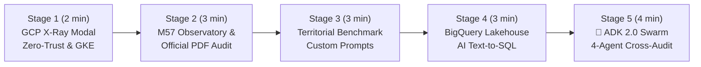

# 🎬 Step-by-Step Demo Playbook — `CivicLens` (M57 Public Finance & Google ADK 2.0 Swarm)

> 🌐 **[Lire ce Guide de Démo en Français 🇫🇷](DEMO_PLAYBOOK.md)** | 🏠 **[Back to Main README](../README-EN.md)** | 🚀 **[Open Live Demo](https://civiclens.hoffmannw.demo.altostrat.com)** | 🗺️ **[Dendrite v3.3 & Draw.io Diagrams](architecture-gcpdraw.md)**

> 🎨 **Interactive Dendrite v3.3 Architecture (Bento Matrix 16:9)**: You can switch to the **`🗺️ Interactive Dendrite v3.3 Diagram`** tab directly inside the app's **`🏗️ Architecture GCP (X-Ray)`** modal, or open it full-screen in [**Dendrite Studio ↗**](https://dendrite-758054785671.cr.gclb.goog/#code=cmVuZGVyT3JkZXI6IG5vZGVzLWZpcnN0CmRpcmVjdGlvbjogZG93bgoKY29uc3QgR2NwQmx1ZSA9ICIjMWE3M2U4Igpjb25zdCBHY3BHcmVlbiA9ICIjMWU4ZTNlIgpjb25zdCBFbWVyYWxkVGVhbCA9ICIjMGQ5NDg4Igpjb25zdCBEYXJrU2xhdGUgPSAiIzIwMjEyNCIKY29uc3QgU3ViVGV4dCA9ICIjNWY2MzY4Igpjb25zdCBDYXJkQm9yZGVyID0gIiNkYWRjZTAiCmNvbnN0IEJ1c1N0cm9rZSA9ICIjMzM0MTU1Igpjb25zdCBTdXJmYWNlV2hpdGUgPSAiI2ZmZmZmZiIKClN0eWxlIEBHaG9zdCB7CiAgZmlsbDogdHJhbnNwYXJlbnQsIHN0cm9rZVdpZHRoOiAwLCBmb250Q29sb3I6IHRyYW5zcGFyZW50LCBwYWRkaW5nOiAwCn0KU3R5bGUgQEFyY2hpdGVjdHVyZVJvb3QgewogIGZpbGw6ICIjZjhmYWZkIiwgc3Ryb2tlQ29sb3I6ICIjYzJkN2Y1Iiwgc3Ryb2tlV2lkdGg6IDEuNSwgYm9yZGVyUmFkaXVzOiAxNiwKICBwYWRkaW5nOiAyMiwgZ2FwOiAxOCwgZm9udENvbG9yOiAiIzNjNDA0MyIsIGZvbnRTaXplOiAyMiwgbGFiZWxXZWlnaHQ6IGJvbGQsCiAgaWNvbjogIkdvb2dsZUNsb3VkIiwgaWNvblNpemU6IDI4Cn0KU3R5bGUgQFBlcmltZXRlclpvbmUgewogIGZpbGw6ICIjZThmMGZlIiwgc3Ryb2tlQ29sb3I6ICIjOGFiNGY4Iiwgc3Ryb2tlV2lkdGg6IDEuNSwgYm9yZGVyUmFkaXVzOiAxMiwKICBwYWRkaW5nOiAxNiwgZ2FwOiAxNiwgZm9udENvbG9yOiAkRGFya1NsYXRlLCBmb250U2l6ZTogMTUsIGxhYmVsV2VpZ2h0OiBib2xkCn0KU3R5bGUgQEV4ZWN1dGlvblpvbmUgewogIGZpbGw6ICIjZjNlOGZkIiwgc3Ryb2tlQ29sb3I6ICIjYzA4NGZjIiwgc3Ryb2tlV2lkdGg6IDEuNSwgYm9yZGVyUmFkaXVzOiAxMiwKICBwYWRkaW5nOiAxNiwgZ2FwOiAxNiwgZm9udENvbG9yOiAkRGFya1NsYXRlLCBmb250U2l6ZTogMTUsIGxhYmVsV2VpZ2h0OiBib2xkCn0KU3R5bGUgQEdvdmVybmFuY2Vab25lIHsKICBmaWxsOiAiI2U2ZjRlYSIsIHN0cm9rZUNvbG9yOiAiIzgxYzk5NSIsIHN0cm9rZVdpZHRoOiAxLjUsIGJvcmRlclJhZGl1czogMTIsCiAgcGFkZGluZzogMTYsIGdhcDogMTQsIGZvbnRDb2xvcjogJERhcmtTbGF0ZSwgZm9udFNpemU6IDE1LCBsYWJlbFdlaWdodDogYm9sZAp9ClN0eWxlIEBSZXNvdXJjZVpvbmUgewogIGZpbGw6ICIjZmVmN2UwIiwgc3Ryb2tlQ29sb3I6ICIjZmRlMjkzIiwgc3Ryb2tlV2lkdGg6IDEuNSwgYm9yZGVyUmFkaXVzOiAxMiwKICBwYWRkaW5nOiAxNiwgZ2FwOiAxNiwgZm9udENvbG9yOiAkRGFya1NsYXRlLCBmb250U2l6ZTogMTUsIGxhYmVsV2VpZ2h0OiBib2xkCn0KU3R5bGUgQFB1cnBsZVN1Ykdyb3VwIHsKICBmaWxsOiAiI2U5ZDVmZiIsIHN0cm9rZUNvbG9yOiBkYXJrZW4oIiNlOWQ1ZmYiLCAxNCksIHN0cm9rZVdpZHRoOiAxLCBib3JkZXJSYWRpdXM6IDEwLAogIHBhZGRpbmc6IDEyLCBnYXA6IDEwLCBmb250Q29sb3I6ICREYXJrU2xhdGUsIGZvbnRTaXplOiAxMywgbGFiZWxXZWlnaHQ6IGJvbGQKfQpTdHlsZSBAR3JlZW5TdWJHcm91cCB7CiAgZmlsbDogIiNjZWVhZDYiLCBzdHJva2VDb2xvcjogZGFya2VuKCIjY2VlYWQ2IiwgMTQpLCBzdHJva2VXaWR0aDogMSwgYm9yZGVyUmFkaXVzOiAxMCwKICBwYWRkaW5nOiAxMCwgZ2FwOiA3LCBmb250Q29sb3I6ICREYXJrU2xhdGUsIGZvbnRTaXplOiAxMywgbGFiZWxXZWlnaHQ6IGJvbGQKfQpTdHlsZSBAQW1iZXJTdWJHcm91cCB7CiAgZmlsbDogIiNmOWU0YTciLCBzdHJva2VDb2xvcjogZGFya2VuKCIjZjllNGE3IiwgMTQpLCBzdHJva2VXaWR0aDogMSwgYm9yZGVyUmFkaXVzOiAxMCwKICBwYWRkaW5nOiAxMiwgZ2FwOiAxMiwgZm9udENvbG9yOiAkRGFya1NsYXRlLCBmb250U2l6ZTogMTMsIGxhYmVsV2VpZ2h0OiBib2xkCn0KU3R5bGUgQEFjdG9yQ2FyZCB7CiAgd2lkdGg6IDE4MiwgaGVpZ2h0OiA1NiwKICBmaWxsOiAkU3VyZmFjZVdoaXRlLCBzdHJva2VDb2xvcjogJENhcmRCb3JkZXIsIHN0cm9rZVdpZHRoOiAxLCBib3JkZXJSYWRpdXM6IDgsCiAgZm9udENvbG9yOiAkRGFya1NsYXRlLCBzdWJGb250Q29sb3I6ICRTdWJUZXh0LAogIGZvbnRTaXplOiAxNCwgc3ViRm9udFNpemU6IDExLCBsYWJlbFdlaWdodDogYm9sZCwKICB0ZXh0QWxpZ246ICJsZWZ0IiwgdGV4dFZBbGlnbjogIm1pZGRsZSIsCiAgaWNvblBvc2l0aW9uOiAibGVmdCIsIGljb25TaXplOiAyOCwgcGFkZGluZzogMTAsIHNoYWRvdzogdHJ1ZQp9ClN0eWxlIEBQcm9kdWN0Q2FyZCB7CiAgd2lkdGg6IDE3MCwgaGVpZ2h0OiA1OCwKICBmaWxsOiAkU3VyZmFjZVdoaXRlLCBzdHJva2VDb2xvcjogJENhcmRCb3JkZXIsIHN0cm9rZVdpZHRoOiAxLCBib3JkZXJSYWRpdXM6IDgsCiAgZm9udENvbG9yOiAkRGFya1NsYXRlLCBzdWJGb250Q29sb3I6ICRTdWJUZXh0LAogIGZvbnRTaXplOiAxMy41LCBzdWJGb250U2l6ZTogMTAuNSwgbGFiZWxXZWlnaHQ6IGJvbGQsCiAgdGV4dEFsaWduOiAibGVmdCIsIHRleHRWQWxpZ246ICJtaWRkbGUiLAogIGljb25Qb3NpdGlvbjogImxlZnQiLCBpY29uU2l6ZTogMjYsIHBhZGRpbmc6IDEwLCBzaGFkb3c6IHRydWUKfQpTdHlsZSBAR2F0ZXdheUh1YkNhcmQgewogIGJhc2U6IEBQcm9kdWN0Q2FyZCwKICB3aWR0aDogMTk4LCBoZWlnaHQ6IDY2LCBzdHJva2VDb2xvcjogIiM3YzNhZWQiLCBzdHJva2VXaWR0aDogMiwKICBmb250U2l6ZTogMTQuNSwgc3ViRm9udFNpemU6IDExLCBpY29uU2l6ZTogMzAsIHBhZGRpbmc6IDEyCn0KU3R5bGUgQFBvbGljeVBpbGwgewogIHdpZHRoOiAyMzQsIGhlaWdodDogMzIsCiAgZmlsbDogJFN1cmZhY2VXaGl0ZSwgc3Ryb2tlQ29sb3I6ICIjOWFhMGE2Iiwgc3Ryb2tlV2lkdGg6IDEsIGJvcmRlclJhZGl1czogMTYsCiAgZm9udENvbG9yOiAkRGFya1NsYXRlLCBmb250U2l6ZTogMTIuNSwgbGFiZWxXZWlnaHQ6IGJvbGQsCiAgdGV4dEFsaWduOiAibGVmdCIsIHRleHRWQWxpZ246ICJtaWRkbGUiLAogIGljb25Qb3NpdGlvbjogImxlZnQiLCBpY29uU2l6ZTogMTYsIHBhZGRpbmc6IDEwLCBzaGFkb3c6IHRydWUKfQoKWm9uZSBAQ2l2aWNMZW5zX1BsYXRmb3JtIHsKICB0aXRsZTogIkNpdmljTGVucyDigJQgUHVibGljIEZpbmFuY2UgTTU3IE9ic2VydmF0b3J5ICYgR29vZ2xlIEFESyAyLjAgTXVsdGktQWdlbnQgU3dhcm0iCiAgc3R5bGU6IEBBcmNoaXRlY3R1cmVSb290CiAgbGF5b3V0OiBtYXRyaXgKICBhcmVhczogWwogICAgInoxIHoxIHoxIHoxIHoxIiwKICAgICJ6MyB6MyB6MyB6MiB6MiIsCiAgICAiejQgejQgejQgejQgejQiCiAgXQogIHNpemVzOiBbIjEuMDVmciIsICIxLjA1ZnIiLCAiMS4wNWZyIiwgIjAuOTJmciIsICIwLjkyZnIiXQogIGdhcDogMjAKCiAgWm9uZSBAWm9uZTFfSW5ncmVzcyB7CiAgICBhcmVhOiAiejEiCiAgICB0aXRsZTogIjEuIENpdGl6ZW4gJiBNdW5pY2lwYWwgUGVyaW1ldGVyIChaZXJvLVRydXN0IEVkZ2UgJiBJQVApIgogICAgc3R5bGU6IEBQZXJpbWV0ZXJab25lCiAgICBsYXlvdXQ6IHJvdywgZ2FwOiAxOCwgYWxpZ246IGNlbnRlciwganVzdGlmeTogY2VudGVyCiAgICBbY2l0aXplbnNfbWF5b3JzOiAiQ2l0aXplbnMgJiBNYXlvcnMiIHwgIjM1LDAwMCBNdW5pY2lwYWxpdGllcyJdIHsgc3R5bGU6IEBBY3RvckNhcmQsIGljb246ICJVc2VycyIgfQogICAgW2NsX2FybW9yX3dhZjogIkNsb3VkIEFybW9yIFdBRiIgfCAiQWRhcHRpdmUgRERvUyAmIE9XQVNQIl0geyBzdHlsZTogQFByb2R1Y3RDYXJkLCB3aWR0aDogMTg2LCBpY29uOiAiQ2xvdWRBcm1vciIgfQogICAgW2NsX2h0dHBzX2xiOiAiR2xvYmFsIEhUVFBTIExCIiB8ICJNYW5hZ2VkIFNTTCBJbmdyZXNzIl0geyBzdHlsZTogQFByb2R1Y3RDYXJkLCB3aWR0aDogMTg2LCBpY29uOiAiQ2xvdWRMb2FkQmFsYW5jaW5nIiB9CiAgICBbY2xfaWFwX2F1dGg6ICJJZGVudGl0eS1Bd2FyZSBQcm94eSIgfCAiQ3J5cHRvZ3JhcGhpYyBKV1QgSGVhZGVyIl0geyBzdHlsZTogQFByb2R1Y3RDYXJkLCB3aWR0aDogMTkyLCBpY29uOiAiR29vZ2xlSWRlbnRpdHkiIH0KICAgIFtjbF93ZWJfdWk6ICJDaXZpY0xlbnMgNS1UYWIgVUkiIHwgIk9ic2VydmF0b3J5IOKAoiBCaWdRdWVyeSDigKIgU3dhcm0iXSB7IHN0eWxlOiBAUHJvZHVjdENhcmQsIHdpZHRoOiAxOTgsIGljb246ICJMYXB0b3AiIH0KICB9CgogIFpvbmUgQFpvbmUzX0dLRV9Td2FybSB7CiAgICBhcmVhOiAiejMiCiAgICB0aXRsZTogIjIuIEdLRSBBdXRvcGlsb3QgUnVudGltZSAmIEdvb2dsZSBBREsgMi4wIDQtQWdlbnQgU3dhcm0gKFdvcmtsb2FkIElkZW50aXR5KSIKICAgIHN0eWxlOiBARXhlY3V0aW9uWm9uZQogICAgbGF5b3V0OiByb3csIGdhcDogMzQsIGFsaWduOiBjZW50ZXIsIGp1c3RpZnk6IGNlbnRlcgoKICAgIFtzdXBlcnZpc29yX2FnZW50OiAiMS4gU3VwZXJ2aXNvckFnZW50XG4oQURLIE9yY2hlc3RyYXRvcikiIHwgIkludGVudCAmIFRhc2sgUm91dGVyIl0gewogICAgICBzdHlsZTogQEdhdGV3YXlIdWJDYXJkLCBpY29uOiAiR29vZ2xlQWdlbnRzIiwKICAgICAgZGVzY3JpcHRpb246ICJDbGFzc2lmaWVzIGNpdmljICYgTTU3IGFjY291bnRpbmcgaW50ZW50IGFuZCBkZWxlZ2F0ZXMgdG8gc3BlY2lhbGl6ZWQgc3ViYWdlbnRzIgogICAgfQoKICAgIFpvbmUgQFNwZWNpYWxpc3RBZ2VudHNDb2wgewogICAgICBzdHlsZTogQEdob3N0LCBsYXlvdXQ6IGNvbHVtbiwgZ2FwOiAxMiwgYWxpZ246IHN0cmV0Y2gKCiAgICAgIFpvbmUgQERhdGFSZXRyaWV2YWxBZ2VudHMgewogICAgICAgIHRpdGxlOiAiUGFyYWxsZWwgUXVhbnRpdGF0aXZlICYgTGVnYWwgUmV0cmlldmFsIFN1YmFnZW50cyIKICAgICAgICBzdHlsZTogQFB1cnBsZVN1Ykdyb3VwLCB3aWR0aDogMzc2LCBsYXlvdXQ6IHJvdywgZ2FwOiAxMiwgYWxpZ246IGNlbnRlciwganVzdGlmeTogY2VudGVyCiAgICAgICAgW2J1ZGdldF9zcWxfYWdlbnQ6ICIyLiBCdWRnZXRTUUxBZ2VudCIgfCAiTTU3IEJpZ1F1ZXJ5ICsgT0ZHTCJdIHsgc3R5bGU6IEBQcm9kdWN0Q2FyZCwgd2lkdGg6IDE3NCwgaWNvbjogIkJpZ1F1ZXJ5IiB9CiAgICAgICAgW2RlbGliX2F1ZGl0b3JfYWdlbnQ6ICIzLiBEZWxpYmVyYXRpb25BdWRpdG9yIiB8ICJwZ3ZlY3RvciBQREYgKyBCZXJjeSJdIHsgc3R5bGU6IEBQcm9kdWN0Q2FyZCwgd2lkdGg6IDE3NCwgaWNvbjogIlNlYXJjaCIgfQogICAgICB9CgogICAgICBab25lIEBTeW50aGVzaXNBdWRpdEFnZW50IHsKICAgICAgICB0aXRsZTogIkNyb3NzLUV4YW1pbmF0aW9uICYgT2ZmaWNpYWwgUmVwb3J0IEdlbmVyYXRpb24iCiAgICAgICAgc3R5bGU6IEBQdXJwbGVTdWJHcm91cCwgZGFzaGVkOiB0cnVlLCB3aWR0aDogMzc2LCBsYXlvdXQ6IHJvdywgZ2FwOiAxMiwgYWxpZ246IGNlbnRlciwganVzdGlmeTogY2VudGVyCiAgICAgICAgW2Nyb3NzY2hlY2tfYWdlbnQ6ICI0LiBDcm9zc0NoZWNrQXVkaXQiIHwgIlZvdGVkIFBERiB2cy4gRXhlY3V0ZWQgU1FMIl0geyBzdHlsZTogQFByb2R1Y3RDYXJkLCB3aWR0aDogMTc0LCBpY29uOiAiU2hpZWxkQ2hlY2siIH0KICAgICAgICBbcGRmX3JlcG9ydF9nZW46ICJNNTcgUERGICYgU2NvcmUgLzEwMCIgfCAiUmVwb3J0TGFiICsgRmluT3BzIEJhZGdlIl0geyBzdHlsZTogQFByb2R1Y3RDYXJkLCB3aWR0aDogMTc0LCBpY29uOiAiQmFyQ2hhcnQzIiB9CiAgICAgIH0KICAgIH0KICB9CgogIFpvbmUgQFpvbmUyX0dvdmVybmFuY2UgewogICAgYXJlYTogInoyIgogICAgdGl0bGU6ICIzLiBNNTcgRGF0YSBHb3Zlcm5hbmNlICYgU292ZXJlaWduIEd1YXJkcmFpbHMiCiAgICBzdHlsZTogQEdvdmVybmFuY2Vab25lCiAgICBsYXlvdXQ6IHJvdywgZ2FwOiAyMCwgYWxpZ246IGNlbnRlciwganVzdGlmeTogY2VudGVyCgogICAgWm9uZSBATTU3R3VhcmRyYWlscyB7CiAgICAgIHRpdGxlOiAiTTU3IEFjY291bnRpbmcgJiBTZWN1cml0eSBSdWxlcyIKICAgICAgc3R5bGU6IEBHcmVlblN1Ykdyb3VwLCBsYXlvdXQ6IGNvbHVtbiwgZ2FwOiA4LCBhbGlnbjogY2VudGVyCiAgICAgIFtydWxlX3JlYWRvbmx5OiAiQmlnUXVlcnlUb29sc2V0IFNFTEVDVC1Pbmx5Il0geyBzdHlsZTogQFBvbGljeVBpbGwsIGljb246ICJMb2NrIiB9CiAgICAgIFtydWxlX201N19zZXA6ICJNNTcgT3AgKDAxMS8wMTIvNjUpIHZzIEludiAoMjAvMjEpIl0geyBzdHlsZTogQFBvbGljeVBpbGwsIGljb246ICJTaGllbGRDaGVjayIgfQogICAgICBbcnVsZV93aTogIktleWxlc3MgR0tFIFdvcmtsb2FkIElkZW50aXR5Il0geyBzdHlsZTogQFBvbGljeVBpbGwsIGljb246ICJHb29nbGVJZGVudGl0eSIgfQogICAgICBbcnVsZV9yZ3BkOiAiR0RQUiBBbm9ueW1pemF0aW9uICYgV09STSBEUiJdIHsgc3R5bGU6IEBQb2xpY3lQaWxsLCBpY29uOiAiU2VjdXJpdHlDb21tYW5kQ2VudGVyIiB9CiAgICB9CiAgfQoKICBab25lIEBab25lNF9MYWtlaG91c2UgewogICAgYXJlYTogIno0IgogICAgdGl0bGU6ICI0LiBTb3ZlcmVpZ24gRGF0YSBMYWtlaG91c2UsIEh5YnJpZCBWZWN0b3IgU3RvcmUgJiBOYXRpb25hbCBPcGVuIERhdGEgQVBJcyIKICAgIHN0eWxlOiBAUmVzb3VyY2Vab25lCiAgICBsYXlvdXQ6IG1hdHJpeCwgY29sczogMywgc2l6ZXM6IFsiMS4wNWZyIiwgIjEuMWZyIiwgIjAuOTVmciJdLCBnYXA6IDE4LCBhbGlnbjogY2VudGVyCgogICAgWm9uZSBAU3RydWN0dXJlZEZpbmFuY2VTdG9yZSB7CiAgICAgIHRpdGxlOiAiU3RydWN0dXJlZCBNNTcgQWNjb3VudGluZyBMYWtlaG91c2UiCiAgICAgIHN0eWxlOiBAQW1iZXJTdWJHcm91cCwgbGF5b3V0OiByb3csIGdhcDogMTIsIGFsaWduOiBjZW50ZXIsIGp1c3RpZnk6IGNlbnRlcgogICAgICBbYnFfbTU3X2xha2Vob3VzZTogIkJpZ1F1ZXJ5IExha2Vob3VzZSIgfCAiY2l2aWNsZW5zX2ZpbmFuY2VzIChNNTcpIl0geyBzdHlsZTogQFByb2R1Y3RDYXJkLCB3aWR0aDogMTc2LCBpY29uOiAiQmlnUXVlcnkiIH0KICAgICAgW2JlcmN5X29mZ2xfYXBpOiAiREdGaVAgLyBPRkdMICYgQmVyY3kiIHwgIjY1MCsgT3BlbiBEYXRhIERhdGFzZXRzIl0geyBzdHlsZTogQFByb2R1Y3RDYXJkLCB3aWR0aDogMTc4LCBpY29uOiAiR2xvYmUiIH0KICAgIH0KCiAgICBab25lIEBVbnN0cnVjdHVyZWRWZWN0b3JTdG9yZSB7CiAgICAgIHRpdGxlOiAiQ291bmNpbCBEZWxpYmVyYXRpb25zICYgTXVsdGltb2RhbCBSQUciCiAgICAgIHN0eWxlOiBAQW1iZXJTdWJHcm91cCwgbGF5b3V0OiByb3csIGdhcDogMTIsIGFsaWduOiBjZW50ZXIsIGp1c3RpZnk6IGNlbnRlcgogICAgICBbY2xvdWRzcWxfcGd2ZWN0b3I6ICJDbG91ZCBTUUwgUEcgMTYiIHwgInBndmVjdG9yIEhOU1cgKDc2OGQpIl0geyBzdHlsZTogQFByb2R1Y3RDYXJkLCB3aWR0aDogMTc0LCBpY29uOiAiQ2xvdWRTUUwiIH0KICAgICAgW2djc19wZGZfdmF1bHQ6ICJDbG91ZCBTdG9yYWdlIFZhdWx0IiB8ICJDb3VuY2lsIFBERiBBY3RzIl0geyBzdHlsZTogQFByb2R1Y3RDYXJkLCB3aWR0aDogMTcwLCBpY29uOiAiR2NwU3RvcmFnZUJ1Y2tldCIgfQogICAgfQoKICAgIFpvbmUgQFZlcnRleEFuZEJhY2t1cCB7CiAgICAgIHRpdGxlOiAiVmVydGV4IEFJICYgSW1tdXRhYmxlIERSIgogICAgICBzdHlsZTogQEFtYmVyU3ViR3JvdXAsIGxheW91dDogcm93LCBnYXA6IDEyLCBhbGlnbjogY2VudGVyLCBqdXN0aWZ5OiBjZW50ZXIKICAgICAgW3ZlcnRleF9nZW1pbmlfY2w6ICJWZXJ0ZXggQUkgR2VtaW5pIDMuNSIgfCAiVGV4dC10by1TUUwgJiBFbWJlZGRpbmdzIl0geyBzdHlsZTogQFByb2R1Y3RDYXJkLCB3aWR0aDogMTc4LCBpY29uOiAiVmVydGV4QUkiIH0KICAgICAgW2JhY2t1cF9kcl9jbDogIkJhY2t1cCAmIERSIFNlcnZpY2UiIHwgIk11bHRpLVJlZ2lvbiBXT1JNIFZhdWx0Il0geyBzdHlsZTogQFByb2R1Y3RDYXJkLCB3aWR0aDogMTc0LCBpY29uOiAiU2VjdXJpdHlDb21tYW5kQ2VudGVyIiB9CiAgICB9CiAgfQp9CgpbY2l0aXplbnNfbWF5b3JzXSAtLT4gW2NsX2FybW9yX3dhZl0geyBjb2xvcjogJEdjcEJsdWUsIHN0cm9rZVdpZHRoOiAyLCBzb3VyY2VBbmNob3I6ICJyaWdodCIsIHRhcmdldEFuY2hvcjogImxlZnQiLCBjdXJ2ZTogInN0ZXAiLCBzZXF1ZW5jZUJhZGdlOiAiMSIsIGJhZGdlRmlsbDogJEdjcEJsdWUsIGJhZGdlRm9udENvbG9yOiAkU3VyZmFjZVdoaXRlIH0KW2NsX2FybW9yX3dhZl0gLS0+IFtjbF9odHRwc19sYl0geyBjb2xvcjogJEdjcEJsdWUsIHN0cm9rZVdpZHRoOiAyLCBzb3VyY2VBbmNob3I6ICJyaWdodCIsIHRhcmdldEFuY2hvcjogImxlZnQiLCBjdXJ2ZTogInN0ZXAiIH0KW2NsX2h0dHBzX2xiXSAtLT4gW2NsX2lhcF9hdXRoXSB7IGNvbG9yOiAkR2NwQmx1ZSwgc3Ryb2tlV2lkdGg6IDIsIHNvdXJjZUFuY2hvcjogInJpZ2h0IiwgdGFyZ2V0QW5jaG9yOiAibGVmdCIsIGN1cnZlOiAic3RlcCIgfQpbY2xfaWFwX2F1dGhdIC0tPiBbY2xfd2ViX3VpXSB7IGNvbG9yOiAkR2NwQmx1ZSwgc3Ryb2tlV2lkdGg6IDIsIHNvdXJjZUFuY2hvcjogInJpZ2h0IiwgdGFyZ2V0QW5jaG9yOiAibGVmdCIsIGN1cnZlOiAic3RlcCIgfQoKW1pvbmUxX0luZ3Jlc3NdIC0tPiBbc3VwZXJ2aXNvcl9hZ2VudF0geyBjb2xvcjogIiM3YzNhZWQiLCBzdHJva2VXaWR0aDogMiwgc291cmNlQW5jaG9yOiAiYm90dG9tIiwgdGFyZ2V0QW5jaG9yOiAidG9wIiwgY3VydmU6ICJzdGVwIiwgbGFiZWw6ICJTd2FybSBBdWRpdCIsIHNlcXVlbmNlQmFkZ2U6ICIyIiwgYmFkZ2VGaWxsOiAiIzdjM2FlZCIsIGJhZGdlRm9udENvbG9yOiAkU3VyZmFjZVdoaXRlIH0KW3N1cGVydmlzb3JfYWdlbnRdIC0tPiBbRGF0YVJldHJpZXZhbEFnZW50c10geyBjb2xvcjogIiM3YzNhZWQiLCBzdHJva2VXaWR0aDogMiwgc291cmNlQW5jaG9yOiAicmlnaHQiLCB0YXJnZXRBbmNob3I6ICJsZWZ0IiwgY3VydmU6ICJzdGVwIiB9CltzdXBlcnZpc29yX2FnZW50XSAtLT4gW1N5bnRoZXNpc0F1ZGl0QWdlbnRdIHsgY29sb3I6ICIjN2MzYWVkIiwgc3Ryb2tlV2lkdGg6IDIsIHNvdXJjZUFuY2hvcjogInJpZ2h0IiwgdGFyZ2V0QW5jaG9yOiAibGVmdCIsIGN1cnZlOiAic3RlcCIgfQpbU3BlY2lhbGlzdEFnZW50c0NvbF0gLS0+IFtNNTdHdWFyZHJhaWxzXSB7IGNvbG9yOiAkR2NwR3JlZW4sIHN0cm9rZVdpZHRoOiAxLjgsIGRhc2hlZDogdHJ1ZSwgc291cmNlQW5jaG9yOiAicmlnaHQiLCB0YXJnZXRBbmNob3I6ICJsZWZ0IiwgY3VydmU6ICJzdGVwIiwgbGFiZWw6ICJFbmZvcmNlZCBCeSIgfQoKW1pvbmUzX0dLRV9Td2FybV0gLS0+IFtTdHJ1Y3R1cmVkRmluYW5jZVN0b3JlXSB7IGNvbG9yOiAkRW1lcmFsZFRlYWwsIHN0cm9rZVdpZHRoOiAyLCBzb3VyY2VBbmNob3I6ICJib3R0b20iLCB0YXJnZXRBbmNob3I6ICJ0b3AiLCBjdXJ2ZTogInN0ZXAiLCBsYWJlbDogIk01NyBTUUwgJiBBUEkiLCBzZXF1ZW5jZUJhZGdlOiAiMyIsIGJhZGdlRmlsbDogJEVtZXJhbGRUZWFsLCBiYWRnZUZvbnRDb2xvcjogJFN1cmZhY2VXaGl0ZSB9Cltab25lM19HS0VfU3dhcm1dIC0tPiBbVW5zdHJ1Y3R1cmVkVmVjdG9yU3RvcmVdIHsgY29sb3I6ICRHY3BCbHVlLCBzdHJva2VXaWR0aDogMiwgc291cmNlQW5jaG9yOiAiYm90dG9tIiwgdGFyZ2V0QW5jaG9yOiAidG9wIiwgY3VydmU6ICJzdGVwIiwgbGFiZWw6ICJwZ3ZlY3RvciBITlNXIiwgc2VxdWVuY2VCYWRnZTogIjQiLCBiYWRnZUZpbGw6ICRHY3BCbHVlLCBiYWRnZUZvbnRDb2xvcjogJFN1cmZhY2VXaGl0ZSB9Cltab25lMl9Hb3Zlcm5hbmNlXSAtLT4gW1ZlcnRleEFuZEJhY2t1cF0geyBjb2xvcjogJEJ1c1N0cm9rZSwgc3Ryb2tlV2lkdGg6IDEuOCwgZGFzaGVkOiB0cnVlLCBzb3VyY2VBbmNob3I6ICJib3R0b20iLCB0YXJnZXRBbmNob3I6ICJ0b3AiLCBjdXJ2ZTogInN0ZXAiLCBsYWJlbDogIkFEQyAmIFdPUk0iIH0K) ([`.dendrite`](diagrams/civiclens_adk_swarm_v3.dendrite) / [`.drawio`](diagrams/civiclens_adk_swarm_v3.drawio)).
This document is the **step-by-step live demonstration playbook** for presenting **CivicLens** — the French Municipal Public Finance Observatory (35,000 municipalities, **M57 accounting standard**, **650+ Bercy Open Data datasets**) powered by **Google ADK 2.0 (4 subagents)**, **BigQuery**, **Cloud SQL `pgvector`**, and **GKE Autopilot**.

Every stage specifies:
1. **🖱️ Action to Perform** (1-Click UI tab/button or CLI command)
2. **🤖 Which Agent / GCP Service Acts Under the Hood**
3. **👀 What to Observe on Screen & 💡 Key Customer Pitch (GCP Value)**

---

## ⏱️ Demo Flow Overview (Duration: 12–15 min)

---

## 🔹 Stage 1: Live Sovereign Architecture X-Ray (`🏗️ Architecture GCP (X-Ray)`)

### 1. 🖱️ Action to Perform
1. Open **[`https://civiclens.hoffmannw.demo.altostrat.com`](https://civiclens.hoffmannw.demo.altostrat.com)**.
2. Click the **`🏗️ Architecture GCP (X-Ray)`** button in the top navigation bar.

### 2. 🤖 Which GCP Services Are Highlighted Under the Hood
The modal displays the 6 pillars of the production architecture running in `europe-west1` (`wh-djvagl`):
1. **Cloud Armor WAF & Zero-Trust IAP**: L7 OWASP Top 10 filtering and cryptographic Google Identity-Aware Proxy (`X-Goog-Authenticated-User-Email`).
2. **GKE Autopilot + Workload Identity**: Managed Kubernetes cluster (`wh-djvagl-gkecluster`) with keyless OIDC IAM federation (zero static JSON keys).
3. **Google ADK 2.0 & Vertex AI**: 4-subagent financial and legal audit swarm powered by Gemini 3.5 / 3.6 Flash.
4. **BigQuery Data Lakehouse**: Serverless columnar analytics over M57 municipal balances (`civiclens_finances.balances_communes`) with strict `SELECT-Only` guardrails.
5. **Cloud SQL PostgreSQL 16 + `pgvector`**: 768-dim hybrid vector search (`text-embedding-004`) over voted municipal council PDF deliberations.
6. **FinOps & Observability**: Per-audit token cost tracking (`~$0.00018`) and structured Cloud Logging.

### 3. 👀 What to Observe & 💡 Key Customer Pitch
- **On screen**: **1-Click Deep Links** open GKE Autopilot, BigQuery Studio, Cloud SQL, or Cloud Armor directly in the Google Cloud Console during the briefing.
- **💡 Key Customer Pitch**: *"This architecture meets public-sector security requirements out of the box: Zero-Trust IAP access, keyless Workload Identity, and full auditability."*

---

## 🔹 Stage 2: Municipal Observatory (DGFiP / OFGL) & Official M57 PDF Report

### 1. 🖱️ Action to Perform
1. Stay on the 1st tab **`🏛️ Observatoire des Communes`**.
2. Click a municipality quick-pill (e.g., **`Bordeaux`**, **`Nantes`**, **`Pantin`**, or **`Toulouse`**).
3. Click **`✨ Générer l'audit budgétaire Gemini`** and then **`📄 Télécharger PDF (M57)`**.

### 2. 🤖 What Happens Under the Hood
- `comptes_publics_service.py` queries the official **OFGL / DGFiP** API in real time (2017–2024 history).
- Computes core **M57 accounting ratios**:
  - **Operating expenses** (chapters `011`, `012`, `65`)
  - **Capital investment** (chapters `20`, `21`, `23`)
  - **Gross savings (CAF)** and **Debt payback capacity (in years)** vs the 12-year national prudential threshold.
- Vertex AI Gemini generates an executive financial diagnosis and ReportLab compiles an official **M57 PDF Audit Report**.

### 3. 👀 What to Observe & 💡 Key Customer Pitch
- **On screen**: 4 M57 KPI cards, 2 multi-year Chart.js charts (M€ and €/capita), and instant PDF report generation.

---

## 🔹 Stage 3: Territorial Benchmark (`⚖️ Benchmark Territorial`)

### 1. 🖱️ Action to Perform
1. Click the 2nd tab **`⚖️ Benchmark Territorial`**.
2. Click a preset pair such as **`Bordeaux vs Nantes`**.
3. *(Optional)* Expand **`🎯 Personnaliser les Prompts d'Audit (4 Volets)`** to show how financial analysts can customize the 4 Gemini audit dimensions live.

---

## 🔹 Stage 4: BigQuery Data Lakehouse & AI Text-to-SQL (`🔍 Data Lakehouse BigQuery`)

### 1. 🖱️ Action to Perform
1. Click the 3rd tab **`🔍 Data Lakehouse BigQuery`**.
2. Click one of the suggested natural-language analytical queries and click **`⚡ Exécuter sur BigQuery`**.

*(CLI alternative: `make demo-bigquery`)*

### 2. 🤖 What Happens Under the Hood (`analytics_service.py`)
1. **Vertex AI Gemini** translates the natural-language question into an optimized **BigQuery GoogleSQL** query targeting `civiclens_finances.balances_communes`.
2. **Read-Only Guardrail (`data-governance-steward`)**: Validates that the generated SQL is strictly `SELECT-Only` (blocking any `DROP`, `DELETE`, `UPDATE`, `INSERT` statements).
3. Executes serverlessly on BigQuery and renders an interactive `Chart.js` chart + executive summary.

---

## 🔹 Stage 5: The Showstopper — `🤖 Swarm Audit ADK 2.0 (4 Agents M57)`

### 1. 🖱️ Action to Perform
1. Click the 5th tab **`🤖 Swarm Audit ADK 2.0 (4 Agents M57)`**.
2. Click one of the **3 Live 1-Click Demo Scenarios**:
   - **`🎯 Scenario 1 • Bordeaux (Chap. 65)`**: *Cross-audit M57 chapter 65 operating subsidies vs 2024 voted council deliberations*
   - **`🌱 Scenario 2 • Nantes (Chap. 21)`**: *Verify M57 chapter 21 ecological investment sustainability vs 2024 gross savings (CAF)*
   - **`⚖️ Scenario 3 • Pantin (Chap. 012)`**: *Analyze M57 chapter 012 payroll rigidity and debt payback capacity*

*(CLI alternative: `make demo-swarm` or `make demo-catalog`)*

### 2. 🤖 Which Google ADK 2.0 Subagents Act Under the Hood (`civic_swarm_adk.py`)
The pipeline orchestrates **4 specialized subagents**:
1. **`SupervisorAgent` (🎯 Civic Orchestrator)**: Classifies civic intent and delegates quantitative (SQL M57) and legal (PDF `pgvector`) sub-tasks.
2. **`BudgetSQLAgent` (📊 M57 Accounting & BigQueryToolset)**: Executes read-only M57 SQL queries on BigQuery and fetches multi-year OFGL records.
3. **`DeliberationAuditorAgent` (📜 Legal PDF & pgvector Auditor)**: Performs hybrid vector + full-text search across municipal council deliberations and 650+ Bercy datasets.
4. **`CrossCheckAuditAgent` (🛡️ Compliance Fact-Checker)**: Cross-checks voted PDF commitments against executed SQL M57 expenditures, computes the **M57 Compliance Score (`/100`)**, and synthesizes the final audit report.

### 3. 👀 What to Observe & 💡 Key Customer Pitch
- **On screen**:
  - All **4 subagent cards** light up with their execution latency (`✓ ms`) and live trace summary.
  - The KPI bar displays the **M57 Compliance Score (`96 / 100`)**, **Total Swarm Latency**, **Vertex AI FinOps Cost (`~$0.00018`)**, and cross-checked evidence count.
  - Left column: **Read-Only M57 SQL Trace** (`🛡️ SELECT-Only Guardrail`) and matched council deliberations.
  - Right column: Full **Cross-Check Audit Report**.
- **💡 Key Customer Pitch**: *"With Google ADK 2.0 on GKE Autopilot, we move beyond basic chatbots to an orchestrated team of specialized agents that cross-examine structured BigQuery M57 ledgers against unstructured PDF council deliberations in Cloud SQL `pgvector` in seconds."*
