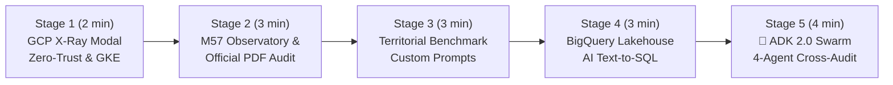

# 🎬 Step-by-Step Demo Playbook — `CivicLens` (M57 Public Finance & Google ADK 2.0 Swarm)

> 🌐 **[Lire ce Guide de Démo en Français 🇫🇷](DEMO_PLAYBOOK.md)** | 🏠 **[Back to Main README](../README-EN.md)** | 🚀 **[Open Live Demo](https://civiclens.hoffmannw.demo.altostrat.com)**

This document is the **step-by-step live demonstration playbook** for presenting **CivicLens** — the French Municipal Public Finance Observatory (35,000 municipalities, **M57 accounting standard**, **650+ Bercy Open Data datasets**) powered by **Google ADK 2.0 (4 subagents)**, **BigQuery**, **Cloud SQL `pgvector`**, and **GKE Autopilot**.

Every stage specifies:
1. **🖱️ Action to Perform** (1-Click UI tab/button or CLI command)
2. **🤖 Which Agent / GCP Service Acts Under the Hood**
3. **👀 What to Observe on Screen & 💡 Key Customer Pitch (GCP Value)**

---

## ⏱️ Demo Flow Overview (Duration: 12–15 min)

---

## 🔹 Stage 1: Live Sovereign Architecture X-Ray (`🏗️ Architecture GCP (X-Ray)`)

### 1. 🖱️ Action to Perform
1. Open **[`https://civiclens.hoffmannw.demo.altostrat.com`](https://civiclens.hoffmannw.demo.altostrat.com)**.
2. Click the **`🏗️ Architecture GCP (X-Ray)`** button in the top navigation bar.

### 2. 🤖 Which GCP Services Are Highlighted Under the Hood
The modal displays the 6 pillars of the production architecture running in `europe-west1` (`wh-djvagl`):
1. **Cloud Armor WAF & Zero-Trust IAP**: L7 OWASP Top 10 filtering and cryptographic Google Identity-Aware Proxy (`X-Goog-Authenticated-User-Email`).
2. **GKE Autopilot + Workload Identity**: Managed Kubernetes cluster (`wh-djvagl-gkecluster`) with keyless OIDC IAM federation (zero static JSON keys).
3. **Google ADK 2.0 & Vertex AI**: 4-subagent financial and legal audit swarm powered by Gemini 3.5 / 3.6 Flash.
4. **BigQuery Data Lakehouse**: Serverless columnar analytics over M57 municipal balances (`civiclens_finances.balances_communes`) with strict `SELECT-Only` guardrails.
5. **Cloud SQL PostgreSQL 16 + `pgvector`**: 768-dim hybrid vector search (`text-embedding-004`) over voted municipal council PDF deliberations.
6. **FinOps & Observability**: Per-audit token cost tracking (`~$0.00018`) and structured Cloud Logging.

### 3. 👀 What to Observe & 💡 Key Customer Pitch
- **On screen**: **1-Click Deep Links** open GKE Autopilot, BigQuery Studio, Cloud SQL, or Cloud Armor directly in the Google Cloud Console during the briefing.
- **💡 Key Customer Pitch**: *"This architecture meets public-sector security requirements out of the box: Zero-Trust IAP access, keyless Workload Identity, and full auditability."*

---

## 🔹 Stage 2: Municipal Observatory (DGFiP / OFGL) & Official M57 PDF Report

### 1. 🖱️ Action to Perform
1. Stay on the 1st tab **`🏛️ Observatoire des Communes`**.
2. Click a municipality quick-pill (e.g., **`Bordeaux`**, **`Nantes`**, **`Pantin`**, or **`Toulouse`**).
3. Click **`✨ Générer l'audit budgétaire Gemini`** and then **`📄 Télécharger PDF (M57)`**.

### 2. 🤖 What Happens Under the Hood
- `comptes_publics_service.py` queries the official **OFGL / DGFiP** API in real time (2017–2024 history).
- Computes core **M57 accounting ratios**:
  - **Operating expenses** (chapters `011`, `012`, `65`)
  - **Capital investment** (chapters `20`, `21`, `23`)
  - **Gross savings (CAF)** and **Debt payback capacity (in years)** vs the 12-year national prudential threshold.
- Vertex AI Gemini generates an executive financial diagnosis and ReportLab compiles an official **M57 PDF Audit Report**.

### 3. 👀 What to Observe & 💡 Key Customer Pitch
- **On screen**: 4 M57 KPI cards, 2 multi-year Chart.js charts (M€ and €/capita), and instant PDF report generation.

---

## 🔹 Stage 3: Territorial Benchmark (`⚖️ Benchmark Territorial`)

### 1. 🖱️ Action to Perform
1. Click the 2nd tab **`⚖️ Benchmark Territorial`**.
2. Click a preset pair such as **`Bordeaux vs Nantes`**.
3. *(Optional)* Expand **`🎯 Personnaliser les Prompts d'Audit (4 Volets)`** to show how financial analysts can customize the 4 Gemini audit dimensions live.

---

## 🔹 Stage 4: BigQuery Data Lakehouse & AI Text-to-SQL (`🔍 Data Lakehouse BigQuery`)

### 1. 🖱️ Action to Perform
1. Click the 3rd tab **`🔍 Data Lakehouse BigQuery`**.
2. Click one of the suggested natural-language analytical queries and click **`⚡ Exécuter sur BigQuery`**.

*(CLI alternative: `make demo-bigquery`)*

### 2. 🤖 What Happens Under the Hood (`analytics_service.py`)
1. **Vertex AI Gemini** translates the natural-language question into an optimized **BigQuery GoogleSQL** query targeting `civiclens_finances.balances_communes`.
2. **Read-Only Guardrail (`data-governance-steward`)**: Validates that the generated SQL is strictly `SELECT-Only` (blocking any `DROP`, `DELETE`, `UPDATE`, `INSERT` statements).
3. Executes serverlessly on BigQuery and renders an interactive `Chart.js` chart + executive summary.

---

## 🔹 Stage 5: The Showstopper — `🤖 Swarm Audit ADK 2.0 (4 Agents M57)`

### 1. 🖱️ Action to Perform
1. Click the 5th tab **`🤖 Swarm Audit ADK 2.0 (4 Agents M57)`**.
2. Click one of the **3 Live 1-Click Demo Scenarios**:
   - **`🎯 Scenario 1 • Bordeaux (Chap. 65)`**: *Cross-audit M57 chapter 65 operating subsidies vs 2024 voted council deliberations*
   - **`🌱 Scenario 2 • Nantes (Chap. 21)`**: *Verify M57 chapter 21 ecological investment sustainability vs 2024 gross savings (CAF)*
   - **`⚖️ Scenario 3 • Pantin (Chap. 012)`**: *Analyze M57 chapter 012 payroll rigidity and debt payback capacity*

*(CLI alternative: `make demo-swarm` or `make demo-catalog`)*

### 2. 🤖 Which Google ADK 2.0 Subagents Act Under the Hood (`civic_swarm_adk.py`)
The pipeline orchestrates **4 specialized subagents**:
1. **`SupervisorAgent` (🎯 Civic Orchestrator)**: Classifies civic intent and delegates quantitative (SQL M57) and legal (PDF `pgvector`) sub-tasks.
2. **`BudgetSQLAgent` (📊 M57 Accounting & BigQueryToolset)**: Executes read-only M57 SQL queries on BigQuery and fetches multi-year OFGL records.
3. **`DeliberationAuditorAgent` (📜 Legal PDF & pgvector Auditor)**: Performs hybrid vector + full-text search across municipal council deliberations and 650+ Bercy datasets.
4. **`CrossCheckAuditAgent` (🛡️ Compliance Fact-Checker)**: Cross-checks voted PDF commitments against executed SQL M57 expenditures, computes the **M57 Compliance Score (`/100`)**, and synthesizes the final audit report.

### 3. 👀 What to Observe & 💡 Key Customer Pitch
- **On screen**:
  - All **4 subagent cards** light up with their execution latency (`✓ ms`) and live trace summary.
  - The KPI bar displays the **M57 Compliance Score (`96 / 100`)**, **Total Swarm Latency**, **Vertex AI FinOps Cost (`~$0.00018`)**, and cross-checked evidence count.
  - Left column: **Read-Only M57 SQL Trace** (`🛡️ SELECT-Only Guardrail`) and matched council deliberations.
  - Right column: Full **Cross-Check Audit Report**.
- **💡 Key Customer Pitch**: *"With Google ADK 2.0 on GKE Autopilot, we move beyond basic chatbots to an orchestrated team of specialized agents that cross-examine structured BigQuery M57 ledgers against unstructured PDF council deliberations in Cloud SQL `pgvector` in seconds."*
