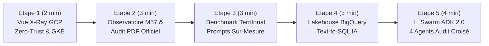

# 🎬 Guide de Démonstration Pas-à-Pas — `CivicLens` (Comptes Publics M57 & Swarm Google ADK 2.0)

> 🌐 **[Read this Demo Playbook in English 🇬🇧](DEMO_PLAYBOOK-EN.md)** | 🏠 **[Retour au README Principal](../README.md)** | 🚀 **[Ouvrir la Démo Live](https://civiclens.hoffmannw.demo.altostrat.com)**

Ce document est le **conducteur de démonstration pas-à-pas** pour présenter **CivicLens** — l'Observatoire Citoyen des Finances Publiques Locales (35 000 communes, nomenclature comptable **M57**, **650+ jeux Open Data Bercy**) propulsé par **Google ADK 2.0 (4 sous-agents)**, **BigQuery**, **Cloud SQL `pgvector`** et **GKE Autopilot**.

Chaque étape détaille :
1. **🖱️ Action à réaliser** (onglet/bouton 1-Click dans l'UI ou commande CLI)
2. **🤖 Quel Agent / Service GCP entre en action** (sous le capot)
3. **👀 Ce qu'il faut observer à l'écran & 💡 Message clé client (Valeur GCP)**

---

## ⏱️ Vue d'Ensemble du Scénario (Durée : 12 à 15 min)

---

## 🔹 Étape 1 : Radiographie de l'Architecture Souveraine (`🏗️ Architecture GCP (X-Ray)`)

### 1. 🖱️ Action à réaliser
1. Ouvrir **[`https://civiclens.hoffmannw.demo.altostrat.com`](https://civiclens.hoffmannw.demo.altostrat.com)**.
2. Cliquer dans la barre supérieure sur le bouton **`🏗️ Architecture GCP (X-Ray)`**.

### 2. 🤖 Quels Services GCP sont présentés sous le capot
La modale expose les 6 piliers de l'architecture déployée en région `europe-west1` (`wh-djvagl`) :
1. **Cloud Armor WAF & IAP Zero-Trust** : Filtrage OWASP Top 10 et authentification Google Identity-Aware Proxy (`X-Goog-Authenticated-User-Email`).
2. **GKE Autopilot + Workload Identity** : Cluster Kubernetes managé (`wh-djvagl-gkecluster`) sans aucune clé JSON de compte de service.
3. **Google ADK 2.0 & Vertex AI** : Swarm de 4 sous-agents financiers et juridiques propulsés par Gemini 3.5 / 3.6 Flash.
4. **BigQuery Data Lakehouse** : Analyse colonnaire sur les balances comptables M57 (`civiclens_finances.balances_communes`) avec garde-fou strict `SELECT-Only`.
5. **Cloud SQL PostgreSQL 16 + `pgvector`** : Recherche hybride 768-dim (`text-embedding-004`) sur les délibérations PDF des conseils municipaux.
6. **FinOps & Observabilité** : Suivi du coût par audit (`~$0.00018`) et logs structurés Cloud Logging.

### 3. 👀 Ce qu'il faut observer & 💡 Message clé client
- **À l'écran** : Les **Deep-Links 1-Click** permettent d'ouvrir en direct GKE Autopilot, BigQuery Studio ou Cloud Armor dans la Console GCP pendant la présentation.
- **💡 Message clé client** : *« Cette architecture répond aux exigences du secteur public et des collectivités : chiffrement, fédération d'identité sans secret statique (Workload Identity) et traçabilité de bout en bout. »*

---

## 🔹 Étape 2 : Observatoire des Communes (DGFiP / OFGL) & Rapport d'Audit PDF M57

### 1. 🖱️ Action à réaliser
1. Rester sur le 1er onglet **`🏛️ Observatoire des Communes`**.
2. Cliquer sur une ville dans les pilules rapides (ex: **`Bordeaux`**, **`Nantes`**, **`Pantin`** ou **`Toulouse`**).
3. Cliquer sur **`✨ Générer l'audit budgétaire Gemini`** puis sur **`📄 Télécharger PDF (M57)`**.

### 2. 🤖 Ce qui se passe sous le capot
- Le service `comptes_publics_service.py` interroge l'API nationale **OFGL / DGFiP** en temps réel (historique 2017–2024).
- Il calcule les agrégats de la nomenclature **M57** :
  - **Fonctionnement** (chapitres `011`, `012`, `65`)
  - **Investissement / Équipement** (chapitres `20`, `21`, `23`)
  - **Épargne brute (CAF)** et **Capacité de désendettement (en années)** par rapport au seuil national d'alerte (12 ans).
- Vertex AI Gemini rédige un diagnostic financier structuré et ReportLab génère un **Rapport Officiel PDF M57** prêt pour le conseil municipal.

### 3. 👀 Ce qu'il faut observer & 💡 Message clé client
- **À l'écran** : Les 4 KPIs budgétaires, les 2 graphiques d'évolution pluriannuelle (M€ et €/habitant) et le téléchargement instantané du PDF officiel.
- **💡 Message clé client** : *« En un clic, un directeur financier de collectivité ou un citoyen obtient la synthèse M57 officielle de n'importe laquelle des 35 000 communes françaises. »*

---

## 🔹 Étape 3 : Benchmark Territorial Comparatif (`⚖️ Benchmark Territorial`)

### 1. 🖱️ Action à réaliser
1. Cliquer sur le 2e onglet **`⚖️ Benchmark Territorial`**.
2. Cliquer sur le raccourci **`Bordeaux vs Nantes`** (ou **`Pantin vs Montreuil`**).
3. *(Optionnel)* Ouvrir l'accordéon **`🎯 Personnaliser les Prompts d'Audit (4 Volets)`** pour montrer que les consignes d'analyse M57 sont modifiables en direct.

### 2. 🤖 Ce qui se passe sous le capot
- Extraction parallèle des séries OFGL des deux collectivités, calcul des écarts relatifs en `€/habitant` et synthèse comparative Gemini en 4 volets (Fonctionnement, CAF/Investissement, Dette, Recommandations).

### 3. 👀 Ce qu'il faut observer & 💡 Message clé client
- **À l'écran** : Tableau comparatif coloré (vert/ambre selon la performance relative), graphique radar/barres côte à côte et rapport comparatif.

---

## 🔹 Étape 4 : Data Lakehouse BigQuery & Text-to-SQL IA (`🔍 Data Lakehouse BigQuery`)

### 1. 🖱️ Action à réaliser
1. Cliquer sur le 3e onglet **`🔍 Data Lakehouse BigQuery`**.
2. Cliquer sur l'une des questions analytiques pré-configurées (ex: *« Quelles sont les communes avec la meilleure épargne brute par habitant ? »*) puis sur **`⚡ Exécuter sur BigQuery`**.

*(Alternative en CLI : `make demo-bigquery`)*

### 2. 🤖 Ce qui se passe sous le capot (`analytics_service.py`)
1. **Vertex AI Gemini** traduit la question en langage naturel en une requête **GoogleSQL BigQuery** optimisée sur `civiclens_finances.balances_communes`.
2. **Garde-fou de sécurité (`data-governance-steward`)** : Vérifie que la requête est strictement en lecture seule (`SELECT` uniquement — tout mot-clé `DROP`, `DELETE`, `UPDATE`, `INSERT` est bloqué).
3. Exécution serverless sur BigQuery et génération automatique d'un graphique `Chart.js` + synthèse décisionnelle.

### 3. 👀 Ce qu'il faut observer & 💡 Message clé client
- **À l'écran** : La requête SQL générée s'affiche dans un encart sombre, suivie du graphique interactif (Barres/Courbe) et de la table de résultats.
- **💡 Message clé client** : *« Les élus et contrôleurs de gestion interrogent des millions de lignes comptables en français courant sur BigQuery sans écrire une seule ligne de SQL, tout en garantissant une sécurité Read-Only absolue. »*

---

## 🔹 Étape 5 : Le Clou de la Démo — `🤖 Swarm Audit ADK 2.0 (4 Agents M57)`

### 1. 🖱️ Action à réaliser
1. Cliquer sur le 5e onglet **`🤖 Swarm Audit ADK 2.0 (4 Agents M57)`**.
2. Cliquer sur l'un des **3 Scénarios de Démonstration Live (1-Click)** :
   - **`🎯 Scénario 1 • Bordeaux (Chap. 65)`** : *Audit de conformité M57 chapitre 65 (subventions aux associations) vs délibérations votées en conseil municipal en 2024*
   - **`🌱 Scénario 2 • Nantes (Chap. 21)`** : *Vérifier la soutenabilité des dépenses d'équipement M57 (chapitre 21 transition écologique) face à l'épargne brute CAF 2024*
   - **`⚖️ Scénario 3 • Pantin (Chap. 012)`** : *Analyser la rigidité des charges de personnel M57 (chapitre 012) et la capacité de désendettement*

*(Alternative en CLI : `make demo-swarm` ou `make demo-catalog`)*

### 2. 🤖 Quels Sous-Agents Google ADK 2.0 entrent en action sous le capot (`civic_swarm_adk.py`)
Le pipeline orchestre séquentiellement **4 sous-agents spécialisés** :
1. **`SupervisorAgent` (🎯 Orchestrateur Civique)** : Analyse l'intention et planifie les sous-tâches comptables (SQL M57) et juridiques (PDF `pgvector`).
2. **`BudgetSQLAgent` (📊 Expert Comptabilité M57)** : Exécute la requête SQL Read-Only sur BigQuery et extrait les 8 exercices OFGL de la commune cible.
3. **`DeliberationAuditorAgent` (📜 Auditeur Juridique)** : Exécute une recherche hybride (`pgvector` + texte intégral) dans les délibérations PDF votées en séance et interroge les 650+ jeux Open Data Bercy.
4. **`CrossCheckAuditAgent` (🛡️ Vérificateur & Fact-Checker)** : Croise les montants votés en conseil municipal (PDF) avec les crédits réellement exécutés (SQL M57), calcule le **Score de Conformité M57 (`/100`)** et rédige le rapport d'audit croisé.

### 3. 👀 Ce qu'il faut observer & 💡 Message clé client
- **À l'écran** :
  - Les **4 cartes d'agents** s'illuminent avec leur temps d'exécution en millisecondes (`✓ ms`) et le résumé de leur action.
  - Le bandeau KPI affiche le **Score de Conformité M57 (`96 / 100`)**, la **Latence Totale**, le **Coût FinOps Vertex AI (`~$0.00018`)** et le nombre de preuves croisées.
  - À gauche : la **Trace SQL Read-Only M57** (`🛡️ Garde-fou SELECT-Only`) et les délibérations PDF extraites.
  - À droite : le **Rapport d'Audit Croisé** complet.
- **💡 Message clé client** : *« Avec Google ADK 2.0 sur GKE Autopilot, nous ne faisons plus du simple chatbot : nous orchestrons une équipe d'agents spécialisés qui croisent automatiquement les bases structurées (BigQuery M57) et non structurées (délibérations PDF dans Cloud SQL `pgvector`) pour certifier la conformité budgétaire en quelques secondes. »*
