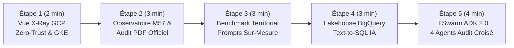

# 🎬 Guide de Démonstration Pas-à-Pas — `CivicLens` (Comptes Publics M57 & Swarm Google ADK 2.0)

> 🌐 **[Read this Demo Playbook in English 🇬🇧](DEMO_PLAYBOOK-EN.md)** | 🏠 **[Retour au README Principal](../README.md)** | 🚀 **[Ouvrir la Démo Live](https://civiclens.hoffmannw.demo.altostrat.com)** | 🗺️ **[Schémas Dendrite v3.3 & Draw.io](architecture-gcpdraw.md)**

> 🎨 **Architecture Interactive Dendrite v3.3 (Bento Matrix 16:9)** : Vous pouvez basculer sur l'onglet **`🗺️ Schéma Interactif Dendrite v3.3`** directement dans la modale **`🏗️ Architecture GCP (X-Ray)`** de l'application, ou l'ouvrir plein écran dans [**Dendrite Studio ↗**](https://dendrite-758054785671.cr.gclb.goog/#code=cmVuZGVyT3JkZXI6IG5vZGVzLWZpcnN0CmRpcmVjdGlvbjogZG93bgoKY29uc3QgR2NwQmx1ZSA9ICIjMWE3M2U4Igpjb25zdCBHY3BHcmVlbiA9ICIjMWU4ZTNlIgpjb25zdCBFbWVyYWxkVGVhbCA9ICIjMGQ5NDg4Igpjb25zdCBEYXJrU2xhdGUgPSAiIzIwMjEyNCIKY29uc3QgU3ViVGV4dCA9ICIjNWY2MzY4Igpjb25zdCBDYXJkQm9yZGVyID0gIiNkYWRjZTAiCmNvbnN0IEJ1c1N0cm9rZSA9ICIjMzM0MTU1Igpjb25zdCBTdXJmYWNlV2hpdGUgPSAiI2ZmZmZmZiIKClN0eWxlIEBHaG9zdCB7CiAgZmlsbDogdHJhbnNwYXJlbnQsIHN0cm9rZVdpZHRoOiAwLCBmb250Q29sb3I6IHRyYW5zcGFyZW50LCBwYWRkaW5nOiAwCn0KU3R5bGUgQEFyY2hpdGVjdHVyZVJvb3QgewogIGZpbGw6ICIjZjhmYWZkIiwgc3Ryb2tlQ29sb3I6ICIjYzJkN2Y1Iiwgc3Ryb2tlV2lkdGg6IDEuNSwgYm9yZGVyUmFkaXVzOiAxNiwKICBwYWRkaW5nOiAyMiwgZ2FwOiAxOCwgZm9udENvbG9yOiAiIzNjNDA0MyIsIGZvbnRTaXplOiAyMiwgbGFiZWxXZWlnaHQ6IGJvbGQsCiAgaWNvbjogIkdvb2dsZUNsb3VkIiwgaWNvblNpemU6IDI4Cn0KU3R5bGUgQFBlcmltZXRlclpvbmUgewogIGZpbGw6ICIjZThmMGZlIiwgc3Ryb2tlQ29sb3I6ICIjOGFiNGY4Iiwgc3Ryb2tlV2lkdGg6IDEuNSwgYm9yZGVyUmFkaXVzOiAxMiwKICBwYWRkaW5nOiAxNiwgZ2FwOiAxNiwgZm9udENvbG9yOiAkRGFya1NsYXRlLCBmb250U2l6ZTogMTUsIGxhYmVsV2VpZ2h0OiBib2xkCn0KU3R5bGUgQEV4ZWN1dGlvblpvbmUgewogIGZpbGw6ICIjZjNlOGZkIiwgc3Ryb2tlQ29sb3I6ICIjYzA4NGZjIiwgc3Ryb2tlV2lkdGg6IDEuNSwgYm9yZGVyUmFkaXVzOiAxMiwKICBwYWRkaW5nOiAxNiwgZ2FwOiAxNiwgZm9udENvbG9yOiAkRGFya1NsYXRlLCBmb250U2l6ZTogMTUsIGxhYmVsV2VpZ2h0OiBib2xkCn0KU3R5bGUgQEdvdmVybmFuY2Vab25lIHsKICBmaWxsOiAiI2U2ZjRlYSIsIHN0cm9rZUNvbG9yOiAiIzgxYzk5NSIsIHN0cm9rZVdpZHRoOiAxLjUsIGJvcmRlclJhZGl1czogMTIsCiAgcGFkZGluZzogMTYsIGdhcDogMTQsIGZvbnRDb2xvcjogJERhcmtTbGF0ZSwgZm9udFNpemU6IDE1LCBsYWJlbFdlaWdodDogYm9sZAp9ClN0eWxlIEBSZXNvdXJjZVpvbmUgewogIGZpbGw6ICIjZmVmN2UwIiwgc3Ryb2tlQ29sb3I6ICIjZmRlMjkzIiwgc3Ryb2tlV2lkdGg6IDEuNSwgYm9yZGVyUmFkaXVzOiAxMiwKICBwYWRkaW5nOiAxNiwgZ2FwOiAxNiwgZm9udENvbG9yOiAkRGFya1NsYXRlLCBmb250U2l6ZTogMTUsIGxhYmVsV2VpZ2h0OiBib2xkCn0KU3R5bGUgQFB1cnBsZVN1Ykdyb3VwIHsKICBmaWxsOiAiI2U5ZDVmZiIsIHN0cm9rZUNvbG9yOiBkYXJrZW4oIiNlOWQ1ZmYiLCAxNCksIHN0cm9rZVdpZHRoOiAxLCBib3JkZXJSYWRpdXM6IDEwLAogIHBhZGRpbmc6IDEyLCBnYXA6IDEwLCBmb250Q29sb3I6ICREYXJrU2xhdGUsIGZvbnRTaXplOiAxMywgbGFiZWxXZWlnaHQ6IGJvbGQKfQpTdHlsZSBAR3JlZW5TdWJHcm91cCB7CiAgZmlsbDogIiNjZWVhZDYiLCBzdHJva2VDb2xvcjogZGFya2VuKCIjY2VlYWQ2IiwgMTQpLCBzdHJva2VXaWR0aDogMSwgYm9yZGVyUmFkaXVzOiAxMCwKICBwYWRkaW5nOiAxMCwgZ2FwOiA3LCBmb250Q29sb3I6ICREYXJrU2xhdGUsIGZvbnRTaXplOiAxMywgbGFiZWxXZWlnaHQ6IGJvbGQKfQpTdHlsZSBAQW1iZXJTdWJHcm91cCB7CiAgZmlsbDogIiNmOWU0YTciLCBzdHJva2VDb2xvcjogZGFya2VuKCIjZjllNGE3IiwgMTQpLCBzdHJva2VXaWR0aDogMSwgYm9yZGVyUmFkaXVzOiAxMCwKICBwYWRkaW5nOiAxMiwgZ2FwOiAxMiwgZm9udENvbG9yOiAkRGFya1NsYXRlLCBmb250U2l6ZTogMTMsIGxhYmVsV2VpZ2h0OiBib2xkCn0KU3R5bGUgQEFjdG9yQ2FyZCB7CiAgd2lkdGg6IDE4MiwgaGVpZ2h0OiA1NiwKICBmaWxsOiAkU3VyZmFjZVdoaXRlLCBzdHJva2VDb2xvcjogJENhcmRCb3JkZXIsIHN0cm9rZVdpZHRoOiAxLCBib3JkZXJSYWRpdXM6IDgsCiAgZm9udENvbG9yOiAkRGFya1NsYXRlLCBzdWJGb250Q29sb3I6ICRTdWJUZXh0LAogIGZvbnRTaXplOiAxNCwgc3ViRm9udFNpemU6IDExLCBsYWJlbFdlaWdodDogYm9sZCwKICB0ZXh0QWxpZ246ICJsZWZ0IiwgdGV4dFZBbGlnbjogIm1pZGRsZSIsCiAgaWNvblBvc2l0aW9uOiAibGVmdCIsIGljb25TaXplOiAyOCwgcGFkZGluZzogMTAsIHNoYWRvdzogdHJ1ZQp9ClN0eWxlIEBQcm9kdWN0Q2FyZCB7CiAgd2lkdGg6IDE3MCwgaGVpZ2h0OiA1OCwKICBmaWxsOiAkU3VyZmFjZVdoaXRlLCBzdHJva2VDb2xvcjogJENhcmRCb3JkZXIsIHN0cm9rZVdpZHRoOiAxLCBib3JkZXJSYWRpdXM6IDgsCiAgZm9udENvbG9yOiAkRGFya1NsYXRlLCBzdWJGb250Q29sb3I6ICRTdWJUZXh0LAogIGZvbnRTaXplOiAxMy41LCBzdWJGb250U2l6ZTogMTAuNSwgbGFiZWxXZWlnaHQ6IGJvbGQsCiAgdGV4dEFsaWduOiAibGVmdCIsIHRleHRWQWxpZ246ICJtaWRkbGUiLAogIGljb25Qb3NpdGlvbjogImxlZnQiLCBpY29uU2l6ZTogMjYsIHBhZGRpbmc6IDEwLCBzaGFkb3c6IHRydWUKfQpTdHlsZSBAR2F0ZXdheUh1YkNhcmQgewogIGJhc2U6IEBQcm9kdWN0Q2FyZCwKICB3aWR0aDogMTk4LCBoZWlnaHQ6IDY2LCBzdHJva2VDb2xvcjogIiM3YzNhZWQiLCBzdHJva2VXaWR0aDogMiwKICBmb250U2l6ZTogMTQuNSwgc3ViRm9udFNpemU6IDExLCBpY29uU2l6ZTogMzAsIHBhZGRpbmc6IDEyCn0KU3R5bGUgQFBvbGljeVBpbGwgewogIHdpZHRoOiAyMzQsIGhlaWdodDogMzIsCiAgZmlsbDogJFN1cmZhY2VXaGl0ZSwgc3Ryb2tlQ29sb3I6ICIjOWFhMGE2Iiwgc3Ryb2tlV2lkdGg6IDEsIGJvcmRlclJhZGl1czogMTYsCiAgZm9udENvbG9yOiAkRGFya1NsYXRlLCBmb250U2l6ZTogMTIuNSwgbGFiZWxXZWlnaHQ6IGJvbGQsCiAgdGV4dEFsaWduOiAibGVmdCIsIHRleHRWQWxpZ246ICJtaWRkbGUiLAogIGljb25Qb3NpdGlvbjogImxlZnQiLCBpY29uU2l6ZTogMTYsIHBhZGRpbmc6IDEwLCBzaGFkb3c6IHRydWUKfQoKWm9uZSBAQ2l2aWNMZW5zX1BsYXRmb3JtIHsKICB0aXRsZTogIkNpdmljTGVucyDigJQgUHVibGljIEZpbmFuY2UgTTU3IE9ic2VydmF0b3J5ICYgR29vZ2xlIEFESyAyLjAgTXVsdGktQWdlbnQgU3dhcm0iCiAgc3R5bGU6IEBBcmNoaXRlY3R1cmVSb290CiAgbGF5b3V0OiBtYXRyaXgKICBhcmVhczogWwogICAgInoxIHoxIHoxIHoxIHoxIiwKICAgICJ6MyB6MyB6MyB6MiB6MiIsCiAgICAiejQgejQgejQgejQgejQiCiAgXQogIHNpemVzOiBbIjEuMDVmciIsICIxLjA1ZnIiLCAiMS4wNWZyIiwgIjAuOTJmciIsICIwLjkyZnIiXQogIGdhcDogMjAKCiAgWm9uZSBAWm9uZTFfSW5ncmVzcyB7CiAgICBhcmVhOiAiejEiCiAgICB0aXRsZTogIjEuIENpdGl6ZW4gJiBNdW5pY2lwYWwgUGVyaW1ldGVyIChaZXJvLVRydXN0IEVkZ2UgJiBJQVApIgogICAgc3R5bGU6IEBQZXJpbWV0ZXJab25lCiAgICBsYXlvdXQ6IHJvdywgZ2FwOiAxOCwgYWxpZ246IGNlbnRlciwganVzdGlmeTogY2VudGVyCiAgICBbY2l0aXplbnNfbWF5b3JzOiAiQ2l0aXplbnMgJiBNYXlvcnMiIHwgIjM1LDAwMCBNdW5pY2lwYWxpdGllcyJdIHsgc3R5bGU6IEBBY3RvckNhcmQsIGljb246ICJVc2VycyIgfQogICAgW2NsX2FybW9yX3dhZjogIkNsb3VkIEFybW9yIFdBRiIgfCAiQWRhcHRpdmUgRERvUyAmIE9XQVNQIl0geyBzdHlsZTogQFByb2R1Y3RDYXJkLCB3aWR0aDogMTg2LCBpY29uOiAiQ2xvdWRBcm1vciIgfQogICAgW2NsX2h0dHBzX2xiOiAiR2xvYmFsIEhUVFBTIExCIiB8ICJNYW5hZ2VkIFNTTCBJbmdyZXNzIl0geyBzdHlsZTogQFByb2R1Y3RDYXJkLCB3aWR0aDogMTg2LCBpY29uOiAiQ2xvdWRMb2FkQmFsYW5jaW5nIiB9CiAgICBbY2xfaWFwX2F1dGg6ICJJZGVudGl0eS1Bd2FyZSBQcm94eSIgfCAiQ3J5cHRvZ3JhcGhpYyBKV1QgSGVhZGVyIl0geyBzdHlsZTogQFByb2R1Y3RDYXJkLCB3aWR0aDogMTkyLCBpY29uOiAiR29vZ2xlSWRlbnRpdHkiIH0KICAgIFtjbF93ZWJfdWk6ICJDaXZpY0xlbnMgNS1UYWIgVUkiIHwgIk9ic2VydmF0b3J5IOKAoiBCaWdRdWVyeSDigKIgU3dhcm0iXSB7IHN0eWxlOiBAUHJvZHVjdENhcmQsIHdpZHRoOiAxOTgsIGljb246ICJMYXB0b3AiIH0KICB9CgogIFpvbmUgQFpvbmUzX0dLRV9Td2FybSB7CiAgICBhcmVhOiAiejMiCiAgICB0aXRsZTogIjIuIEdLRSBBdXRvcGlsb3QgUnVudGltZSAmIEdvb2dsZSBBREsgMi4wIDQtQWdlbnQgU3dhcm0gKFdvcmtsb2FkIElkZW50aXR5KSIKICAgIHN0eWxlOiBARXhlY3V0aW9uWm9uZQogICAgbGF5b3V0OiByb3csIGdhcDogMzQsIGFsaWduOiBjZW50ZXIsIGp1c3RpZnk6IGNlbnRlcgoKICAgIFtzdXBlcnZpc29yX2FnZW50OiAiMS4gU3VwZXJ2aXNvckFnZW50XG4oQURLIE9yY2hlc3RyYXRvcikiIHwgIkludGVudCAmIFRhc2sgUm91dGVyIl0gewogICAgICBzdHlsZTogQEdhdGV3YXlIdWJDYXJkLCBpY29uOiAiR29vZ2xlQWdlbnRzIiwKICAgICAgZGVzY3JpcHRpb246ICJDbGFzc2lmaWVzIGNpdmljICYgTTU3IGFjY291bnRpbmcgaW50ZW50IGFuZCBkZWxlZ2F0ZXMgdG8gc3BlY2lhbGl6ZWQgc3ViYWdlbnRzIgogICAgfQoKICAgIFpvbmUgQFNwZWNpYWxpc3RBZ2VudHNDb2wgewogICAgICBzdHlsZTogQEdob3N0LCBsYXlvdXQ6IGNvbHVtbiwgZ2FwOiAxMiwgYWxpZ246IHN0cmV0Y2gKCiAgICAgIFpvbmUgQERhdGFSZXRyaWV2YWxBZ2VudHMgewogICAgICAgIHRpdGxlOiAiUGFyYWxsZWwgUXVhbnRpdGF0aXZlICYgTGVnYWwgUmV0cmlldmFsIFN1YmFnZW50cyIKICAgICAgICBzdHlsZTogQFB1cnBsZVN1Ykdyb3VwLCB3aWR0aDogMzc2LCBsYXlvdXQ6IHJvdywgZ2FwOiAxMiwgYWxpZ246IGNlbnRlciwganVzdGlmeTogY2VudGVyCiAgICAgICAgW2J1ZGdldF9zcWxfYWdlbnQ6ICIyLiBCdWRnZXRTUUxBZ2VudCIgfCAiTTU3IEJpZ1F1ZXJ5ICsgT0ZHTCJdIHsgc3R5bGU6IEBQcm9kdWN0Q2FyZCwgd2lkdGg6IDE3NCwgaWNvbjogIkJpZ1F1ZXJ5IiB9CiAgICAgICAgW2RlbGliX2F1ZGl0b3JfYWdlbnQ6ICIzLiBEZWxpYmVyYXRpb25BdWRpdG9yIiB8ICJwZ3ZlY3RvciBQREYgKyBCZXJjeSJdIHsgc3R5bGU6IEBQcm9kdWN0Q2FyZCwgd2lkdGg6IDE3NCwgaWNvbjogIlNlYXJjaCIgfQogICAgICB9CgogICAgICBab25lIEBTeW50aGVzaXNBdWRpdEFnZW50IHsKICAgICAgICB0aXRsZTogIkNyb3NzLUV4YW1pbmF0aW9uICYgT2ZmaWNpYWwgUmVwb3J0IEdlbmVyYXRpb24iCiAgICAgICAgc3R5bGU6IEBQdXJwbGVTdWJHcm91cCwgZGFzaGVkOiB0cnVlLCB3aWR0aDogMzc2LCBsYXlvdXQ6IHJvdywgZ2FwOiAxMiwgYWxpZ246IGNlbnRlciwganVzdGlmeTogY2VudGVyCiAgICAgICAgW2Nyb3NzY2hlY2tfYWdlbnQ6ICI0LiBDcm9zc0NoZWNrQXVkaXQiIHwgIlZvdGVkIFBERiB2cy4gRXhlY3V0ZWQgU1FMIl0geyBzdHlsZTogQFByb2R1Y3RDYXJkLCB3aWR0aDogMTc0LCBpY29uOiAiU2hpZWxkQ2hlY2siIH0KICAgICAgICBbcGRmX3JlcG9ydF9nZW46ICJNNTcgUERGICYgU2NvcmUgLzEwMCIgfCAiUmVwb3J0TGFiICsgRmluT3BzIEJhZGdlIl0geyBzdHlsZTogQFByb2R1Y3RDYXJkLCB3aWR0aDogMTc0LCBpY29uOiAiQmFyQ2hhcnQzIiB9CiAgICAgIH0KICAgIH0KICB9CgogIFpvbmUgQFpvbmUyX0dvdmVybmFuY2UgewogICAgYXJlYTogInoyIgogICAgdGl0bGU6ICIzLiBNNTcgRGF0YSBHb3Zlcm5hbmNlICYgU292ZXJlaWduIEd1YXJkcmFpbHMiCiAgICBzdHlsZTogQEdvdmVybmFuY2Vab25lCiAgICBsYXlvdXQ6IHJvdywgZ2FwOiAyMCwgYWxpZ246IGNlbnRlciwganVzdGlmeTogY2VudGVyCgogICAgWm9uZSBATTU3R3VhcmRyYWlscyB7CiAgICAgIHRpdGxlOiAiTTU3IEFjY291bnRpbmcgJiBTZWN1cml0eSBSdWxlcyIKICAgICAgc3R5bGU6IEBHcmVlblN1Ykdyb3VwLCBsYXlvdXQ6IGNvbHVtbiwgZ2FwOiA4LCBhbGlnbjogY2VudGVyCiAgICAgIFtydWxlX3JlYWRvbmx5OiAiQmlnUXVlcnlUb29sc2V0IFNFTEVDVC1Pbmx5Il0geyBzdHlsZTogQFBvbGljeVBpbGwsIGljb246ICJMb2NrIiB9CiAgICAgIFtydWxlX201N19zZXA6ICJNNTcgT3AgKDAxMS8wMTIvNjUpIHZzIEludiAoMjAvMjEpIl0geyBzdHlsZTogQFBvbGljeVBpbGwsIGljb246ICJTaGllbGRDaGVjayIgfQogICAgICBbcnVsZV93aTogIktleWxlc3MgR0tFIFdvcmtsb2FkIElkZW50aXR5Il0geyBzdHlsZTogQFBvbGljeVBpbGwsIGljb246ICJHb29nbGVJZGVudGl0eSIgfQogICAgICBbcnVsZV9yZ3BkOiAiR0RQUiBBbm9ueW1pemF0aW9uICYgV09STSBEUiJdIHsgc3R5bGU6IEBQb2xpY3lQaWxsLCBpY29uOiAiU2VjdXJpdHlDb21tYW5kQ2VudGVyIiB9CiAgICB9CiAgfQoKICBab25lIEBab25lNF9MYWtlaG91c2UgewogICAgYXJlYTogIno0IgogICAgdGl0bGU6ICI0LiBTb3ZlcmVpZ24gRGF0YSBMYWtlaG91c2UsIEh5YnJpZCBWZWN0b3IgU3RvcmUgJiBOYXRpb25hbCBPcGVuIERhdGEgQVBJcyIKICAgIHN0eWxlOiBAUmVzb3VyY2Vab25lCiAgICBsYXlvdXQ6IG1hdHJpeCwgY29sczogMywgc2l6ZXM6IFsiMS4wNWZyIiwgIjEuMWZyIiwgIjAuOTVmciJdLCBnYXA6IDE4LCBhbGlnbjogY2VudGVyCgogICAgWm9uZSBAU3RydWN0dXJlZEZpbmFuY2VTdG9yZSB7CiAgICAgIHRpdGxlOiAiU3RydWN0dXJlZCBNNTcgQWNjb3VudGluZyBMYWtlaG91c2UiCiAgICAgIHN0eWxlOiBAQW1iZXJTdWJHcm91cCwgbGF5b3V0OiByb3csIGdhcDogMTIsIGFsaWduOiBjZW50ZXIsIGp1c3RpZnk6IGNlbnRlcgogICAgICBbYnFfbTU3X2xha2Vob3VzZTogIkJpZ1F1ZXJ5IExha2Vob3VzZSIgfCAiY2l2aWNsZW5zX2ZpbmFuY2VzIChNNTcpIl0geyBzdHlsZTogQFByb2R1Y3RDYXJkLCB3aWR0aDogMTc2LCBpY29uOiAiQmlnUXVlcnkiIH0KICAgICAgW2JlcmN5X29mZ2xfYXBpOiAiREdGaVAgLyBPRkdMICYgQmVyY3kiIHwgIjY1MCsgT3BlbiBEYXRhIERhdGFzZXRzIl0geyBzdHlsZTogQFByb2R1Y3RDYXJkLCB3aWR0aDogMTc4LCBpY29uOiAiR2xvYmUiIH0KICAgIH0KCiAgICBab25lIEBVbnN0cnVjdHVyZWRWZWN0b3JTdG9yZSB7CiAgICAgIHRpdGxlOiAiQ291bmNpbCBEZWxpYmVyYXRpb25zICYgTXVsdGltb2RhbCBSQUciCiAgICAgIHN0eWxlOiBAQW1iZXJTdWJHcm91cCwgbGF5b3V0OiByb3csIGdhcDogMTIsIGFsaWduOiBjZW50ZXIsIGp1c3RpZnk6IGNlbnRlcgogICAgICBbY2xvdWRzcWxfcGd2ZWN0b3I6ICJDbG91ZCBTUUwgUEcgMTYiIHwgInBndmVjdG9yIEhOU1cgKDc2OGQpIl0geyBzdHlsZTogQFByb2R1Y3RDYXJkLCB3aWR0aDogMTc0LCBpY29uOiAiQ2xvdWRTUUwiIH0KICAgICAgW2djc19wZGZfdmF1bHQ6ICJDbG91ZCBTdG9yYWdlIFZhdWx0IiB8ICJDb3VuY2lsIFBERiBBY3RzIl0geyBzdHlsZTogQFByb2R1Y3RDYXJkLCB3aWR0aDogMTcwLCBpY29uOiAiR2NwU3RvcmFnZUJ1Y2tldCIgfQogICAgfQoKICAgIFpvbmUgQFZlcnRleEFuZEJhY2t1cCB7CiAgICAgIHRpdGxlOiAiVmVydGV4IEFJICYgSW1tdXRhYmxlIERSIgogICAgICBzdHlsZTogQEFtYmVyU3ViR3JvdXAsIGxheW91dDogcm93LCBnYXA6IDEyLCBhbGlnbjogY2VudGVyLCBqdXN0aWZ5OiBjZW50ZXIKICAgICAgW3ZlcnRleF9nZW1pbmlfY2w6ICJWZXJ0ZXggQUkgR2VtaW5pIDMuNSIgfCAiVGV4dC10by1TUUwgJiBFbWJlZGRpbmdzIl0geyBzdHlsZTogQFByb2R1Y3RDYXJkLCB3aWR0aDogMTc4LCBpY29uOiAiVmVydGV4QUkiIH0KICAgICAgW2JhY2t1cF9kcl9jbDogIkJhY2t1cCAmIERSIFNlcnZpY2UiIHwgIk11bHRpLVJlZ2lvbiBXT1JNIFZhdWx0Il0geyBzdHlsZTogQFByb2R1Y3RDYXJkLCB3aWR0aDogMTc0LCBpY29uOiAiU2VjdXJpdHlDb21tYW5kQ2VudGVyIiB9CiAgICB9CiAgfQp9CgpbY2l0aXplbnNfbWF5b3JzXSAtLT4gW2NsX2FybW9yX3dhZl0geyBjb2xvcjogJEdjcEJsdWUsIHN0cm9rZVdpZHRoOiAyLCBzb3VyY2VBbmNob3I6ICJyaWdodCIsIHRhcmdldEFuY2hvcjogImxlZnQiLCBjdXJ2ZTogInN0ZXAiLCBzZXF1ZW5jZUJhZGdlOiAiMSIsIGJhZGdlRmlsbDogJEdjcEJsdWUsIGJhZGdlRm9udENvbG9yOiAkU3VyZmFjZVdoaXRlIH0KW2NsX2FybW9yX3dhZl0gLS0+IFtjbF9odHRwc19sYl0geyBjb2xvcjogJEdjcEJsdWUsIHN0cm9rZVdpZHRoOiAyLCBzb3VyY2VBbmNob3I6ICJyaWdodCIsIHRhcmdldEFuY2hvcjogImxlZnQiLCBjdXJ2ZTogInN0ZXAiIH0KW2NsX2h0dHBzX2xiXSAtLT4gW2NsX2lhcF9hdXRoXSB7IGNvbG9yOiAkR2NwQmx1ZSwgc3Ryb2tlV2lkdGg6IDIsIHNvdXJjZUFuY2hvcjogInJpZ2h0IiwgdGFyZ2V0QW5jaG9yOiAibGVmdCIsIGN1cnZlOiAic3RlcCIgfQpbY2xfaWFwX2F1dGhdIC0tPiBbY2xfd2ViX3VpXSB7IGNvbG9yOiAkR2NwQmx1ZSwgc3Ryb2tlV2lkdGg6IDIsIHNvdXJjZUFuY2hvcjogInJpZ2h0IiwgdGFyZ2V0QW5jaG9yOiAibGVmdCIsIGN1cnZlOiAic3RlcCIgfQoKW1pvbmUxX0luZ3Jlc3NdIC0tPiBbc3VwZXJ2aXNvcl9hZ2VudF0geyBjb2xvcjogIiM3YzNhZWQiLCBzdHJva2VXaWR0aDogMiwgc291cmNlQW5jaG9yOiAiYm90dG9tIiwgdGFyZ2V0QW5jaG9yOiAidG9wIiwgY3VydmU6ICJzdGVwIiwgbGFiZWw6ICJTd2FybSBBdWRpdCIsIHNlcXVlbmNlQmFkZ2U6ICIyIiwgYmFkZ2VGaWxsOiAiIzdjM2FlZCIsIGJhZGdlRm9udENvbG9yOiAkU3VyZmFjZVdoaXRlIH0KW3N1cGVydmlzb3JfYWdlbnRdIC0tPiBbRGF0YVJldHJpZXZhbEFnZW50c10geyBjb2xvcjogIiM3YzNhZWQiLCBzdHJva2VXaWR0aDogMiwgc291cmNlQW5jaG9yOiAicmlnaHQiLCB0YXJnZXRBbmNob3I6ICJsZWZ0IiwgY3VydmU6ICJzdGVwIiB9CltzdXBlcnZpc29yX2FnZW50XSAtLT4gW1N5bnRoZXNpc0F1ZGl0QWdlbnRdIHsgY29sb3I6ICIjN2MzYWVkIiwgc3Ryb2tlV2lkdGg6IDIsIHNvdXJjZUFuY2hvcjogInJpZ2h0IiwgdGFyZ2V0QW5jaG9yOiAibGVmdCIsIGN1cnZlOiAic3RlcCIgfQpbU3BlY2lhbGlzdEFnZW50c0NvbF0gLS0+IFtNNTdHdWFyZHJhaWxzXSB7IGNvbG9yOiAkR2NwR3JlZW4sIHN0cm9rZVdpZHRoOiAxLjgsIGRhc2hlZDogdHJ1ZSwgc291cmNlQW5jaG9yOiAicmlnaHQiLCB0YXJnZXRBbmNob3I6ICJsZWZ0IiwgY3VydmU6ICJzdGVwIiwgbGFiZWw6ICJFbmZvcmNlZCBCeSIgfQoKW1pvbmUzX0dLRV9Td2FybV0gLS0+IFtTdHJ1Y3R1cmVkRmluYW5jZVN0b3JlXSB7IGNvbG9yOiAkRW1lcmFsZFRlYWwsIHN0cm9rZVdpZHRoOiAyLCBzb3VyY2VBbmNob3I6ICJib3R0b20iLCB0YXJnZXRBbmNob3I6ICJ0b3AiLCBjdXJ2ZTogInN0ZXAiLCBsYWJlbDogIk01NyBTUUwgJiBBUEkiLCBzZXF1ZW5jZUJhZGdlOiAiMyIsIGJhZGdlRmlsbDogJEVtZXJhbGRUZWFsLCBiYWRnZUZvbnRDb2xvcjogJFN1cmZhY2VXaGl0ZSB9Cltab25lM19HS0VfU3dhcm1dIC0tPiBbVW5zdHJ1Y3R1cmVkVmVjdG9yU3RvcmVdIHsgY29sb3I6ICRHY3BCbHVlLCBzdHJva2VXaWR0aDogMiwgc291cmNlQW5jaG9yOiAiYm90dG9tIiwgdGFyZ2V0QW5jaG9yOiAidG9wIiwgY3VydmU6ICJzdGVwIiwgbGFiZWw6ICJwZ3ZlY3RvciBITlNXIiwgc2VxdWVuY2VCYWRnZTogIjQiLCBiYWRnZUZpbGw6ICRHY3BCbHVlLCBiYWRnZUZvbnRDb2xvcjogJFN1cmZhY2VXaGl0ZSB9Cltab25lMl9Hb3Zlcm5hbmNlXSAtLT4gW1ZlcnRleEFuZEJhY2t1cF0geyBjb2xvcjogJEJ1c1N0cm9rZSwgc3Ryb2tlV2lkdGg6IDEuOCwgZGFzaGVkOiB0cnVlLCBzb3VyY2VBbmNob3I6ICJib3R0b20iLCB0YXJnZXRBbmNob3I6ICJ0b3AiLCBjdXJ2ZTogInN0ZXAiLCBsYWJlbDogIkFEQyAmIFdPUk0iIH0K) ([`.dendrite`](diagrams/civiclens_adk_swarm_v3.dendrite) / [`.drawio`](diagrams/civiclens_adk_swarm_v3.drawio)).
Ce document est le **conducteur de démonstration pas-à-pas** pour présenter **CivicLens** — l'Observatoire Citoyen des Finances Publiques Locales (35 000 communes, nomenclature comptable **M57**, **650+ jeux Open Data Bercy**) propulsé par **Google ADK 2.0 (4 sous-agents)**, **BigQuery**, **Cloud SQL `pgvector`** et **GKE Autopilot**.

Chaque étape détaille :
1. **🖱️ Action à réaliser** (onglet/bouton 1-Click dans l'UI ou commande CLI)
2. **🤖 Quel Agent / Service GCP entre en action** (sous le capot)
3. **👀 Ce qu'il faut observer à l'écran & 💡 Message clé client (Valeur GCP)**

---

## ⏱️ Vue d'Ensemble du Scénario (Durée : 12 à 15 min)

---

## 🔹 Étape 1 : Radiographie de l'Architecture Souveraine (`🏗️ Architecture GCP (X-Ray)`)

### 1. 🖱️ Action à réaliser
1. Ouvrir **[`https://civiclens.hoffmannw.demo.altostrat.com`](https://civiclens.hoffmannw.demo.altostrat.com)**.
2. Cliquer dans la barre supérieure sur le bouton **`🏗️ Architecture GCP (X-Ray)`**.

### 2. 🤖 Quels Services GCP sont présentés sous le capot
La modale expose les 6 piliers de l'architecture déployée en région `europe-west1` (`wh-djvagl`) :
1. **Cloud Armor WAF & IAP Zero-Trust** : Filtrage OWASP Top 10 et authentification Google Identity-Aware Proxy (`X-Goog-Authenticated-User-Email`).
2. **GKE Autopilot + Workload Identity** : Cluster Kubernetes managé (`wh-djvagl-gkecluster`) sans aucune clé JSON de compte de service.
3. **Google ADK 2.0 & Vertex AI** : Swarm de 4 sous-agents financiers et juridiques propulsés par Gemini 3.5 / 3.6 Flash.
4. **BigQuery Data Lakehouse** : Analyse colonnaire sur les balances comptables M57 (`civiclens_finances.balances_communes`) avec garde-fou strict `SELECT-Only`.
5. **Cloud SQL PostgreSQL 16 + `pgvector`** : Recherche hybride 768-dim (`text-embedding-004`) sur les délibérations PDF des conseils municipaux.
6. **FinOps & Observabilité** : Suivi du coût par audit (`~$0.00018`) et logs structurés Cloud Logging.

### 3. 👀 Ce qu'il faut observer & 💡 Message clé client
- **À l'écran** : Les **Deep-Links 1-Click** permettent d'ouvrir en direct GKE Autopilot, BigQuery Studio ou Cloud Armor dans la Console GCP pendant la présentation.
- **💡 Message clé client** : *« Cette architecture répond aux exigences du secteur public et des collectivités : chiffrement, fédération d'identité sans secret statique (Workload Identity) et traçabilité de bout en bout. »*

---

## 🔹 Étape 2 : Observatoire des Communes (DGFiP / OFGL) & Rapport d'Audit PDF M57

### 1. 🖱️ Action à réaliser
1. Rester sur le 1er onglet **`🏛️ Observatoire des Communes`**.
2. Cliquer sur une ville dans les pilules rapides (ex: **`Bordeaux`**, **`Nantes`**, **`Pantin`** ou **`Toulouse`**).
3. Cliquer sur **`✨ Générer l'audit budgétaire Gemini`** puis sur **`📄 Télécharger PDF (M57)`**.

### 2. 🤖 Ce qui se passe sous le capot
- Le service `comptes_publics_service.py` interroge l'API nationale **OFGL / DGFiP** en temps réel (historique 2017–2024).
- Il calcule les agrégats de la nomenclature **M57** :
  - **Fonctionnement** (chapitres `011`, `012`, `65`)
  - **Investissement / Équipement** (chapitres `20`, `21`, `23`)
  - **Épargne brute (CAF)** et **Capacité de désendettement (en années)** par rapport au seuil national d'alerte (12 ans).
- Vertex AI Gemini rédige un diagnostic financier structuré et ReportLab génère un **Rapport Officiel PDF M57** prêt pour le conseil municipal.

### 3. 👀 Ce qu'il faut observer & 💡 Message clé client
- **À l'écran** : Les 4 KPIs budgétaires, les 2 graphiques d'évolution pluriannuelle (M€ et €/habitant) et le téléchargement instantané du PDF officiel.
- **💡 Message clé client** : *« En un clic, un directeur financier de collectivité ou un citoyen obtient la synthèse M57 officielle de n'importe laquelle des 35 000 communes françaises. »*

---

## 🔹 Étape 3 : Benchmark Territorial Comparatif (`⚖️ Benchmark Territorial`)

### 1. 🖱️ Action à réaliser
1. Cliquer sur le 2e onglet **`⚖️ Benchmark Territorial`**.
2. Cliquer sur le raccourci **`Bordeaux vs Nantes`** (ou **`Pantin vs Montreuil`**).
3. *(Optionnel)* Ouvrir l'accordéon **`🎯 Personnaliser les Prompts d'Audit (4 Volets)`** pour montrer que les consignes d'analyse M57 sont modifiables en direct.

### 2. 🤖 Ce qui se passe sous le capot
- Extraction parallèle des séries OFGL des deux collectivités, calcul des écarts relatifs en `€/habitant` et synthèse comparative Gemini en 4 volets (Fonctionnement, CAF/Investissement, Dette, Recommandations).

### 3. 👀 Ce qu'il faut observer & 💡 Message clé client
- **À l'écran** : Tableau comparatif coloré (vert/ambre selon la performance relative), graphique radar/barres côte à côte et rapport comparatif.

---

## 🔹 Étape 4 : Data Lakehouse BigQuery & Text-to-SQL IA (`🔍 Data Lakehouse BigQuery`)

### 1. 🖱️ Action à réaliser
1. Cliquer sur le 3e onglet **`🔍 Data Lakehouse BigQuery`**.
2. Cliquer sur l'une des questions analytiques pré-configurées (ex: *« Quelles sont les communes avec la meilleure épargne brute par habitant ? »*) puis sur **`⚡ Exécuter sur BigQuery`**.

*(Alternative en CLI : `make demo-bigquery`)*

### 2. 🤖 Ce qui se passe sous le capot (`analytics_service.py`)
1. **Vertex AI Gemini** traduit la question en langage naturel en une requête **GoogleSQL BigQuery** optimisée sur `civiclens_finances.balances_communes`.
2. **Garde-fou de sécurité (`data-governance-steward`)** : Vérifie que la requête est strictement en lecture seule (`SELECT` uniquement — tout mot-clé `DROP`, `DELETE`, `UPDATE`, `INSERT` est bloqué).
3. Exécution serverless sur BigQuery et génération automatique d'un graphique `Chart.js` + synthèse décisionnelle.

### 3. 👀 Ce qu'il faut observer & 💡 Message clé client
- **À l'écran** : La requête SQL générée s'affiche dans un encart sombre, suivie du graphique interactif (Barres/Courbe) et de la table de résultats.
- **💡 Message clé client** : *« Les élus et contrôleurs de gestion interrogent des millions de lignes comptables en français courant sur BigQuery sans écrire une seule ligne de SQL, tout en garantissant une sécurité Read-Only absolue. »*

---

## 🔹 Étape 5 : Le Clou de la Démo — `🤖 Swarm Audit ADK 2.0 (4 Agents M57)`

### 1. 🖱️ Action à réaliser
1. Cliquer sur le 5e onglet **`🤖 Swarm Audit ADK 2.0 (4 Agents M57)`**.
2. Cliquer sur l'un des **3 Scénarios de Démonstration Live (1-Click)** :
   - **`🎯 Scénario 1 • Bordeaux (Chap. 65)`** : *Audit de conformité M57 chapitre 65 (subventions aux associations) vs délibérations votées en conseil municipal en 2024*
   - **`🌱 Scénario 2 • Nantes (Chap. 21)`** : *Vérifier la soutenabilité des dépenses d'équipement M57 (chapitre 21 transition écologique) face à l'épargne brute CAF 2024*
   - **`⚖️ Scénario 3 • Pantin (Chap. 012)`** : *Analyser la rigidité des charges de personnel M57 (chapitre 012) et la capacité de désendettement*

*(Alternative en CLI : `make demo-swarm` ou `make demo-catalog`)*

### 2. 🤖 Quels Sous-Agents Google ADK 2.0 entrent en action sous le capot (`civic_swarm_adk.py`)
Le pipeline orchestre séquentiellement **4 sous-agents spécialisés** :
1. **`SupervisorAgent` (🎯 Orchestrateur Civique)** : Analyse l'intention et planifie les sous-tâches comptables (SQL M57) et juridiques (PDF `pgvector`).
2. **`BudgetSQLAgent` (📊 Expert Comptabilité M57)** : Exécute la requête SQL Read-Only sur BigQuery et extrait les 8 exercices OFGL de la commune cible.
3. **`DeliberationAuditorAgent` (📜 Auditeur Juridique)** : Exécute une recherche hybride (`pgvector` + texte intégral) dans les délibérations PDF votées en séance et interroge les 650+ jeux Open Data Bercy.
4. **`CrossCheckAuditAgent` (🛡️ Vérificateur & Fact-Checker)** : Croise les montants votés en conseil municipal (PDF) avec les crédits réellement exécutés (SQL M57), calcule le **Score de Conformité M57 (`/100`)** et rédige le rapport d'audit croisé.

### 3. 👀 Ce qu'il faut observer & 💡 Message clé client
- **À l'écran** :
  - Les **4 cartes d'agents** s'illuminent avec leur temps d'exécution en millisecondes (`✓ ms`) et le résumé de leur action.
  - Le bandeau KPI affiche le **Score de Conformité M57 (`96 / 100`)**, la **Latence Totale**, le **Coût FinOps Vertex AI (`~$0.00018`)** et le nombre de preuves croisées.
  - À gauche : la **Trace SQL Read-Only M57** (`🛡️ Garde-fou SELECT-Only`) et les délibérations PDF extraites.
  - À droite : le **Rapport d'Audit Croisé** complet.
- **💡 Message clé client** : *« Avec Google ADK 2.0 sur GKE Autopilot, nous ne faisons plus du simple chatbot : nous orchestrons une équipe d'agents spécialisés qui croisent automatiquement les bases structurées (BigQuery M57) et non structurées (délibérations PDF dans Cloud SQL `pgvector`) pour certifier la conformité budgétaire en quelques secondes. »*
