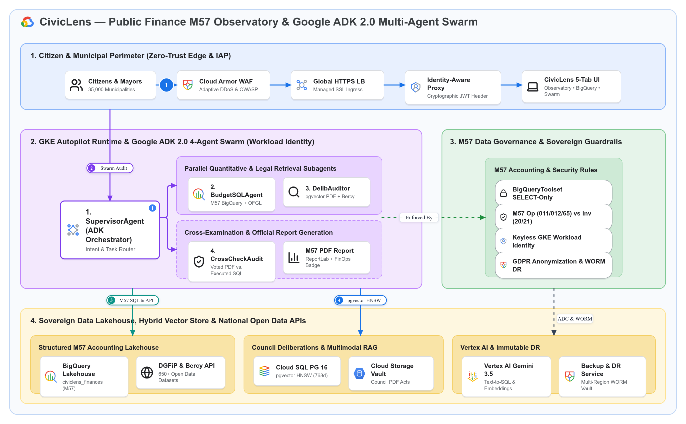

# 🏗️ Schémas d'Architecture Officiels (Dendrite v3.3 Bento Matrix & GCP Draw)

Ce document centralise les **schémas d'architecture as-code** de **CivicLens Platform — GKE Autopilot, Google ADK 2.0 4-Agent Swarm & M57 Lakehouse** selon deux standards complémentaires :
1. **Dendrite v3.3 (Executive Standard 16:9 — Bento Matrix)** : Schéma haute-densité validé sans collision géométrique, exportable en **SVG interactif** et **Draw.io / Lucidchart (`.drawio`)**.
2. **GCP Draw (`go/gcpdraw`)** : Spécification déclarative rapide pour l'outil interne Google Cloud Draw.

---

## 🚀 Accès Rapide & Fichiers Sources Versionnés

| Format / Outil | Fichier / Lien Direct | Usage Recommandé |
| :--- | :--- | :--- |
| **🎨 Ouvrir dans Dendrite Studio (1-Click)** | [**Launch in Dendrite Studio ↗**](https://dendrite-758054785671.cr.gclb.goog/#code=cmVuZGVyT3JkZXI6IG5vZGVzLWZpcnN0CmRpcmVjdGlvbjogZG93bgoKY29uc3QgR2NwQmx1ZSA9ICIjMWE3M2U4Igpjb25zdCBHY3BHcmVlbiA9ICIjMWU4ZTNlIgpjb25zdCBFbWVyYWxkVGVhbCA9ICIjMGQ5NDg4Igpjb25zdCBEYXJrU2xhdGUgPSAiIzIwMjEyNCIKY29uc3QgU3ViVGV4dCA9ICIjNWY2MzY4Igpjb25zdCBDYXJkQm9yZGVyID0gIiNkYWRjZTAiCmNvbnN0IEJ1c1N0cm9rZSA9ICIjMzM0MTU1Igpjb25zdCBTdXJmYWNlV2hpdGUgPSAiI2ZmZmZmZiIKClN0eWxlIEBHaG9zdCB7CiAgZmlsbDogdHJhbnNwYXJlbnQsIHN0cm9rZVdpZHRoOiAwLCBmb250Q29sb3I6IHRyYW5zcGFyZW50LCBwYWRkaW5nOiAwCn0KU3R5bGUgQEFyY2hpdGVjdHVyZVJvb3QgewogIGZpbGw6ICIjZjhmYWZkIiwgc3Ryb2tlQ29sb3I6ICIjYzJkN2Y1Iiwgc3Ryb2tlV2lkdGg6IDEuNSwgYm9yZGVyUmFkaXVzOiAxNiwKICBwYWRkaW5nOiAyMiwgZ2FwOiAxOCwgZm9udENvbG9yOiAiIzNjNDA0MyIsIGZvbnRTaXplOiAyMiwgbGFiZWxXZWlnaHQ6IGJvbGQsCiAgaWNvbjogIkdvb2dsZUNsb3VkIiwgaWNvblNpemU6IDI4Cn0KU3R5bGUgQFBlcmltZXRlclpvbmUgewogIGZpbGw6ICIjZThmMGZlIiwgc3Ryb2tlQ29sb3I6ICIjOGFiNGY4Iiwgc3Ryb2tlV2lkdGg6IDEuNSwgYm9yZGVyUmFkaXVzOiAxMiwKICBwYWRkaW5nOiAxNiwgZ2FwOiAxNiwgZm9udENvbG9yOiAkRGFya1NsYXRlLCBmb250U2l6ZTogMTUsIGxhYmVsV2VpZ2h0OiBib2xkCn0KU3R5bGUgQEV4ZWN1dGlvblpvbmUgewogIGZpbGw6ICIjZjNlOGZkIiwgc3Ryb2tlQ29sb3I6ICIjYzA4NGZjIiwgc3Ryb2tlV2lkdGg6IDEuNSwgYm9yZGVyUmFkaXVzOiAxMiwKICBwYWRkaW5nOiAxNiwgZ2FwOiAxNiwgZm9udENvbG9yOiAkRGFya1NsYXRlLCBmb250U2l6ZTogMTUsIGxhYmVsV2VpZ2h0OiBib2xkCn0KU3R5bGUgQEdvdmVybmFuY2Vab25lIHsKICBmaWxsOiAiI2U2ZjRlYSIsIHN0cm9rZUNvbG9yOiAiIzgxYzk5NSIsIHN0cm9rZVdpZHRoOiAxLjUsIGJvcmRlclJhZGl1czogMTIsCiAgcGFkZGluZzogMTYsIGdhcDogMTQsIGZvbnRDb2xvcjogJERhcmtTbGF0ZSwgZm9udFNpemU6IDE1LCBsYWJlbFdlaWdodDogYm9sZAp9ClN0eWxlIEBSZXNvdXJjZVpvbmUgewogIGZpbGw6ICIjZmVmN2UwIiwgc3Ryb2tlQ29sb3I6ICIjZmRlMjkzIiwgc3Ryb2tlV2lkdGg6IDEuNSwgYm9yZGVyUmFkaXVzOiAxMiwKICBwYWRkaW5nOiAxNiwgZ2FwOiAxNiwgZm9udENvbG9yOiAkRGFya1NsYXRlLCBmb250U2l6ZTogMTUsIGxhYmVsV2VpZ2h0OiBib2xkCn0KU3R5bGUgQFB1cnBsZVN1Ykdyb3VwIHsKICBmaWxsOiAiI2U5ZDVmZiIsIHN0cm9rZUNvbG9yOiBkYXJrZW4oIiNlOWQ1ZmYiLCAxNCksIHN0cm9rZVdpZHRoOiAxLCBib3JkZXJSYWRpdXM6IDEwLAogIHBhZGRpbmc6IDEyLCBnYXA6IDEwLCBmb250Q29sb3I6ICREYXJrU2xhdGUsIGZvbnRTaXplOiAxMywgbGFiZWxXZWlnaHQ6IGJvbGQKfQpTdHlsZSBAR3JlZW5TdWJHcm91cCB7CiAgZmlsbDogIiNjZWVhZDYiLCBzdHJva2VDb2xvcjogZGFya2VuKCIjY2VlYWQ2IiwgMTQpLCBzdHJva2VXaWR0aDogMSwgYm9yZGVyUmFkaXVzOiAxMCwKICBwYWRkaW5nOiAxMCwgZ2FwOiA3LCBmb250Q29sb3I6ICREYXJrU2xhdGUsIGZvbnRTaXplOiAxMywgbGFiZWxXZWlnaHQ6IGJvbGQKfQpTdHlsZSBAQW1iZXJTdWJHcm91cCB7CiAgZmlsbDogIiNmOWU0YTciLCBzdHJva2VDb2xvcjogZGFya2VuKCIjZjllNGE3IiwgMTQpLCBzdHJva2VXaWR0aDogMSwgYm9yZGVyUmFkaXVzOiAxMCwKICBwYWRkaW5nOiAxMiwgZ2FwOiAxMiwgZm9udENvbG9yOiAkRGFya1NsYXRlLCBmb250U2l6ZTogMTMsIGxhYmVsV2VpZ2h0OiBib2xkCn0KU3R5bGUgQEFjdG9yQ2FyZCB7CiAgd2lkdGg6IDE4MiwgaGVpZ2h0OiA1NiwKICBmaWxsOiAkU3VyZmFjZVdoaXRlLCBzdHJva2VDb2xvcjogJENhcmRCb3JkZXIsIHN0cm9rZVdpZHRoOiAxLCBib3JkZXJSYWRpdXM6IDgsCiAgZm9udENvbG9yOiAkRGFya1NsYXRlLCBzdWJGb250Q29sb3I6ICRTdWJUZXh0LAogIGZvbnRTaXplOiAxNCwgc3ViRm9udFNpemU6IDExLCBsYWJlbFdlaWdodDogYm9sZCwKICB0ZXh0QWxpZ246ICJsZWZ0IiwgdGV4dFZBbGlnbjogIm1pZGRsZSIsCiAgaWNvblBvc2l0aW9uOiAibGVmdCIsIGljb25TaXplOiAyOCwgcGFkZGluZzogMTAsIHNoYWRvdzogdHJ1ZQp9ClN0eWxlIEBQcm9kdWN0Q2FyZCB7CiAgd2lkdGg6IDE3MCwgaGVpZ2h0OiA1OCwKICBmaWxsOiAkU3VyZmFjZVdoaXRlLCBzdHJva2VDb2xvcjogJENhcmRCb3JkZXIsIHN0cm9rZVdpZHRoOiAxLCBib3JkZXJSYWRpdXM6IDgsCiAgZm9udENvbG9yOiAkRGFya1NsYXRlLCBzdWJGb250Q29sb3I6ICRTdWJUZXh0LAogIGZvbnRTaXplOiAxMy41LCBzdWJGb250U2l6ZTogMTAuNSwgbGFiZWxXZWlnaHQ6IGJvbGQsCiAgdGV4dEFsaWduOiAibGVmdCIsIHRleHRWQWxpZ246ICJtaWRkbGUiLAogIGljb25Qb3NpdGlvbjogImxlZnQiLCBpY29uU2l6ZTogMjYsIHBhZGRpbmc6IDEwLCBzaGFkb3c6IHRydWUKfQpTdHlsZSBAR2F0ZXdheUh1YkNhcmQgewogIGJhc2U6IEBQcm9kdWN0Q2FyZCwKICB3aWR0aDogMTk4LCBoZWlnaHQ6IDY2LCBzdHJva2VDb2xvcjogIiM3YzNhZWQiLCBzdHJva2VXaWR0aDogMiwKICBmb250U2l6ZTogMTQuNSwgc3ViRm9udFNpemU6IDExLCBpY29uU2l6ZTogMzAsIHBhZGRpbmc6IDEyCn0KU3R5bGUgQFBvbGljeVBpbGwgewogIHdpZHRoOiAyMzQsIGhlaWdodDogMzIsCiAgZmlsbDogJFN1cmZhY2VXaGl0ZSwgc3Ryb2tlQ29sb3I6ICIjOWFhMGE2Iiwgc3Ryb2tlV2lkdGg6IDEsIGJvcmRlclJhZGl1czogMTYsCiAgZm9udENvbG9yOiAkRGFya1NsYXRlLCBmb250U2l6ZTogMTIuNSwgbGFiZWxXZWlnaHQ6IGJvbGQsCiAgdGV4dEFsaWduOiAibGVmdCIsIHRleHRWQWxpZ246ICJtaWRkbGUiLAogIGljb25Qb3NpdGlvbjogImxlZnQiLCBpY29uU2l6ZTogMTYsIHBhZGRpbmc6IDEwLCBzaGFkb3c6IHRydWUKfQoKWm9uZSBAQ2l2aWNMZW5zX1BsYXRmb3JtIHsKICB0aXRsZTogIkNpdmljTGVucyDigJQgUHVibGljIEZpbmFuY2UgTTU3IE9ic2VydmF0b3J5ICYgR29vZ2xlIEFESyAyLjAgTXVsdGktQWdlbnQgU3dhcm0iCiAgc3R5bGU6IEBBcmNoaXRlY3R1cmVSb290CiAgbGF5b3V0OiBtYXRyaXgKICBhcmVhczogWwogICAgInoxIHoxIHoxIHoxIHoxIiwKICAgICJ6MyB6MyB6MyB6MiB6MiIsCiAgICAiejQgejQgejQgejQgejQiCiAgXQogIHNpemVzOiBbIjEuMDVmciIsICIxLjA1ZnIiLCAiMS4wNWZyIiwgIjAuOTJmciIsICIwLjkyZnIiXQogIGdhcDogMjAKCiAgWm9uZSBAWm9uZTFfSW5ncmVzcyB7CiAgICBhcmVhOiAiejEiCiAgICB0aXRsZTogIjEuIENpdGl6ZW4gJiBNdW5pY2lwYWwgUGVyaW1ldGVyIChaZXJvLVRydXN0IEVkZ2UgJiBJQVApIgogICAgc3R5bGU6IEBQZXJpbWV0ZXJab25lCiAgICBsYXlvdXQ6IHJvdywgZ2FwOiAxOCwgYWxpZ246IGNlbnRlciwganVzdGlmeTogY2VudGVyCiAgICBbY2l0aXplbnNfbWF5b3JzOiAiQ2l0aXplbnMgJiBNYXlvcnMiIHwgIjM1LDAwMCBNdW5pY2lwYWxpdGllcyJdIHsgc3R5bGU6IEBBY3RvckNhcmQsIGljb246ICJVc2VycyIgfQogICAgW2NsX2FybW9yX3dhZjogIkNsb3VkIEFybW9yIFdBRiIgfCAiQWRhcHRpdmUgRERvUyAmIE9XQVNQIl0geyBzdHlsZTogQFByb2R1Y3RDYXJkLCB3aWR0aDogMTg2LCBpY29uOiAiQ2xvdWRBcm1vciIgfQogICAgW2NsX2h0dHBzX2xiOiAiR2xvYmFsIEhUVFBTIExCIiB8ICJNYW5hZ2VkIFNTTCBJbmdyZXNzIl0geyBzdHlsZTogQFByb2R1Y3RDYXJkLCB3aWR0aDogMTg2LCBpY29uOiAiQ2xvdWRMb2FkQmFsYW5jaW5nIiB9CiAgICBbY2xfaWFwX2F1dGg6ICJJZGVudGl0eS1Bd2FyZSBQcm94eSIgfCAiQ3J5cHRvZ3JhcGhpYyBKV1QgSGVhZGVyIl0geyBzdHlsZTogQFByb2R1Y3RDYXJkLCB3aWR0aDogMTkyLCBpY29uOiAiR29vZ2xlSWRlbnRpdHkiIH0KICAgIFtjbF93ZWJfdWk6ICJDaXZpY0xlbnMgNS1UYWIgVUkiIHwgIk9ic2VydmF0b3J5IOKAoiBCaWdRdWVyeSDigKIgU3dhcm0iXSB7IHN0eWxlOiBAUHJvZHVjdENhcmQsIHdpZHRoOiAxOTgsIGljb246ICJMYXB0b3AiIH0KICB9CgogIFpvbmUgQFpvbmUzX0dLRV9Td2FybSB7CiAgICBhcmVhOiAiejMiCiAgICB0aXRsZTogIjIuIEdLRSBBdXRvcGlsb3QgUnVudGltZSAmIEdvb2dsZSBBREsgMi4wIDQtQWdlbnQgU3dhcm0gKFdvcmtsb2FkIElkZW50aXR5KSIKICAgIHN0eWxlOiBARXhlY3V0aW9uWm9uZQogICAgbGF5b3V0OiByb3csIGdhcDogMzQsIGFsaWduOiBjZW50ZXIsIGp1c3RpZnk6IGNlbnRlcgoKICAgIFtzdXBlcnZpc29yX2FnZW50OiAiMS4gU3VwZXJ2aXNvckFnZW50XG4oQURLIE9yY2hlc3RyYXRvcikiIHwgIkludGVudCAmIFRhc2sgUm91dGVyIl0gewogICAgICBzdHlsZTogQEdhdGV3YXlIdWJDYXJkLCBpY29uOiAiR29vZ2xlQWdlbnRzIiwKICAgICAgZGVzY3JpcHRpb246ICJDbGFzc2lmaWVzIGNpdmljICYgTTU3IGFjY291bnRpbmcgaW50ZW50IGFuZCBkZWxlZ2F0ZXMgdG8gc3BlY2lhbGl6ZWQgc3ViYWdlbnRzIgogICAgfQoKICAgIFpvbmUgQFNwZWNpYWxpc3RBZ2VudHNDb2wgewogICAgICBzdHlsZTogQEdob3N0LCBsYXlvdXQ6IGNvbHVtbiwgZ2FwOiAxMiwgYWxpZ246IHN0cmV0Y2gKCiAgICAgIFpvbmUgQERhdGFSZXRyaWV2YWxBZ2VudHMgewogICAgICAgIHRpdGxlOiAiUGFyYWxsZWwgUXVhbnRpdGF0aXZlICYgTGVnYWwgUmV0cmlldmFsIFN1YmFnZW50cyIKICAgICAgICBzdHlsZTogQFB1cnBsZVN1Ykdyb3VwLCB3aWR0aDogMzc2LCBsYXlvdXQ6IHJvdywgZ2FwOiAxMiwgYWxpZ246IGNlbnRlciwganVzdGlmeTogY2VudGVyCiAgICAgICAgW2J1ZGdldF9zcWxfYWdlbnQ6ICIyLiBCdWRnZXRTUUxBZ2VudCIgfCAiTTU3IEJpZ1F1ZXJ5ICsgT0ZHTCJdIHsgc3R5bGU6IEBQcm9kdWN0Q2FyZCwgd2lkdGg6IDE3NCwgaWNvbjogIkJpZ1F1ZXJ5IiB9CiAgICAgICAgW2RlbGliX2F1ZGl0b3JfYWdlbnQ6ICIzLiBEZWxpYmVyYXRpb25BdWRpdG9yIiB8ICJwZ3ZlY3RvciBQREYgKyBCZXJjeSJdIHsgc3R5bGU6IEBQcm9kdWN0Q2FyZCwgd2lkdGg6IDE3NCwgaWNvbjogIlNlYXJjaCIgfQogICAgICB9CgogICAgICBab25lIEBTeW50aGVzaXNBdWRpdEFnZW50IHsKICAgICAgICB0aXRsZTogIkNyb3NzLUV4YW1pbmF0aW9uICYgT2ZmaWNpYWwgUmVwb3J0IEdlbmVyYXRpb24iCiAgICAgICAgc3R5bGU6IEBQdXJwbGVTdWJHcm91cCwgZGFzaGVkOiB0cnVlLCB3aWR0aDogMzc2LCBsYXlvdXQ6IHJvdywgZ2FwOiAxMiwgYWxpZ246IGNlbnRlciwganVzdGlmeTogY2VudGVyCiAgICAgICAgW2Nyb3NzY2hlY2tfYWdlbnQ6ICI0LiBDcm9zc0NoZWNrQXVkaXQiIHwgIlZvdGVkIFBERiB2cy4gRXhlY3V0ZWQgU1FMIl0geyBzdHlsZTogQFByb2R1Y3RDYXJkLCB3aWR0aDogMTc0LCBpY29uOiAiU2hpZWxkQ2hlY2siIH0KICAgICAgICBbcGRmX3JlcG9ydF9nZW46ICJNNTcgUERGICYgU2NvcmUgLzEwMCIgfCAiUmVwb3J0TGFiICsgRmluT3BzIEJhZGdlIl0geyBzdHlsZTogQFByb2R1Y3RDYXJkLCB3aWR0aDogMTc0LCBpY29uOiAiQmFyQ2hhcnQzIiB9CiAgICAgIH0KICAgIH0KICB9CgogIFpvbmUgQFpvbmUyX0dvdmVybmFuY2UgewogICAgYXJlYTogInoyIgogICAgdGl0bGU6ICIzLiBNNTcgRGF0YSBHb3Zlcm5hbmNlICYgU292ZXJlaWduIEd1YXJkcmFpbHMiCiAgICBzdHlsZTogQEdvdmVybmFuY2Vab25lCiAgICBsYXlvdXQ6IHJvdywgZ2FwOiAyMCwgYWxpZ246IGNlbnRlciwganVzdGlmeTogY2VudGVyCgogICAgWm9uZSBATTU3R3VhcmRyYWlscyB7CiAgICAgIHRpdGxlOiAiTTU3IEFjY291bnRpbmcgJiBTZWN1cml0eSBSdWxlcyIKICAgICAgc3R5bGU6IEBHcmVlblN1Ykdyb3VwLCBsYXlvdXQ6IGNvbHVtbiwgZ2FwOiA4LCBhbGlnbjogY2VudGVyCiAgICAgIFtydWxlX3JlYWRvbmx5OiAiQmlnUXVlcnlUb29sc2V0IFNFTEVDVC1Pbmx5Il0geyBzdHlsZTogQFBvbGljeVBpbGwsIGljb246ICJMb2NrIiB9CiAgICAgIFtydWxlX201N19zZXA6ICJNNTcgT3AgKDAxMS8wMTIvNjUpIHZzIEludiAoMjAvMjEpIl0geyBzdHlsZTogQFBvbGljeVBpbGwsIGljb246ICJTaGllbGRDaGVjayIgfQogICAgICBbcnVsZV93aTogIktleWxlc3MgR0tFIFdvcmtsb2FkIElkZW50aXR5Il0geyBzdHlsZTogQFBvbGljeVBpbGwsIGljb246ICJHb29nbGVJZGVudGl0eSIgfQogICAgICBbcnVsZV9yZ3BkOiAiR0RQUiBBbm9ueW1pemF0aW9uICYgV09STSBEUiJdIHsgc3R5bGU6IEBQb2xpY3lQaWxsLCBpY29uOiAiU2VjdXJpdHlDb21tYW5kQ2VudGVyIiB9CiAgICB9CiAgfQoKICBab25lIEBab25lNF9MYWtlaG91c2UgewogICAgYXJlYTogIno0IgogICAgdGl0bGU6ICI0LiBTb3ZlcmVpZ24gRGF0YSBMYWtlaG91c2UsIEh5YnJpZCBWZWN0b3IgU3RvcmUgJiBOYXRpb25hbCBPcGVuIERhdGEgQVBJcyIKICAgIHN0eWxlOiBAUmVzb3VyY2Vab25lCiAgICBsYXlvdXQ6IG1hdHJpeCwgY29sczogMywgc2l6ZXM6IFsiMS4wNWZyIiwgIjEuMWZyIiwgIjAuOTVmciJdLCBnYXA6IDE4LCBhbGlnbjogY2VudGVyCgogICAgWm9uZSBAU3RydWN0dXJlZEZpbmFuY2VTdG9yZSB7CiAgICAgIHRpdGxlOiAiU3RydWN0dXJlZCBNNTcgQWNjb3VudGluZyBMYWtlaG91c2UiCiAgICAgIHN0eWxlOiBAQW1iZXJTdWJHcm91cCwgbGF5b3V0OiByb3csIGdhcDogMTIsIGFsaWduOiBjZW50ZXIsIGp1c3RpZnk6IGNlbnRlcgogICAgICBbYnFfbTU3X2xha2Vob3VzZTogIkJpZ1F1ZXJ5IExha2Vob3VzZSIgfCAiY2l2aWNsZW5zX2ZpbmFuY2VzIChNNTcpIl0geyBzdHlsZTogQFByb2R1Y3RDYXJkLCB3aWR0aDogMTc2LCBpY29uOiAiQmlnUXVlcnkiIH0KICAgICAgW2JlcmN5X29mZ2xfYXBpOiAiREdGaVAgLyBPRkdMICYgQmVyY3kiIHwgIjY1MCsgT3BlbiBEYXRhIERhdGFzZXRzIl0geyBzdHlsZTogQFByb2R1Y3RDYXJkLCB3aWR0aDogMTc4LCBpY29uOiAiR2xvYmUiIH0KICAgIH0KCiAgICBab25lIEBVbnN0cnVjdHVyZWRWZWN0b3JTdG9yZSB7CiAgICAgIHRpdGxlOiAiQ291bmNpbCBEZWxpYmVyYXRpb25zICYgTXVsdGltb2RhbCBSQUciCiAgICAgIHN0eWxlOiBAQW1iZXJTdWJHcm91cCwgbGF5b3V0OiByb3csIGdhcDogMTIsIGFsaWduOiBjZW50ZXIsIGp1c3RpZnk6IGNlbnRlcgogICAgICBbY2xvdWRzcWxfcGd2ZWN0b3I6ICJDbG91ZCBTUUwgUEcgMTYiIHwgInBndmVjdG9yIEhOU1cgKDc2OGQpIl0geyBzdHlsZTogQFByb2R1Y3RDYXJkLCB3aWR0aDogMTc0LCBpY29uOiAiQ2xvdWRTUUwiIH0KICAgICAgW2djc19wZGZfdmF1bHQ6ICJDbG91ZCBTdG9yYWdlIFZhdWx0IiB8ICJDb3VuY2lsIFBERiBBY3RzIl0geyBzdHlsZTogQFByb2R1Y3RDYXJkLCB3aWR0aDogMTcwLCBpY29uOiAiR2NwU3RvcmFnZUJ1Y2tldCIgfQogICAgfQoKICAgIFpvbmUgQFZlcnRleEFuZEJhY2t1cCB7CiAgICAgIHRpdGxlOiAiVmVydGV4IEFJICYgSW1tdXRhYmxlIERSIgogICAgICBzdHlsZTogQEFtYmVyU3ViR3JvdXAsIGxheW91dDogcm93LCBnYXA6IDEyLCBhbGlnbjogY2VudGVyLCBqdXN0aWZ5OiBjZW50ZXIKICAgICAgW3ZlcnRleF9nZW1pbmlfY2w6ICJWZXJ0ZXggQUkgR2VtaW5pIDMuNSIgfCAiVGV4dC10by1TUUwgJiBFbWJlZGRpbmdzIl0geyBzdHlsZTogQFByb2R1Y3RDYXJkLCB3aWR0aDogMTc4LCBpY29uOiAiVmVydGV4QUkiIH0KICAgICAgW2JhY2t1cF9kcl9jbDogIkJhY2t1cCAmIERSIFNlcnZpY2UiIHwgIk11bHRpLVJlZ2lvbiBXT1JNIFZhdWx0Il0geyBzdHlsZTogQFByb2R1Y3RDYXJkLCB3aWR0aDogMTc0LCBpY29uOiAiU2VjdXJpdHlDb21tYW5kQ2VudGVyIiB9CiAgICB9CiAgfQp9CgpbY2l0aXplbnNfbWF5b3JzXSAtLT4gW2NsX2FybW9yX3dhZl0geyBjb2xvcjogJEdjcEJsdWUsIHN0cm9rZVdpZHRoOiAyLCBzb3VyY2VBbmNob3I6ICJyaWdodCIsIHRhcmdldEFuY2hvcjogImxlZnQiLCBjdXJ2ZTogInN0ZXAiLCBzZXF1ZW5jZUJhZGdlOiAiMSIsIGJhZGdlRmlsbDogJEdjcEJsdWUsIGJhZGdlRm9udENvbG9yOiAkU3VyZmFjZVdoaXRlIH0KW2NsX2FybW9yX3dhZl0gLS0+IFtjbF9odHRwc19sYl0geyBjb2xvcjogJEdjcEJsdWUsIHN0cm9rZVdpZHRoOiAyLCBzb3VyY2VBbmNob3I6ICJyaWdodCIsIHRhcmdldEFuY2hvcjogImxlZnQiLCBjdXJ2ZTogInN0ZXAiIH0KW2NsX2h0dHBzX2xiXSAtLT4gW2NsX2lhcF9hdXRoXSB7IGNvbG9yOiAkR2NwQmx1ZSwgc3Ryb2tlV2lkdGg6IDIsIHNvdXJjZUFuY2hvcjogInJpZ2h0IiwgdGFyZ2V0QW5jaG9yOiAibGVmdCIsIGN1cnZlOiAic3RlcCIgfQpbY2xfaWFwX2F1dGhdIC0tPiBbY2xfd2ViX3VpXSB7IGNvbG9yOiAkR2NwQmx1ZSwgc3Ryb2tlV2lkdGg6IDIsIHNvdXJjZUFuY2hvcjogInJpZ2h0IiwgdGFyZ2V0QW5jaG9yOiAibGVmdCIsIGN1cnZlOiAic3RlcCIgfQoKW1pvbmUxX0luZ3Jlc3NdIC0tPiBbc3VwZXJ2aXNvcl9hZ2VudF0geyBjb2xvcjogIiM3YzNhZWQiLCBzdHJva2VXaWR0aDogMiwgc291cmNlQW5jaG9yOiAiYm90dG9tIiwgdGFyZ2V0QW5jaG9yOiAidG9wIiwgY3VydmU6ICJzdGVwIiwgbGFiZWw6ICJTd2FybSBBdWRpdCIsIHNlcXVlbmNlQmFkZ2U6ICIyIiwgYmFkZ2VGaWxsOiAiIzdjM2FlZCIsIGJhZGdlRm9udENvbG9yOiAkU3VyZmFjZVdoaXRlIH0KW3N1cGVydmlzb3JfYWdlbnRdIC0tPiBbRGF0YVJldHJpZXZhbEFnZW50c10geyBjb2xvcjogIiM3YzNhZWQiLCBzdHJva2VXaWR0aDogMiwgc291cmNlQW5jaG9yOiAicmlnaHQiLCB0YXJnZXRBbmNob3I6ICJsZWZ0IiwgY3VydmU6ICJzdGVwIiB9CltzdXBlcnZpc29yX2FnZW50XSAtLT4gW1N5bnRoZXNpc0F1ZGl0QWdlbnRdIHsgY29sb3I6ICIjN2MzYWVkIiwgc3Ryb2tlV2lkdGg6IDIsIHNvdXJjZUFuY2hvcjogInJpZ2h0IiwgdGFyZ2V0QW5jaG9yOiAibGVmdCIsIGN1cnZlOiAic3RlcCIgfQpbU3BlY2lhbGlzdEFnZW50c0NvbF0gLS0+IFtNNTdHdWFyZHJhaWxzXSB7IGNvbG9yOiAkR2NwR3JlZW4sIHN0cm9rZVdpZHRoOiAxLjgsIGRhc2hlZDogdHJ1ZSwgc291cmNlQW5jaG9yOiAicmlnaHQiLCB0YXJnZXRBbmNob3I6ICJsZWZ0IiwgY3VydmU6ICJzdGVwIiwgbGFiZWw6ICJFbmZvcmNlZCBCeSIgfQoKW1pvbmUzX0dLRV9Td2FybV0gLS0+IFtTdHJ1Y3R1cmVkRmluYW5jZVN0b3JlXSB7IGNvbG9yOiAkRW1lcmFsZFRlYWwsIHN0cm9rZVdpZHRoOiAyLCBzb3VyY2VBbmNob3I6ICJib3R0b20iLCB0YXJnZXRBbmNob3I6ICJ0b3AiLCBjdXJ2ZTogInN0ZXAiLCBsYWJlbDogIk01NyBTUUwgJiBBUEkiLCBzZXF1ZW5jZUJhZGdlOiAiMyIsIGJhZGdlRmlsbDogJEVtZXJhbGRUZWFsLCBiYWRnZUZvbnRDb2xvcjogJFN1cmZhY2VXaGl0ZSB9Cltab25lM19HS0VfU3dhcm1dIC0tPiBbVW5zdHJ1Y3R1cmVkVmVjdG9yU3RvcmVdIHsgY29sb3I6ICRHY3BCbHVlLCBzdHJva2VXaWR0aDogMiwgc291cmNlQW5jaG9yOiAiYm90dG9tIiwgdGFyZ2V0QW5jaG9yOiAidG9wIiwgY3VydmU6ICJzdGVwIiwgbGFiZWw6ICJwZ3ZlY3RvciBITlNXIiwgc2VxdWVuY2VCYWRnZTogIjQiLCBiYWRnZUZpbGw6ICRHY3BCbHVlLCBiYWRnZUZvbnRDb2xvcjogJFN1cmZhY2VXaGl0ZSB9Cltab25lMl9Hb3Zlcm5hbmNlXSAtLT4gW1ZlcnRleEFuZEJhY2t1cF0geyBjb2xvcjogJEJ1c1N0cm9rZSwgc3Ryb2tlV2lkdGg6IDEuOCwgZGFzaGVkOiB0cnVlLCBzb3VyY2VBbmNob3I6ICJib3R0b20iLCB0YXJnZXRBbmNob3I6ICJ0b3AiLCBjdXJ2ZTogInN0ZXAiLCBsYWJlbDogIkFEQyAmIFdPUk0iIH0K) | Visualisation interactive plein écran, zoom vectoriel, export PNG/SVG/Draw.io en 1 clic |
| **📐 Source Dendrite v3.3 (`.dendrite`)** | [`docs/diagrams/civiclens_adk_swarm_v3.dendrite`](diagrams/civiclens_adk_swarm_v3.dendrite) | Code source déclaratif YAML/DSL Dendrite v3.3 (grille Bento 16:9, icônes GCP officielles) |
| **🧩 Export Draw.io / Diagrams.net (`.drawio`)** | [`docs/diagrams/civiclens_adk_swarm_v3.drawio`](diagrams/civiclens_adk_swarm_v3.drawio) | Fichier XML natif importable dans **Draw.io**, **Lucidchart** ou **Google Slides** |

---

## 🖼️ Aperçu Visuel (Dendrite v3.3 — Bento Matrix 16:9)

[](diagrams/civiclens_adk_swarm_v3.png)

---

## 1. Spécification Dendrite v3.3 (`docs/diagrams/civiclens_adk_swarm_v3.dendrite`)

> **Sous-titre exécutif** : *Sovereign Smart City & Public Finance Platform with 4-Agent ADK 2.0 Swarm, BigQuery M57 Lakehouse & Cloud SQL pgvector HNSW*

Pour re-compiler ce schéma en local ou vérifier les contraintes géométriques (0 overlap, 0 clipping) :
```bash
node /google/src/files/head/depot/google3/cloud/professional_services/agents/skills/dendrite/scripts/render_dendrite.mjs \
  docs/diagrams/civiclens_adk_swarm_v3.dendrite
```

```yaml
renderOrder: nodes-first
direction: down

const GcpBlue = "#1a73e8"
const GcpGreen = "#1e8e3e"
const EmeraldTeal = "#0d9488"
const DarkSlate = "#202124"
const SubText = "#5f6368"
const CardBorder = "#dadce0"
const BusStroke = "#334155"
const SurfaceWhite = "#ffffff"

Style @Ghost {
  fill: transparent, strokeWidth: 0, fontColor: transparent, padding: 0
}
Style @ArchitectureRoot {
  fill: "#f8fafd", strokeColor: "#c2d7f5", strokeWidth: 1.5, borderRadius: 16,
  padding: 22, gap: 18, fontColor: "#3c4043", fontSize: 22, labelWeight: bold,
  icon: "GoogleCloud", iconSize: 28
}
Style @PerimeterZone {
  fill: "#e8f0fe", strokeColor: "#8ab4f8", strokeWidth: 1.5, borderRadius: 12,
  padding: 16, gap: 16, fontColor: $DarkSlate, fontSize: 15, labelWeight: bold
}
Style @ExecutionZone {
  fill: "#f3e8fd", strokeColor: "#c084fc", strokeWidth: 1.5, borderRadius: 12,
  padding: 16, gap: 16, fontColor: $DarkSlate, fontSize: 15, labelWeight: bold
}
Style @GovernanceZone {
  fill: "#e6f4ea", strokeColor: "#81c995", strokeWidth: 1.5, borderRadius: 12,
  padding: 16, gap: 14, fontColor: $DarkSlate, fontSize: 15, labelWeight: bold
}
Style @ResourceZone {
  fill: "#fef7e0", strokeColor: "#fde293", strokeWidth: 1.5, borderRadius: 12,
  padding: 16, gap: 16, fontColor: $DarkSlate, fontSize: 15, labelWeight: bold
}
Style @PurpleSubGroup {
  fill: "#e9d5ff", strokeColor: darken("#e9d5ff", 14), strokeWidth: 1, borderRadius: 10,
  padding: 12, gap: 10, fontColor: $DarkSlate, fontSize: 13, labelWeight: bold
}
Style @GreenSubGroup {
  fill: "#ceead6", strokeColor: darken("#ceead6", 14), strokeWidth: 1, borderRadius: 10,
  padding: 10, gap: 7, fontColor: $DarkSlate, fontSize: 13, labelWeight: bold
}
Style @AmberSubGroup {
  fill: "#f9e4a7", strokeColor: darken("#f9e4a7", 14), strokeWidth: 1, borderRadius: 10,
  padding: 12, gap: 12, fontColor: $DarkSlate, fontSize: 13, labelWeight: bold
}
Style @ActorCard {
  width: 182, height: 56,
  fill: $SurfaceWhite, strokeColor: $CardBorder, strokeWidth: 1, borderRadius: 8,
  fontColor: $DarkSlate, subFontColor: $SubText,
  fontSize: 14, subFontSize: 11, labelWeight: bold,
  textAlign: "left", textVAlign: "middle",
  iconPosition: "left", iconSize: 28, padding: 10, shadow: true
}
Style @ProductCard {
  width: 170, height: 58,
  fill: $SurfaceWhite, strokeColor: $CardBorder, strokeWidth: 1, borderRadius: 8,
  fontColor: $DarkSlate, subFontColor: $SubText,
  fontSize: 13.5, subFontSize: 10.5, labelWeight: bold,
  textAlign: "left", textVAlign: "middle",
  iconPosition: "left", iconSize: 26, padding: 10, shadow: true
}
Style @GatewayHubCard {
  base: @ProductCard,
  width: 198, height: 66, strokeColor: "#7c3aed", strokeWidth: 2,
  fontSize: 14.5, subFontSize: 11, iconSize: 30, padding: 12
}
Style @PolicyPill {
  width: 234, height: 32,
  fill: $SurfaceWhite, strokeColor: "#9aa0a6", strokeWidth: 1, borderRadius: 16,
  fontColor: $DarkSlate, fontSize: 12.5, labelWeight: bold,
  textAlign: "left", textVAlign: "middle",
  iconPosition: "left", iconSize: 16, padding: 10, shadow: true
}

Zone @CivicLens_Platform {
  title: "CivicLens — Public Finance M57 Observatory & Google ADK 2.0 Multi-Agent Swarm"
  style: @ArchitectureRoot
  layout: matrix
  areas: [
    "z1 z1 z1 z1 z1",
    "z3 z3 z3 z2 z2",
    "z4 z4 z4 z4 z4"
  ]
  sizes: ["1.05fr", "1.05fr", "1.05fr", "0.92fr", "0.92fr"]
  gap: 20

  Zone @Zone1_Ingress {
    area: "z1"
    title: "1. Citizen & Municipal Perimeter (Zero-Trust Edge & IAP)"
    style: @PerimeterZone
    layout: row, gap: 18, align: center, justify: center
    [citizens_mayors: "Citizens & Mayors" | "35,000 Municipalities"] { style: @ActorCard, icon: "Users" }
    [cl_armor_waf: "Cloud Armor WAF" | "Adaptive DDoS & OWASP"] { style: @ProductCard, width: 186, icon: "CloudArmor" }
    [cl_https_lb: "Global HTTPS LB" | "Managed SSL Ingress"] { style: @ProductCard, width: 186, icon: "CloudLoadBalancing" }
    [cl_iap_auth: "Identity-Aware Proxy" | "Cryptographic JWT Header"] { style: @ProductCard, width: 192, icon: "GoogleIdentity" }
    [cl_web_ui: "CivicLens 5-Tab UI" | "Observatory • BigQuery • Swarm"] { style: @ProductCard, width: 198, icon: "Laptop" }
  }

  Zone @Zone3_GKE_Swarm {
    area: "z3"
    title: "2. GKE Autopilot Runtime & Google ADK 2.0 4-Agent Swarm (Workload Identity)"
    style: @ExecutionZone
    layout: row, gap: 34, align: center, justify: center

    [supervisor_agent: "1. SupervisorAgent\n(ADK Orchestrator)" | "Intent & Task Router"] {
      style: @GatewayHubCard, icon: "GoogleAgents",
      description: "Classifies civic & M57 accounting intent and delegates to specialized subagents"
    }

    Zone @SpecialistAgentsCol {
      style: @Ghost, layout: column, gap: 12, align: stretch

      Zone @DataRetrievalAgents {
        title: "Parallel Quantitative & Legal Retrieval Subagents"
        style: @PurpleSubGroup, width: 376, layout: row, gap: 12, align: center, justify: center
        [budget_sql_agent: "2. BudgetSQLAgent" | "M57 BigQuery + OFGL"] { style: @ProductCard, width: 174, icon: "BigQuery" }
        [delib_auditor_agent: "3. DeliberationAuditor" | "pgvector PDF + Bercy"] { style: @ProductCard, width: 174, icon: "Search" }
      }

      Zone @SynthesisAuditAgent {
        title: "Cross-Examination & Official Report Generation"
        style: @PurpleSubGroup, dashed: true, width: 376, layout: row, gap: 12, align: center, justify: center
        [crosscheck_agent: "4. CrossCheckAudit" | "Voted PDF vs. Executed SQL"] { style: @ProductCard, width: 174, icon: "ShieldCheck" }
        [pdf_report_gen: "M57 PDF & Score /100" | "ReportLab + FinOps Badge"] { style: @ProductCard, width: 174, icon: "BarChart3" }
      }
    }
  }

  Zone @Zone2_Governance {
    area: "z2"
    title: "3. M57 Data Governance & Sovereign Guardrails"
    style: @GovernanceZone
    layout: row, gap: 20, align: center, justify: center

    Zone @M57Guardrails {
      title: "M57 Accounting & Security Rules"
      style: @GreenSubGroup, layout: column, gap: 8, align: center
      [rule_readonly: "BigQueryToolset SELECT-Only"] { style: @PolicyPill, icon: "Lock" }
      [rule_m57_sep: "M57 Op (011/012/65) vs Inv (20/21)"] { style: @PolicyPill, icon: "ShieldCheck" }
      [rule_wi: "Keyless GKE Workload Identity"] { style: @PolicyPill, icon: "GoogleIdentity" }
      [rule_rgpd: "GDPR Anonymization & WORM DR"] { style: @PolicyPill, icon: "SecurityCommandCenter" }
    }
  }

  Zone @Zone4_Lakehouse {
    area: "z4"
    title: "4. Sovereign Data Lakehouse, Hybrid Vector Store & National Open Data APIs"
    style: @ResourceZone
    layout: matrix, cols: 3, sizes: ["1.05fr", "1.1fr", "0.95fr"], gap: 18, align: center

    Zone @StructuredFinanceStore {
      title: "Structured M57 Accounting Lakehouse"
      style: @AmberSubGroup, layout: row, gap: 12, align: center, justify: center
      [bq_m57_lakehouse: "BigQuery Lakehouse" | "civiclens_finances (M57)"] { style: @ProductCard, width: 176, icon: "BigQuery" }
      [bercy_ofgl_api: "DGFiP / OFGL & Bercy" | "650+ Open Data Datasets"] { style: @ProductCard, width: 178, icon: "Globe" }
    }

    Zone @UnstructuredVectorStore {
      title: "Council Deliberations & Multimodal RAG"
      style: @AmberSubGroup, layout: row, gap: 12, align: center, justify: center
      [cloudsql_pgvector: "Cloud SQL PG 16" | "pgvector HNSW (768d)"] { style: @ProductCard, width: 174, icon: "CloudSQL" }
      [gcs_pdf_vault: "Cloud Storage Vault" | "Council PDF Acts"] { style: @ProductCard, width: 170, icon: "GcpStorageBucket" }
    }

    Zone @VertexAndBackup {
      title: "Vertex AI & Immutable DR"
      style: @AmberSubGroup, layout: row, gap: 12, align: center, justify: center
      [vertex_gemini_cl: "Vertex AI Gemini 3.5" | "Text-to-SQL & Embeddings"] { style: @ProductCard, width: 178, icon: "VertexAI" }
      [backup_dr_cl: "Backup & DR Service" | "Multi-Region WORM Vault"] { style: @ProductCard, width: 174, icon: "SecurityCommandCenter" }
    }
  }
}

[citizens_mayors] --> [cl_armor_waf] { color: $GcpBlue, strokeWidth: 2, sourceAnchor: "right", targetAnchor: "left", curve: "step", sequenceBadge: "1", badgeFill: $GcpBlue, badgeFontColor: $SurfaceWhite }
[cl_armor_waf] --> [cl_https_lb] { color: $GcpBlue, strokeWidth: 2, sourceAnchor: "right", targetAnchor: "left", curve: "step" }
[cl_https_lb] --> [cl_iap_auth] { color: $GcpBlue, strokeWidth: 2, sourceAnchor: "right", targetAnchor: "left", curve: "step" }
[cl_iap_auth] --> [cl_web_ui] { color: $GcpBlue, strokeWidth: 2, sourceAnchor: "right", targetAnchor: "left", curve: "step" }

[Zone1_Ingress] --> [supervisor_agent] { color: "#7c3aed", strokeWidth: 2, sourceAnchor: "bottom", targetAnchor: "top", curve: "step", label: "Swarm Audit", sequenceBadge: "2", badgeFill: "#7c3aed", badgeFontColor: $SurfaceWhite }
[supervisor_agent] --> [DataRetrievalAgents] { color: "#7c3aed", strokeWidth: 2, sourceAnchor: "right", targetAnchor: "left", curve: "step" }
[supervisor_agent] --> [SynthesisAuditAgent] { color: "#7c3aed", strokeWidth: 2, sourceAnchor: "right", targetAnchor: "left", curve: "step" }
[SpecialistAgentsCol] --> [M57Guardrails] { color: $GcpGreen, strokeWidth: 1.8, dashed: true, sourceAnchor: "right", targetAnchor: "left", curve: "step", label: "Enforced By" }

[Zone3_GKE_Swarm] --> [StructuredFinanceStore] { color: $EmeraldTeal, strokeWidth: 2, sourceAnchor: "bottom", targetAnchor: "top", curve: "step", label: "M57 SQL & API", sequenceBadge: "3", badgeFill: $EmeraldTeal, badgeFontColor: $SurfaceWhite }
[Zone3_GKE_Swarm] --> [UnstructuredVectorStore] { color: $GcpBlue, strokeWidth: 2, sourceAnchor: "bottom", targetAnchor: "top", curve: "step", label: "pgvector HNSW", sequenceBadge: "4", badgeFill: $GcpBlue, badgeFontColor: $SurfaceWhite }
[Zone2_Governance] --> [VertexAndBackup] { color: $BusStroke, strokeWidth: 1.8, dashed: true, sourceAnchor: "bottom", targetAnchor: "top", curve: "step", label: "ADC & WORM" }
```

---

## 2. Spécification GCP Draw (`go/gcpdraw`)

### 📋 Instructions d'utilisation
1. Rendez-vous sur l'outil officiel Google Cloud : **[GCP Draw (go/gcpdraw)](https://gcpdraw.corp.google.com)**.
2. Cliquez sur **Import / Code**.
3. Copiez-collez l'intégralité du bloc ci-dessous pour visualiser, éditer et exporter le schéma.

```text
meta {
  title "CivicLens — Smart City & Public Finance ADK 2.0 Platform (v3.3)"
}

elements {
  card users as users {
    display_name "Citizens, Elected Officials & DGS"
  }

  gcp {
    card armor as waf {
      name "Cloud Armor WAF"
      description "Adaptive DDoS & OWASP Top 10 Protection"
    }

    card load_balancer as lb {
      name "Global External Load Balancer"
      description "Anycast IP (34.49.146.250) & Managed Ingress"
    }

    card iap as iap {
      name "Identity-Aware Proxy (IAP)"
      description "Zero Trust Admin & Bastion SSH Tunneling"
    }

    group vpc_prod {
      name "Production VPC (europe-west1) — GKE Autopilot & ADK 2.0 Swarm"

      card gke as gke_autopilot {
        name "GKE Autopilot (FastAPI & 5-Tab Portal)"
        description "1. Citizens | 2. Radar | 3. M57 Budget | 4. Deliberations | 5. ADK 2.0 Swarm + GCP X-Ray"
      }

      card vertex_ai as adk_swarm {
        name "Google ADK 2.0 4-Agent Swarm"
        description "SupervisorAgent -> Parallel(BudgetSQL + DeliberationAuditor) -> CrossCheckAuditAgent"
      }

      card sql as cloud_sql {
        name "Cloud SQL PostgreSQL 16 (PSA)"
        description "pgvector HNSW (m=16, ef=64) — 768d Deliberations & Reports"
      }

      card nat as cloud_nat {
        name "Cloud NAT"
        description "Private Outbound Gateway"
      }
    }

    group data_and_ai {
      name "Data Lakehouse & Vertex AI Foundation (Workload Identity)"

      card storage as documents_vault {
        name "Cloud Storage (GCS)"
        description "Municipal PDFs & Citizen Photo Reports"
      }

      card bigquery as bq_finances {
        name "BigQuery Lakehouse (civiclens_finances)"
        description "142k+ M57 Rows (2019-2024) — Read-Only Guardrail (10 GB Max)"
      }

      card vertex_ai as vertex_ai {
        name "Vertex AI Gemini 2.5 Flash & Embeddings"
        description "Multimodal Vision, Text-to-SQL M57 & text-embedding-004 (768d)"
      }
    }

    group disaster_recovery {
      name "Observability, FinOps & Disaster Recovery"

      card monitoring as monitoring {
        name "Cloud Monitoring & Logging"
        description "Swarm Traceability & FinOps Budget Alerts"
      }

      card backup_and_dr as backup_dr {
        name "Backup & DR Service"
        description "Multi-Region Immutable WORM Vaults"
      }
    }
  }
}

paths {
  users -down-> waf
  waf --> lb
  lb --> gke_autopilot : "Public Ingress"
  lb --> iap
  iap -down-> gke_autopilot : "Zero Trust Admin"

  gke_autopilot --> adk_swarm : "POST /api/agents/swarm-audit"
  adk_swarm --> bq_finances : "BudgetSQLAgent (M57 SQL)"
  adk_swarm --> cloud_sql : "DeliberationAuditorAgent (pgvector HNSW)"
  adk_swarm --> vertex_ai : "CrossCheckAuditAgent (Compliance Score /100)"

  gke_autopilot --> documents_vault : "PDF & Photo Storage"
  gke_autopilot ..> cloud_nat : "Egress"
  gke_autopilot ..> monitoring : "Audit Logs & Metrics"
  cloud_sql ..> backup_dr : "Daily & Weekly WORM Backup"
}
```
